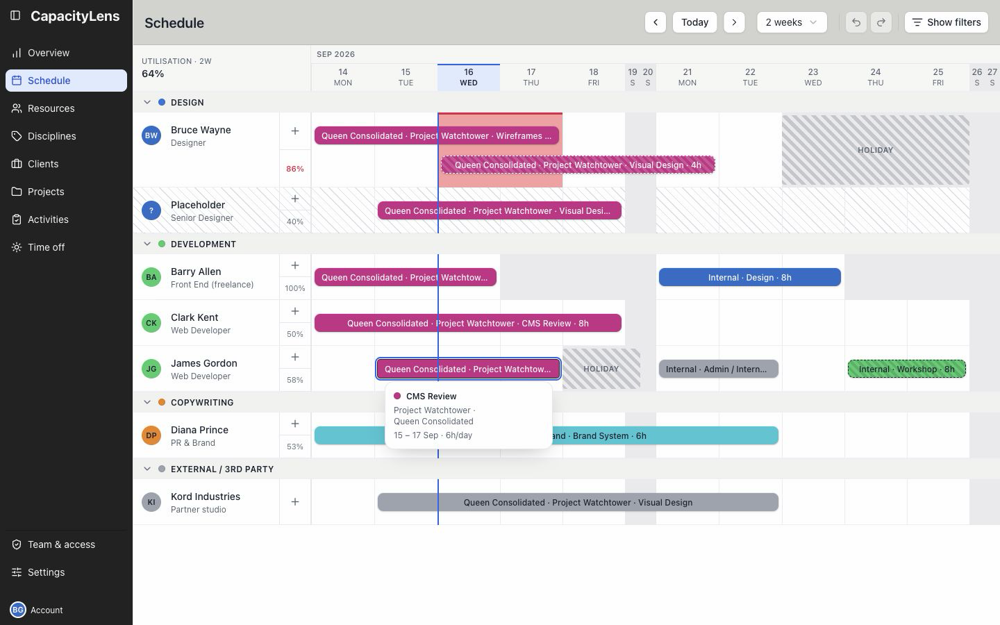
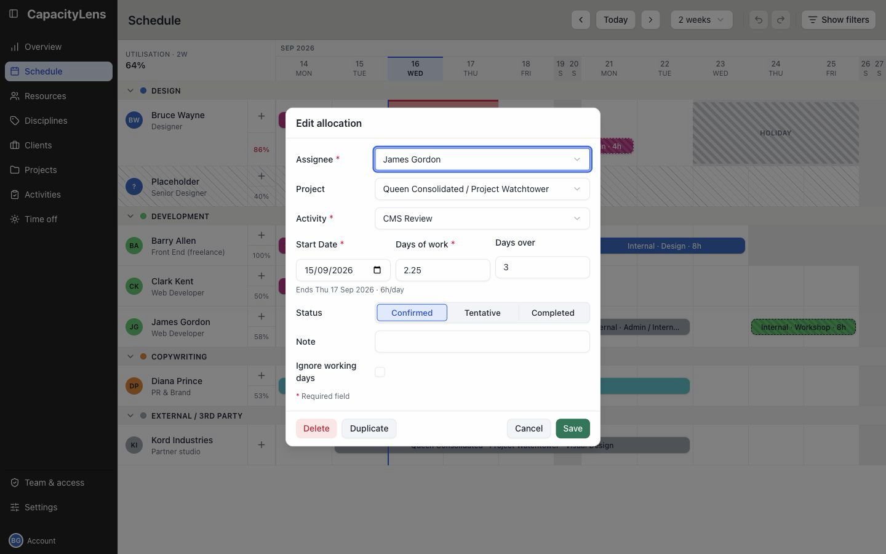

# Change or remove scheduled work

Editors, Admins and Owners can change bookings. Open Schedule in the left menu.

## Move or reassign a booking

Drag the middle of the bar along the same row to move it earlier or later. Drag it onto another person's row to reassign the work.

The booking keeps its working length, so a different working pattern can change the calendar dates it spans.

## Change the date span

Drag the left or right edge of the bar to change its start or end date.

## Edit details or delete the booking

Click the bar to open Edit allocation. Change the assignee, project, activity, dates, amount, status, task, or note, then select Save.

To remove the booking, open Edit allocation and select Delete.

Use Undo in the toolbar, or Ctrl/Cmd+Z, if you remove or change the wrong booking.

[Find available capacity](/using/find-capacity), or read [Projects and allocations](/guide/projects-and-allocations#edit-move-and-remove-allocations) for the detailed move, resize, and repeat rules.
