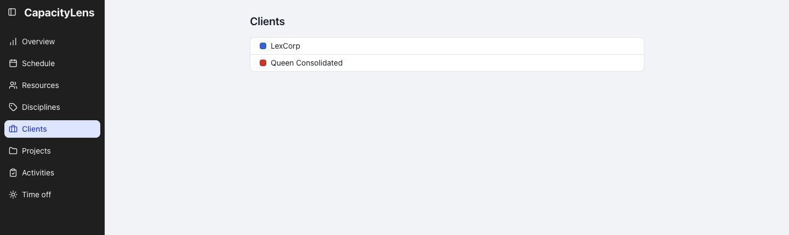

# Clients

To see a client's scheduled work, open Schedule → Show filters and select the client.

[More about Schedule filters](/guide/the-schedule#filtering-and-searching)

[Add or change clients](/guide/projects-and-allocations#clients-and-projects)
