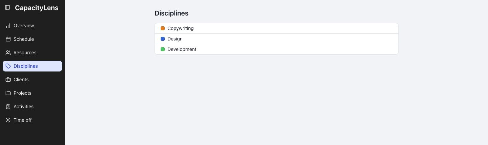
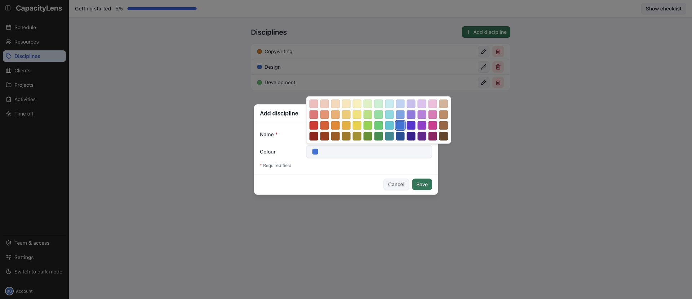
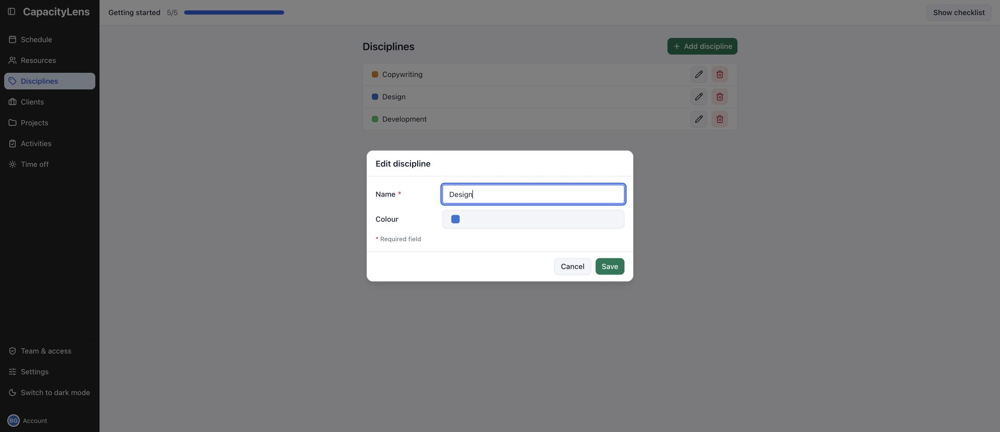
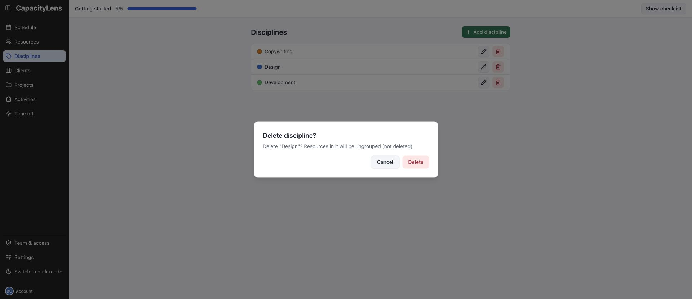

# Disciplines

Disciplines group people on Schedule and give their rows a shared colour. Create a discipline before
assigning it to a person in **Resources**. The Resources form's **Discipline** field is hidden when
the company has switched disciplines off.

## Add or change a discipline

On **Disciplines**, select **Add discipline**, enter a name, choose a preset colour and save. The
new group appears in the list and on Schedule when a person is assigned to it. New disciplines are
added to the end of the schedule's group order automatically; the management list stays
alphabetical.

Select the pencil on a row to change its name or colour. Saving updates the group and its people on
Schedule. If the name is blank, the form stays open so you can correct it.

## Remove a discipline

Select the trash button on its row and read the **Delete discipline?** confirmation. Deleting a
discipline ungroups its people; it does not delete people or their bookings. Confirm to remove the
group. Those people appear under the schedule's unassigned or engagement group until you assign
them to another discipline. If you removed the wrong discipline, use **Undo** in the Schedule
toolbar to restore it and its grouping.

When the company turns **Use disciplines** off in [Settings](/using/settings#disciplines), the
**Disciplines** link and page are hidden. Visiting `/disciplines` sends you back to Schedule. The
setting hides groups and discipline controls; it does not delete discipline records or assignments.
Turn it back on to show them again.

[Assign a person's discipline](/using/resources#add-a-person)

[Company discipline settings](/using/settings#disciplines)
