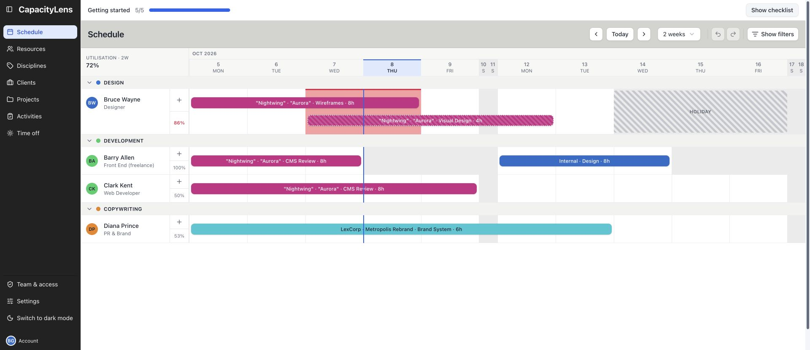
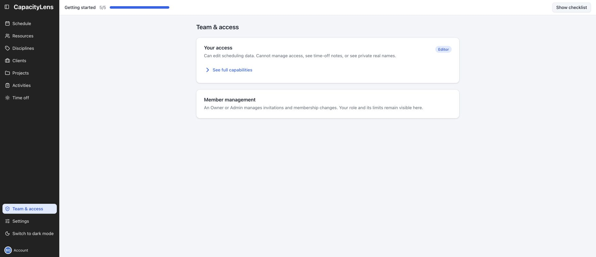
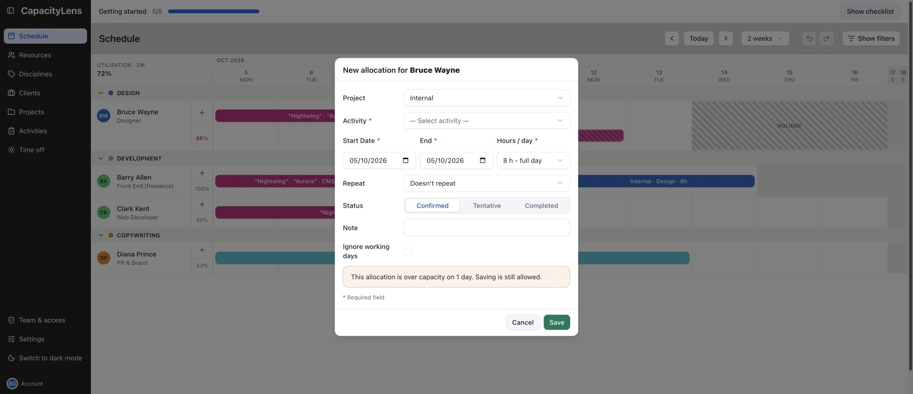

# Plan work as an Editor

This route is for the person who keeps the team's plan up to date. An Editor can create and
change scheduling records and ordinary company settings. An Admin or Owner manages membership;
only the Owner controls company joining policy, imports and company deletion.

## Join the right company

Use the invitation or company joining link supplied by your Owner or Admin. Follow
[Join your team](/using/join-your-team) with the address they authorised. Sign-in alone does not
make you a member, and a scheduled person is not automatically a sign-in account.

After entering the company, open **Team & access** near the bottom of the left menu and check your
role. If it says Viewer, ask an Owner or Admin for Editor access before trying to change work.
If you belong to several companies, use **Switch company** and choose the one whose plan you
intend to change. Your role can be different in each company.

## Check the period and the person

1. Open **Schedule**, select **Today**, then use **Weeks visible** to show the period you need.
2. Select **Show filters** to narrow the rows or work by person, discipline, client, project or
   activity. Clear a filter when expected work is missing.
3. Find the person's row. Read their utilisation, working days, time off and existing bookings
   together. A blank calendar cell does not prove spare capacity.
4. Open the person's avatar to inspect their read-only work list when you need the individual
   view. Close the drawer to return to the shared grid.

The utilisation beside each person describes the dates currently visible. An overbooking warning
for the next two weeks is a separate signal. Fully booked at 100% is not over capacity; work
exceeds capacity only when the allocation is greater than the time available.

If **Overview** appears in your menu, use its **Has availability** filter and weekly figures to
compare the team. It is restricted to Owners and Admins by default. An Admin can enable it for
Editors. [Read the schedule](/using/read-the-schedule) and [Overview](/using/overview) explain the
figures, filters and different planning windows.

## Prepare what the booking needs

Check **Resources** for the scheduled person and their working pattern. An invitation creates
membership, not a schedulable row; if the person is absent, add the appropriate resource before
booking them. When the company uses disciplines, open **Disciplines** to create or edit its groups.

Check **Clients**, **Projects** and **Activities** for the work to book. A project activity belongs
to its project; an internal activity does not need a client. Some activities can be reused across
projects. Add the missing records through those pages, or use inline activity creation when your
company has enabled it.

These are shared company records. Use the existing names where they fit rather than making a
second copy. [Resources](/using/resources), [Disciplines](/using/disciplines),
[Clients and projects](/using/projects) and [Activities](/using/activities) show the forms and
explain deletion, privacy and placeholder behavior.

## Make and check a booking

1. In **Schedule**, use the **+** beside the person's name to open the allocation form. You can
   also draw over available dates when the draw control is offered.
2. Choose the person, activity and any project, then the start and end dates. Enter the amount
   in the company's selected units: Hours, Days or Blocks.
3. Set a tentative status or add a note only when it helps the plan. If repetition is available,
   check the preview and end condition before saving.
4. Save. Find the resulting bar on the correct row and dates, and check utilisation or conflicts.

Ordinary bookings use the person's working weekdays and the company's working week. They also
respect a person's start and end dates. Time off and closures reduce availability. **Ignore
working days** changes how an allocation uses its span; it does not make every date a valid place
to begin a new booking or bypass the person's active-date boundary.

Blocks express bookings without measuring capacity, so capacity figures are unavailable in that
mode. An over-capacity warning needs a planning decision; it does not silently move work to another
person. [Schedule and change work](/using/schedule-work) covers each field, repeated bookings and
the available gestures.

## Keep the plan current

Open a booking to edit its amount, dates, status, note or permitted assignment. Use duplicate when
the new booking should start from an existing one. Dragging and keyboard adjustments provide
faster date or assignment changes; the same working-day and resource rules still apply.

Use **Undo** or **Redo** when the available history contains the change you need to reverse. Check
the resulting schedule rather than assuming another person's later edit was also undone.
Record absences and company closures on **Time off**, then check the affected period again.
Time-off notes are reserved for Owners and Admins, even though Editors can manage the scheduling
record. [Time off](/using/time-off) explains conflicts, repetition and the distinction between a
person's absence and a company closure.

## Choose your display and protect your sign-in

In **Settings → My display**, choose preferences for this browser without changing a teammate's
view. **Company setup** and **Scheduling features** affect everyone; change them deliberately and
check the existing plan afterwards. Week start and time zone are fixed when the company is
created. [Settings](/using/settings) explains each setting's effect and access restriction.

Open **Account** at the bottom of the menu for the identity used to sign in, available personal
security controls and **Sign out**. [Account](/using/account) explains password and company-login
differences. Your company role belongs to your membership; your sign-in identity can be used in
more than one company. Administrative password resets and session revocation affect that identity
across companies, so ask an Owner or Admin if your access needs recovery.

## When something interrupts the work

### A booking cannot start on the selected date

Check the person's active dates, working pattern and the company's working days. Begin on an
allowed working date. Read the form's error before changing the amount or enabling an exception;
**Ignore working days** does not remove every date restriction.

### A save failed or another person changed the same record

Keep the failure visible and use the offered retry or recovery control. If CapacityLens replaces a
stale edit with the current server record, review that record before editing again. A bar you can
still see is not proof that its last change was saved. [Day-to-day FAQ](/using/faq) covers connection
and recovery messages.

### I can see a code name but not a client's real name

That is the company's private-name protection. Only the Owner sees the confidential real names;
being an Editor or Admin does not remove that protection. Use the code name shown in the plan.

### I am using an offline snapshot

The snapshot is read-only, even for an Editor. Reconnect and return to the live company before
changing work. Cached data is opt-in, expires after seven days and does not queue edits for later
submission. See [Offline access](/using/settings#offline-access).
