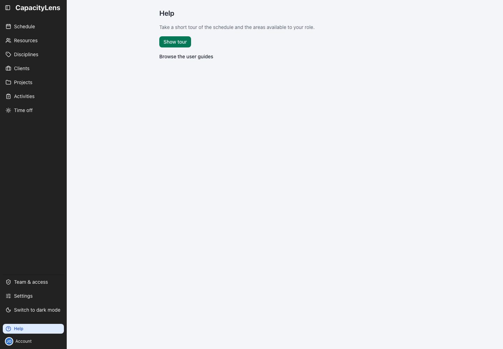

# Help

Open **Help** near the bottom of the sidebar, just above Account. It is available to every role,
even after Getting started is dismissed. You can also find Help in the command palette.

Select **Show tour** to open Schedule and follow the guidance for your role. Owners see company setup
and scheduling stops; Viewers see two stops about reading the schedule. See
[Roles and permissions](/getting-started/roles-and-permissions#take-a-role-based-tour) for each role's tour.

The button is disabled while the application checks your access, when it cannot confirm your access,
or while a read-only offline snapshot is open. If the tour cannot start, the application shows an error so you
can try again.

Select **Browse the user guides** for the online [day-to-day guide](/using/).
