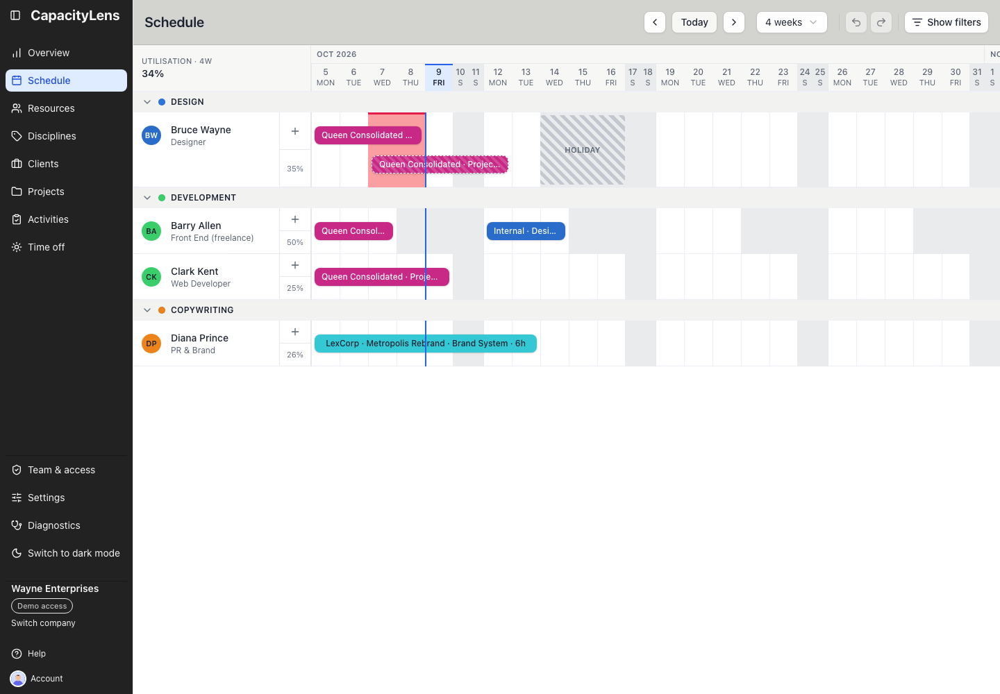

# Use CapacityLens day to day

This guide is for everyone who reads or plans the schedule: the people booked on it, and the
Editors who arrange their work. CapacityLens shows your team's planned work, time off and
availability on one shared grid. Open [Schedule](/using/read-the-schedule) to find your work, or
[join your team](/using/join-your-team) first if you still need to sign in.

Each page in the left menu has its own page here. Viewers can read every page their company
allows; Editors, Admins and Owners can also schedule and change work. Your role is shown in
[Team & access](/using/team-access). Open [Help](/help) for a role-based tour and links to these
guides; the tour remains available after Getting started is dismissed.

## Choose your day-to-day route

- [Plan work as an Editor](/using/editor): prepare records, check capacity, make and update bookings,
  and recover from scheduling interruptions.
- [Check the plan as a Viewer](/using/viewer): find your work, understand availability and absences,
  choose personal preferences, and get help with missing access.

Owners and Admins can use the Editor route for their scheduling work. Their company setup and
access-management responsibilities have separate [Owner](/owner/) and [Admin](/admin/) guides.

## Pages

- [Schedule](/using/read-the-schedule): the day-by-day planning grid for allocations,
  utilisation and time off.
- [Overview](/using/overview): each person's remaining capacity, week by week, across four, eight
  or twelve weeks.
- [Resources](/using/resources): the people, placeholders and external parties available for
  scheduling.
- [Disciplines](/using/disciplines): the coloured groups used for people and schedule rows.
- [Clients and projects](/using/projects): the organisations whose projects appear in allocations.
- [Activities](/using/activities): internal, all-projects and project-specific work.
- [Time off](/using/time-off): company closures and personal time away from work.
- [Team & access](/using/team-access): your access and, for Owners and Admins, members and
  invitations.
- [Settings](/using/settings): company-wide planning rules, device preferences and offline access.
- [Help](/help): start the tour for your role and browse the user guides.
- [Account](/using/account): your signed-in identity and personal account controls.

## Tasks

- [Find available capacity](/using/overview#find-available-capacity)
- [Schedule and change work](/using/schedule-work)
- [Record time off](/using/time-off#record-time-off)
- [Day-to-day FAQ](/using/faq)
