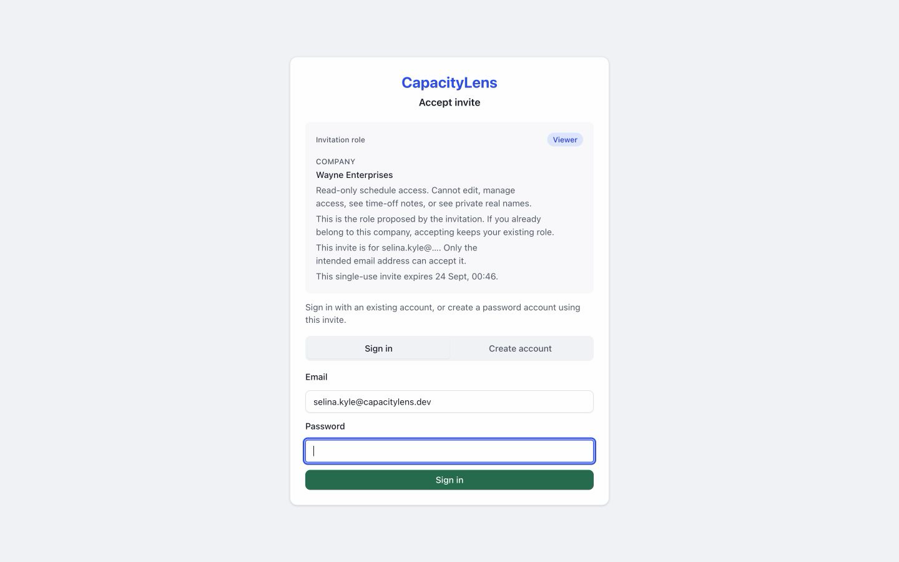
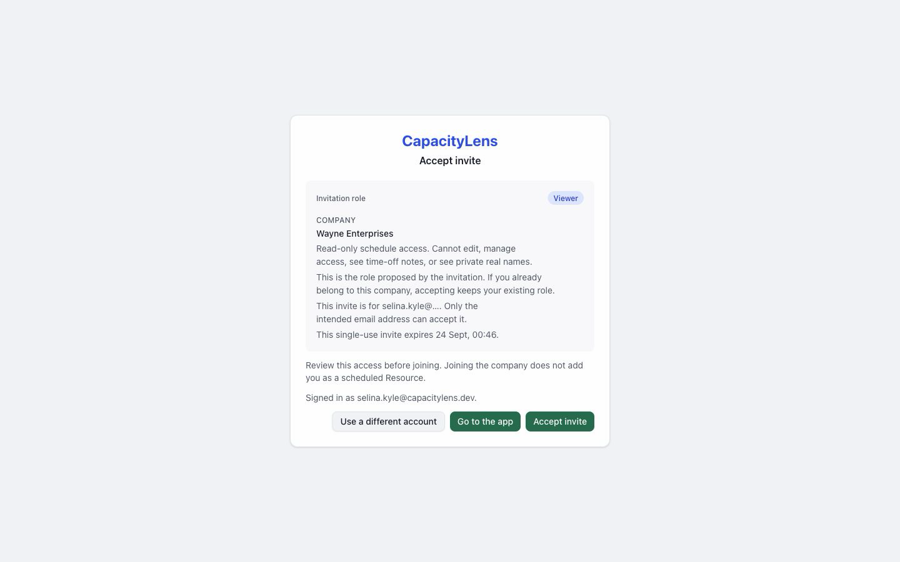

# Join your team

Open the invitation your agency sent you. Use the invited email address.

Choose Sign in if you already have an account, or Create account if you need one.

If your agency uses company login, choose its provider instead.

If the preview shows the wrong signed-in identity, select Use a different account.

## Accept your invitation

Accept the invitation to open your company's Schedule.

If the link has expired or was already used, ask the sender for a replacement.

[Find your work on Schedule](/using/read-the-schedule)
