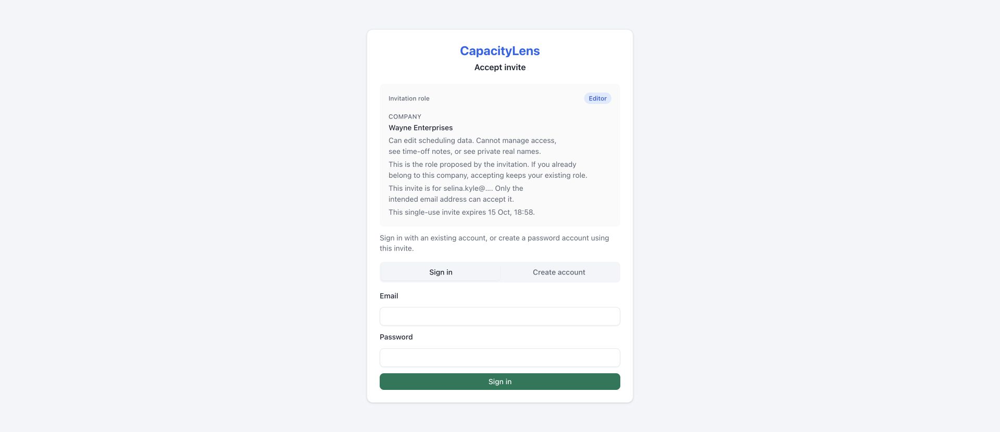
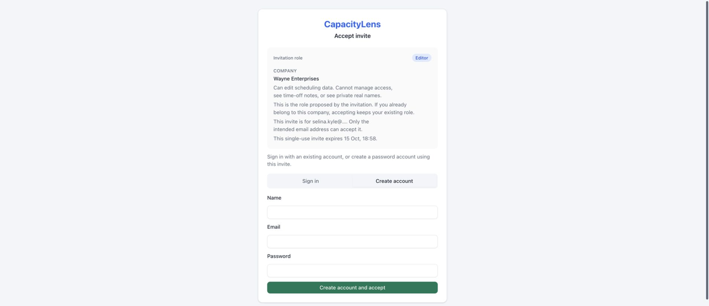
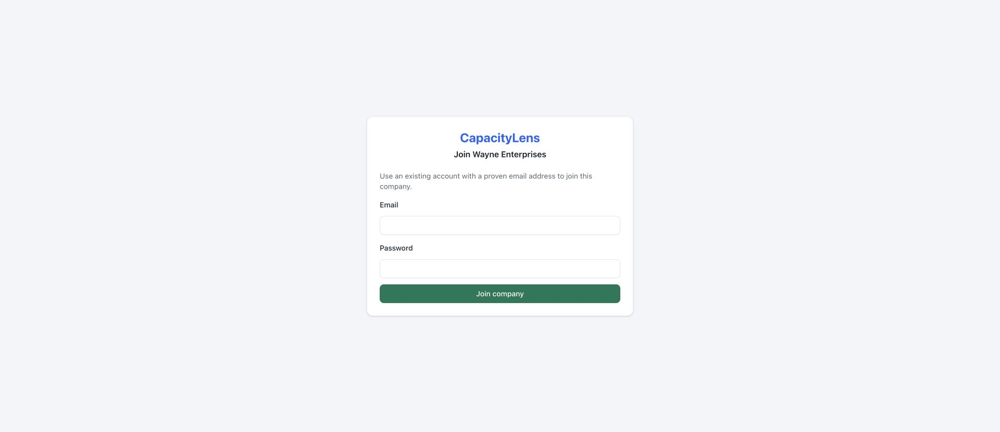
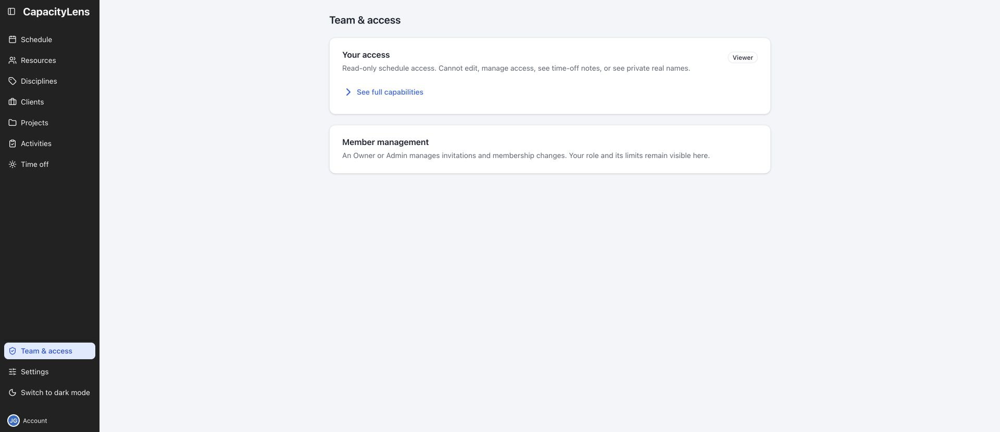

# Join your team

Your agency may send an addressed invitation or a company joining link. These are different ways
to join. An invitation names the company and proposed role before you sign in. A joining link names
the company and applies the company's current joining policy; it does not create a new password
account.

## Accept an invitation

Open the link and check the company, proposed role, expiry and any email hint. If the invitation is
tied to an email address, it must be accepted by that address. Opening the link only previews it; it
does not add you to the company.

If you already have a CapacityLens password sign-in, enter that email and password, then review
and select **Accept invite**. If company login is available, choose the configured provider,
complete its verification steps and return to accept. When already signed in, check that the
identity shown is the address the invitation was sent to.

If you need a new password identity and signup is offered, select **Create account**, enter your
name, the invited email and a password, then select **Create account and accept**. This creates the
identity and accepts the invitation together; you do not need a second acceptance step.

A successful acceptance opens the company’s Schedule. A new member receives the invited role.
If you are already a member, accepting keeps your existing role; ask an Owner or Admin to change
it when your responsibilities have changed.

If the invitation is for the wrong email, ask the sender to create one for the correct address.
Expired or already-used invitations cannot be accepted; ask an Owner or Admin to revoke and replace
the invitation. If sign-in opens the wrong identity, use **Use a different account** on the invite
page before accepting.

## Join with a company link

Open the joining link and check that the page names the company you expect. Enter your email, then
choose an available sign-in provider or sign in with an existing password account. Complete
any second-factor check and select **Join company**. A joining link does not create a password
account. Open registration and policies that use approved domains require verified email proof.
People admitted by policy receive the **Viewer** role. An addressed invitation can give the role it names.

If the page says it cannot prove your email, select **Email me a verification link** if that option
is shown, then open the message while signed in. If it does not arrive, select that option again.
You can also use a configured verified provider or ask an Owner or Admin for an addressed invitation.
When Microsoft asks you to prove your email, open its message in the same browser that started the
request. Use **Resend email** if it does not arrive, or **Start again** to cancel that attempt and
restart. See [Set up Google or Microsoft sign-in](/company-login/set-up-company-login) for that
provider step. If joining is refused, ask an Owner or Admin whether the company's policy allows your
address or whether your access is disabled.

## After you join

CapacityLens adds you as a company member and opens its Schedule. Your role appears under **Team &
access → Your access**. Being a member does not automatically add a schedulable person with your
name; ask an Owner or Admin if you also need a row for planning work.

If **Team & access** lists you as a member but you do not see a scheduled person for yourself,
ask your Admin to check whether your person Resource exists and is linked to your membership.

[Find your work on Schedule](/using/read-the-schedule)
