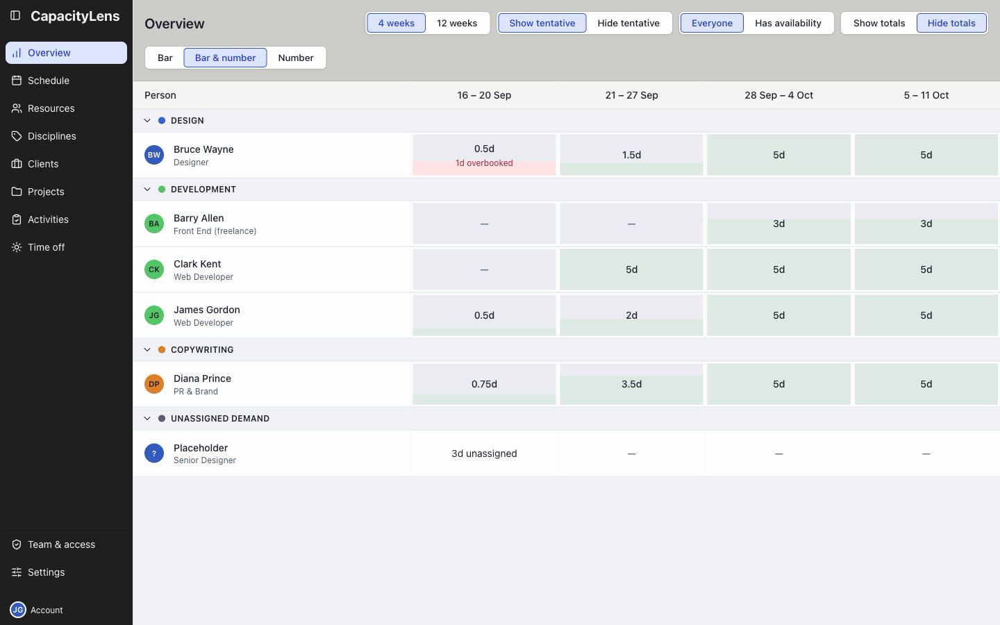
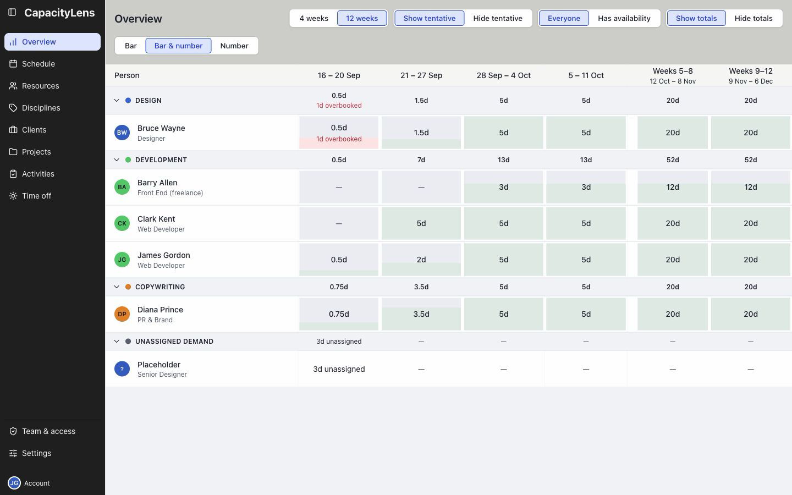

# Overview

Overview shows who has room for more work, one week at a time. It starts with the rest of this
week and the next three weeks.

Ledger shows free days and a horizontal bar. Grey hatching marks tentative work.

Has availability filters the table to people with spare capacity.

Totals adds each week's committed percentage and free days above the table.

Turn Tentative off to see capacity without provisional bookings.

## Look further ahead

Choose 8 weeks or 12 weeks to look further ahead. Every column is still one week; scroll across
the table to see the later weeks.

Load curve replaces the figures with vertical bars. Hover a cell for its figures, or
switch back to Ledger.

The avatar beside a name opens that person's [work list](/using/read-the-schedule#your-work-list).

If Overview is missing from your menu, your company may restrict access.

Overview does not show capacity figures in Blocks mode.

[Overview figures and filters](/guide/capacity-overview)
