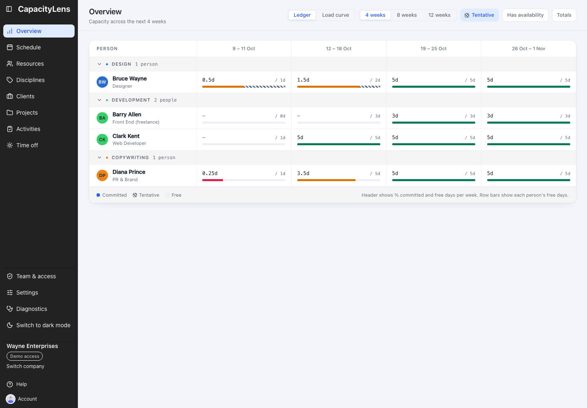
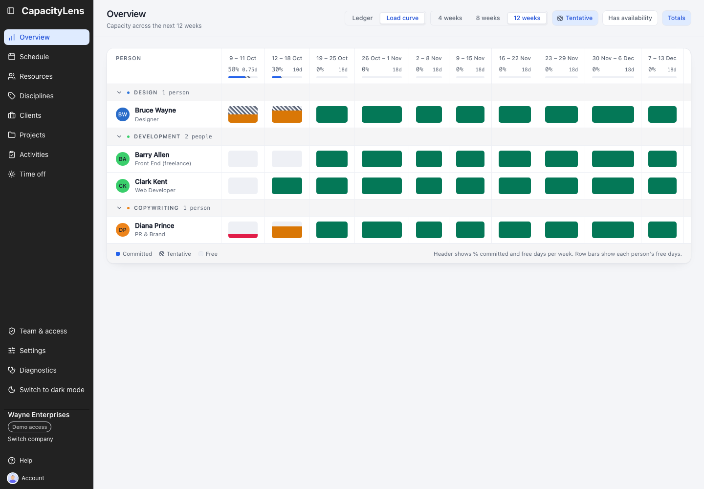
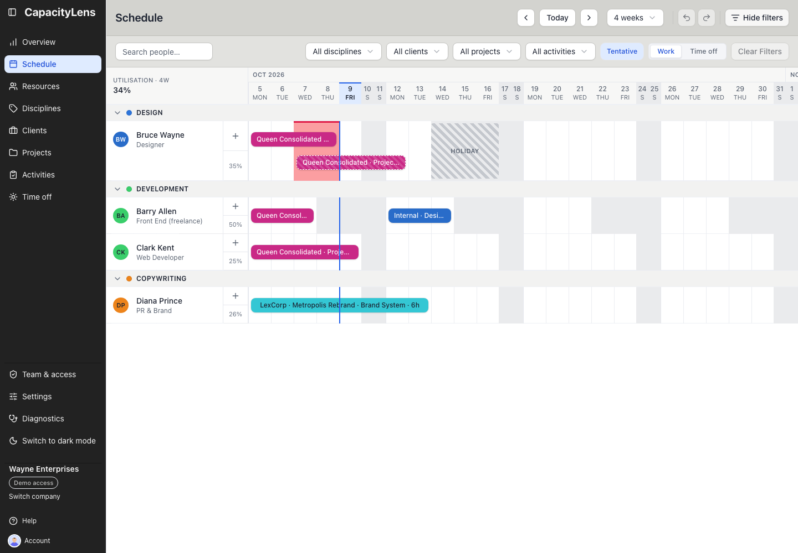
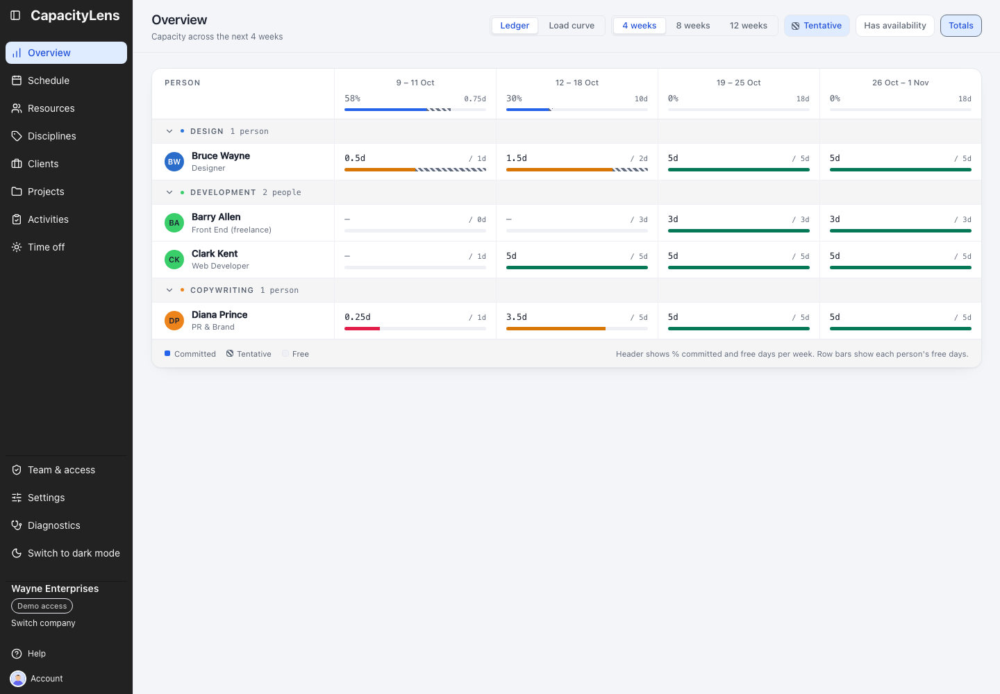

# Overview

Overview shows who has room for more work, one week at a time. It starts with the rest of this
week and the next three weeks.

Ledger shows free days and a horizontal bar. Grey hatching marks tentative work.

Has availability filters the table to people with spare capacity.

Totals adds each week's committed percentage and free days above the table.

Turn Tentative off to see capacity without provisional bookings.

## Look further ahead

Choose 8 weeks or 12 weeks to look further ahead. Every column is still one week; scroll across
the table to see the later weeks.

Load curve replaces the figures with vertical bars. Hover a cell for its figures, or
switch back to Ledger.

The avatar beside a name opens that person's [work list](/using/read-the-schedule#your-work-list).

If Overview is missing from your menu, your company may restrict access.

Overview does not show capacity figures in Blocks mode.

## Find available capacity

Open Schedule in the left menu. Use Today and Weeks visible to choose the period to compare.

Show filters lets you narrow the schedule by person, discipline, client, project or activity.

The utilisation percentage beside each person uses the dates currently visible. An empty cell alone does not prove availability: working patterns, time off and closures also affect capacity.

### Compare the team in Overview

In Overview, select Has availability to find people with spare capacity.

If Overview is missing from the menu, ask an Admin about access.

## Open the overview

Overview shows who can take work during the remainder of this week and the complete company
weeks that follow. The four-, eight- and twelve-week choices each show one column per week. It
uses the same working patterns, time off and company closures as the Schedule.

Choose **Overview** immediately above **Schedule** in the sidebar. The table shows active people
in the same order and groups as the Schedule. Each group row names its group and people count;
external resources and archived or deleted people are excluded.

Each week cell shows a person's free days out of their capacity for that week, for example
**2d / 5d**. Beneath the figures, a bar fills with the share of capacity still free:

- green when at least 80% of the week is free;
- amber when at least 40% is free;
- red when less than 40% is free.

Tentative work appears as a grey hatch after the free portion of the bar. A muted dash replaces
the figure when the person has no free time, whether fully booked or unavailable. An overbooked
week prints the overbooked days in red in place of the capacity figure; the bar itself only ever
shows free time, so overbooking never paints it. Hover the cell to read the full breakdown.

Free capacity is rounded down to the nearest quarter-day. Overbooking is rounded up. Weekly totals
calculate from exact values before rounding.

If placeholders are enabled, their allocations appear separately as **Unassigned demand**. This
demand is rounded up to the nearest quarter-day, is not counted as people capacity, and never
carries a bar.

Hover or focus a person's avatar to reveal an eye icon. Selecting it opens that person's
read-only schedule drawer, covering the current company week and the following three weeks
rather than the Overview's own columns, without changing the table's filters or scroll
position — the same drawer as [the schedule](/using/read-the-schedule).

## Choose a cell display

**Ledger** starts selected and shows the figures and a horizontal bar in every cell.

Choose **Load curve** for a vertical fill that rises with the person's free share of the week.
The tentative hatch sits above it.

Hover a cell to read its figures, or return to **Ledger**.

Switching between the two changes only the inside of each week cell. The header, group rows and
column widths stay exactly where they are.

## Choose a planning horizon

The horizon control starts at **4 weeks**: the remainder of the current company week followed by
the next three complete company weeks. Choose **8 weeks** or **12 weeks** to add complete company
weeks, one column each. Scroll horizontally to reach the later weeks.

The subtitle under the page title states the horizon in use.

Every horizon follows the company's Monday or Sunday week start. Column headings show each week's
date range, so a range crossing a calendar year reads in context without repeating the year.

The choice resets to **4 weeks** when you reopen Overview or reload the page. It is temporary page
state, not a company or device preference. Switching it keeps your tentative-work, availability,
totals and display-mode choices, as well as collapsed groups.

## Filter the table

**Tentative** starts on. Turn it off to recalculate people's capacity and unassigned demand from
confirmed allocations only; the tentative hatch disappears from every bar and total.

Turn on **Has availability** to show only people with at least 0.25 free days in any displayed
week. Placeholders remain when they have displayed demand.

## Show weekly totals

**Totals** starts off. Turn it on to add a second header row above the table with, for each week
across the people currently shown:

- the percentage of their combined capacity committed to confirmed work;
- their combined free days;
- a bar with the committed share in blue and the tentative share as a grey hatch.

The percentage turns red once committed and tentative work together reach 90% of the week. Hover
a total to read the committed days, capacity and tentative days behind it. Adding or removing the
totals row never moves the columns.

Companies using Blocks mode see an explanation because Blocks do not measure capacity. Switch to
Hours or Days in **Settings** to use the overview.

## Control access

Overview is available to Owners and Admins by default. An Owner or Admin can open **Settings**,
find **Overview access**, and choose **Admins**, **Admins & Editors**, or
**Everyone**.

The chosen access applies to both the sidebar link and the direct `/overview` route.

This setting controls who can open the page, not the underlying data: everyone with sign-in
access to the company already receives the same allocations and resources through the schedule.

## What's next

[Schedule work](/using/schedule-work) for the person with room, or read the [Schedule](/using/read-the-schedule)
for filters and the day-by-day grid.
