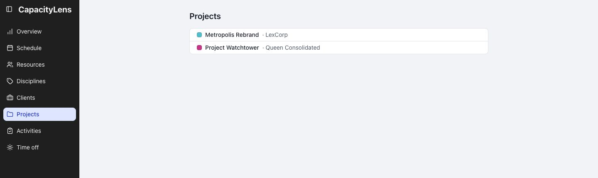

# Projects

Each project shows its client alongside it.

Open Schedule → Show filters and select the project to see its bookings.

[More about Schedule filters](/guide/the-schedule#filtering-and-searching)

[Add or change projects](/guide/projects-and-allocations#clients-and-projects)
