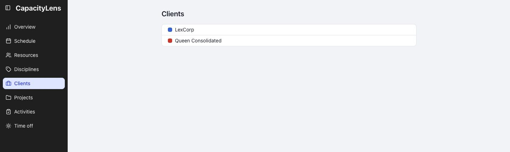
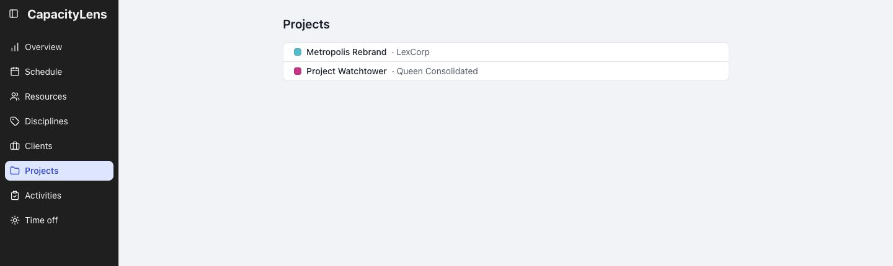
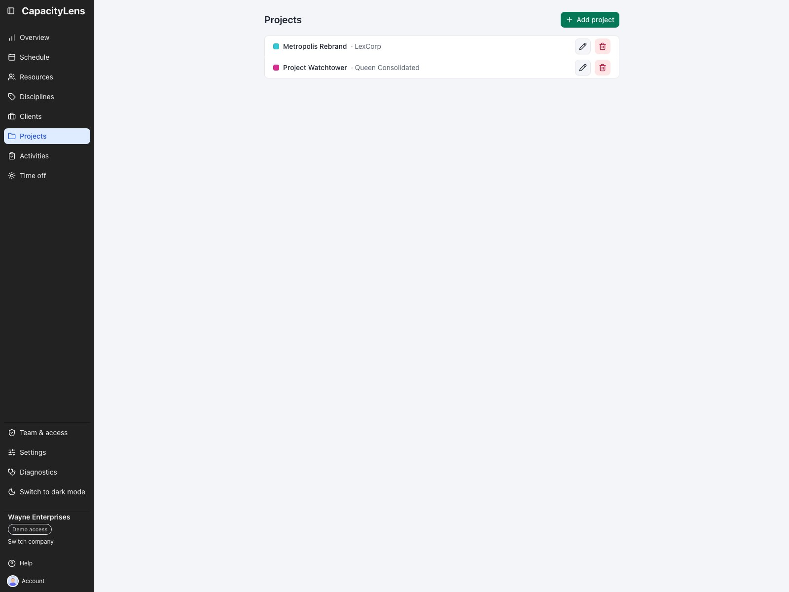
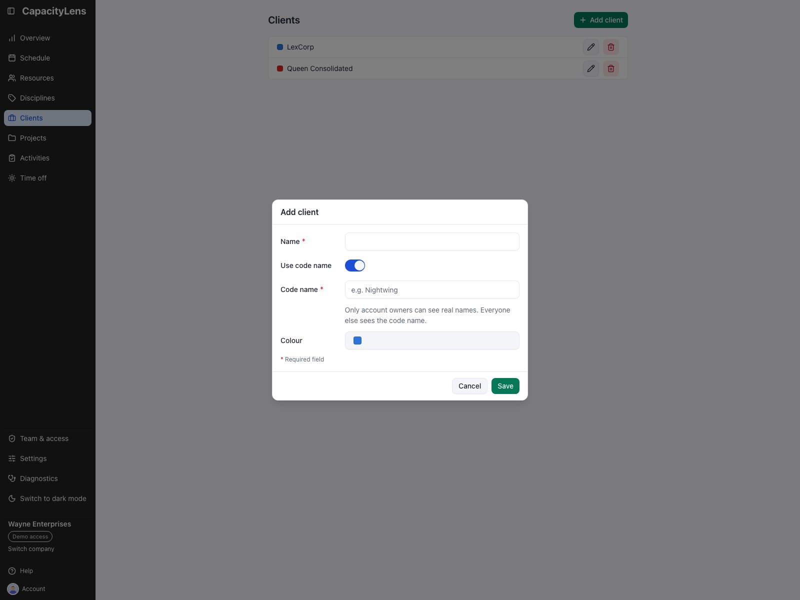
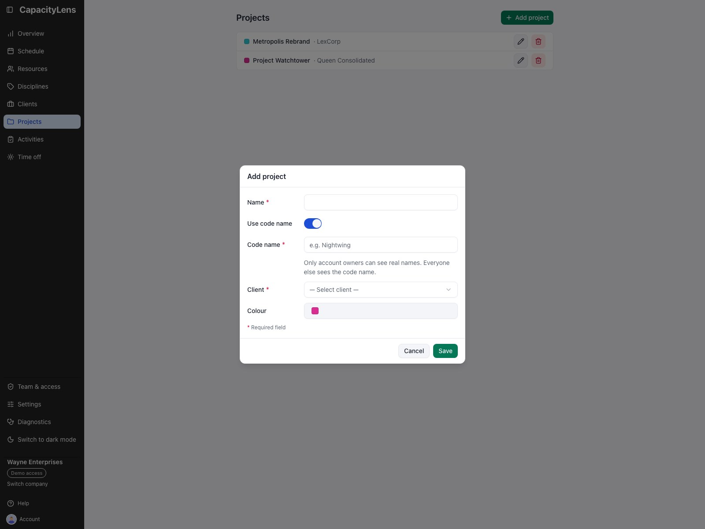

# Clients and projects

Work in CapacityLens hangs off a simple shape: a client owns projects, and a project
owns the [activities](/reference/glossary) people are actually booked against.

## Clients

To see a client's scheduled work, open Schedule → Show filters and select the client.

## Projects

Each project shows its client alongside it.

Open Schedule → Show filters and select the project to see its bookings.

Both filters are described with the rest of the [Schedule filters](/using/read-the-schedule#filtering-and-searching).

## Add clients and projects

1. Open **Clients**.
2. Click **Add client**, then give it a name and a colour.
3. Open **Projects**.
4. Click **Add project**. Every project belongs to a client, so choose one from the
   list.

The Clients page keeps its rows alphabetical. The Projects page sorts first by client,
then by project within that client. A private client's or project's code name controls
its alphabetical position when one is set. Each row still puts the project name first
and shows its client in grey as supporting information.

Every company starts with one built-in client called **Internal** for non-billable
work — general admin, internal meetings, anything that isn't client work. It can't be
renamed or deleted. Its projects, and every internal activity, always appear in neutral grey on the
schedule, so the project form hides the colour picker once **Internal** is the client.

If a client or project name shouldn't be visible to most of the team — an
unannounced prospect, for example — turn on **Use code name** when you create or edit
it. The explanation below **Code name** confirms that everyone below Owner sees the
code name instead of the real one; only the Owner sees both. See [Roles and permissions](/getting-started/roles-and-permissions)
for what each role can see.

## What's next

[Activities](/using/activities) explains the work people are booked against, and
[Schedule work](/using/schedule-work) puts it on the schedule.
