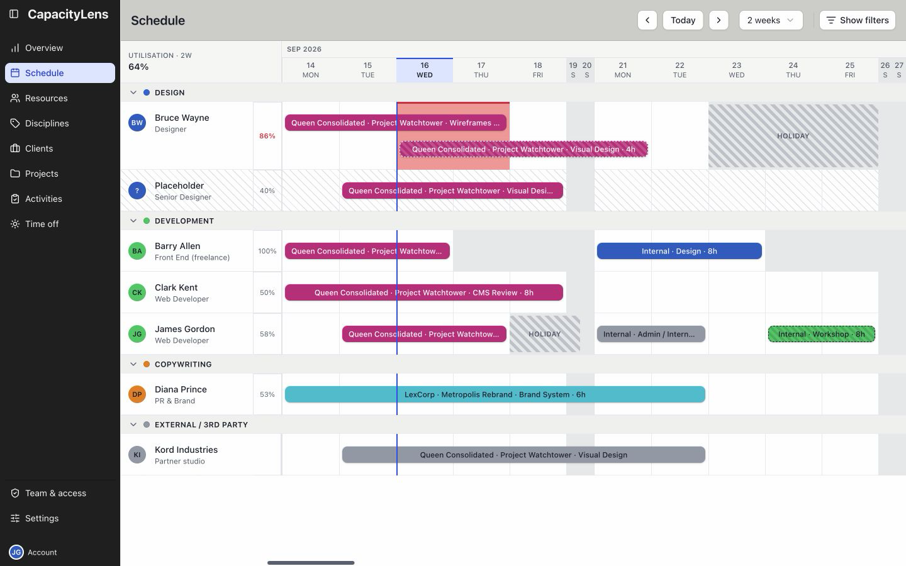
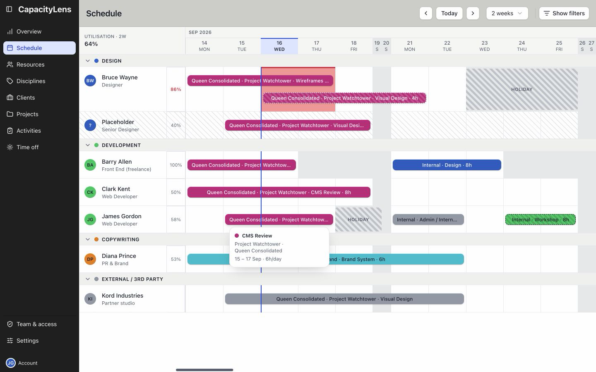
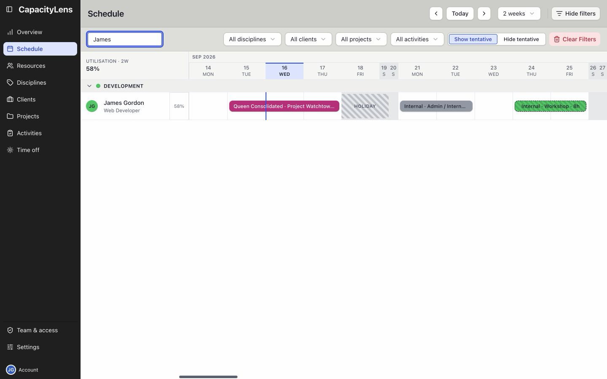

# Schedule

Open Schedule in the left menu. Select the avatar beside your name to open your work list.

Hover over the avatar or move keyboard focus to it to reveal the eye icon.

## Your work list

The list covers the current company week and the following three weeks.

It combines your bookings and personal time off.

Changing the main Schedule's dates or filters does not change this four-week range.

## Booking details

Hover over a booking, or focus it with the keyboard, to see its details.

If your role allows editing, click the booking to open its editing form.

## When the work you expect is missing

Select Show filters to search for your name or narrow the schedule with a client, project,
or activity filter.

Clear Filters removes a search or filter.

Today returns the grid to the current week.

If you still cannot find yourself, ask your agency's Admin to check your access and schedule.

## More schedule detail

- [Search and filter the schedule](/guide/the-schedule#filtering-and-searching)
- [Understand utilisation and overbooking](/guide/the-schedule#reading-overwork)
- [Schedule work](/using/schedule-work)
- [Move or change a booking](/using/change-work)
