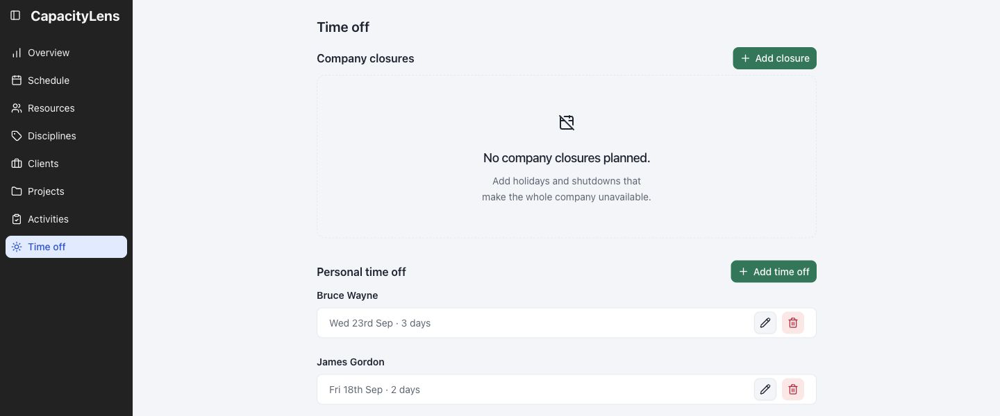
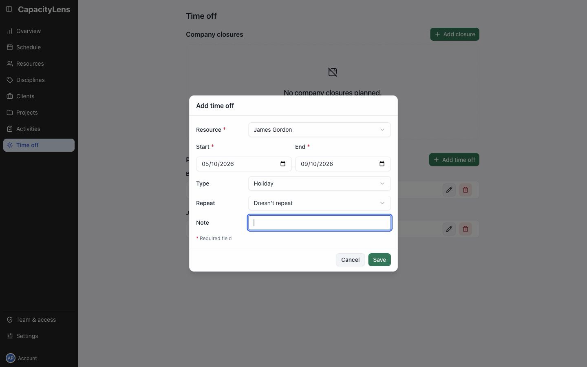

# Record time off

Editors, Admins, and Owners can record personal time off. Viewers can see the resulting absence but cannot add or change it.

Open Time off from the left menu and select Add time off.

Choose Resource, Start, End and Type, then select Save.

If you add a Note, only Admins and Owners can read it.

The saved absence appears as a hatched block on the person's row and those dates have no available capacity.

## Use the schedule as an alternative

Open Schedule, select Show filters, and choose Time off beside Work. Click the plus button on a person's row or drag across the dates. The Add time off form opens with the person and dates preselected.

External parties cannot have personal time off.

Switch the draw mode back to Work after saving.

Read [Time off](/guide/time-off) for repeating absence, company closures, and conflicts with allocations.
