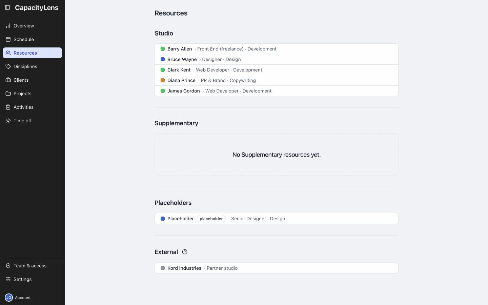

# Resources

Each person's role and discipline appear beside their name, where supplied.

A Placeholder holds bookings that still need a person assigned.

To see someone's work, open their work list on [Schedule](/using/read-the-schedule#your-work-list).

[People, placeholders and external parties](/guide/people-and-placeholders)

[Add scheduled people](/admin/add-people)
