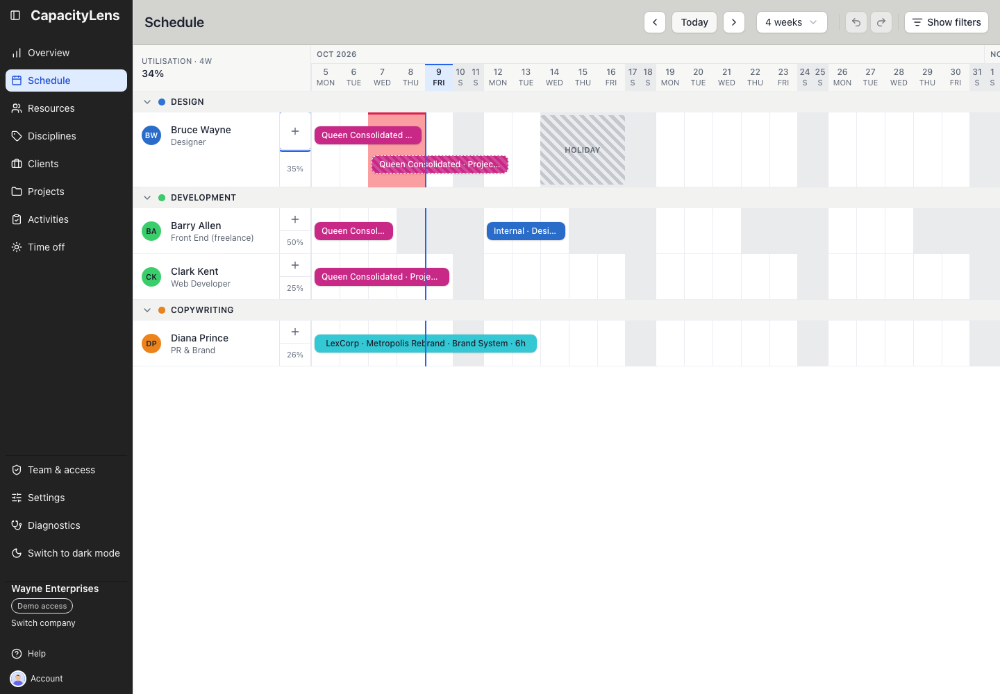
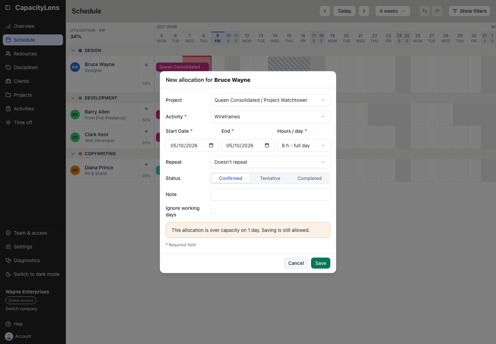
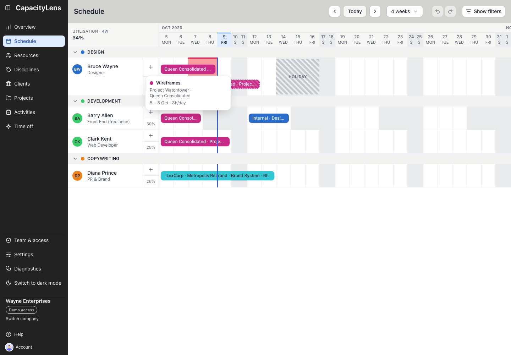
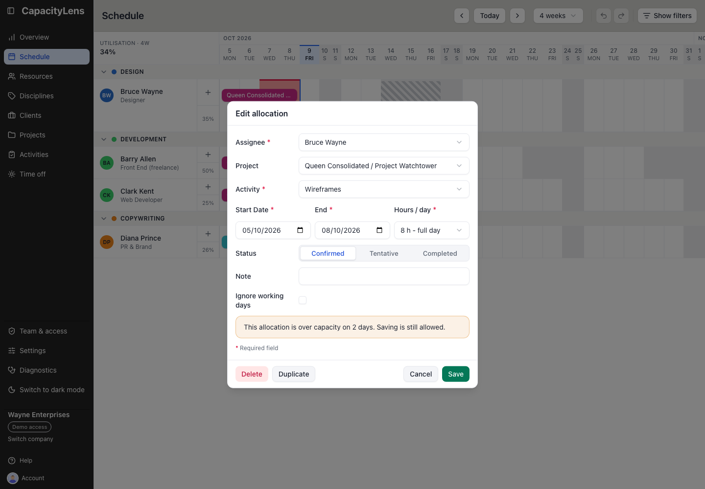
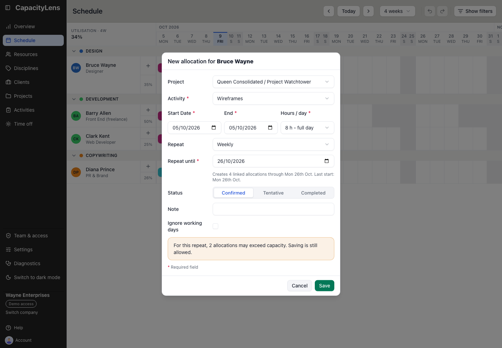
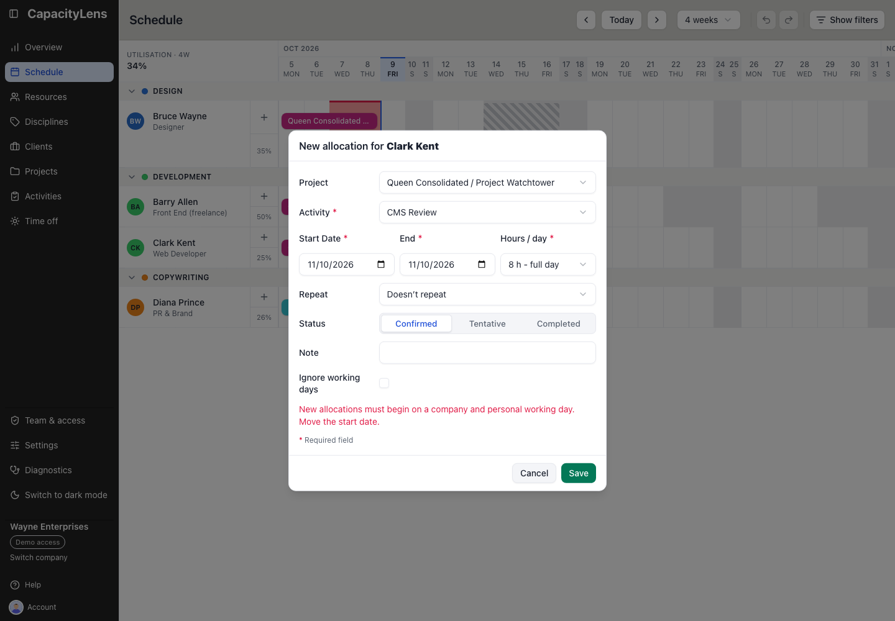

# Schedule and change work

An [allocation](/reference/glossary) books a person's time against an activity for a date range
and appears as a bar on the [Schedule](/using/read-the-schedule). Clients, projects and
activities come first: see [Clients and projects](/using/projects) and [Activities](/using/activities).

## Schedule work

Editors, Admins and Owners can add bookings. You need a person in Resources and an activity to book.

Open Schedule in the left menu and select the plus button on the person's row.

To choose dates on the grid, drag across an empty part of their row. Select one empty cell
for a one-day booking; a single click opens the form for that day.

Choose Project, then Activity. Use Internal or No specific project when the work has no project.

Check the dates, amount and status, then select Save. The booking appears on the person's row.

## Change or remove scheduled work

Editors, Admins and Owners can change bookings. Open Schedule in the left menu.

### Move or reassign a booking

Drag the middle of the bar along the same row to move it earlier or later. Drag it onto another person's row to reassign the work.

The booking keeps its working length, so a different working pattern can change the calendar dates it spans.

### Change the date span

Drag the left or right edge of the bar to change its start or end date.

### Edit details or delete the booking

Click the bar to open Edit allocation. Change the assignee, project, activity, dates, amount, status, task, or note, then select Save.

To remove the booking, open Edit allocation and select Delete.

Use Undo in the toolbar, or Ctrl/Cmd+Z, if you remove or change the wrong booking.

## Create an allocation

There are two ways to book a person's time on the schedule:

1. Click the **+** button on their row, which opens the allocation form pre-filled
   with the visible week.
2. Draw it directly: click and drag across the days you want on that person's row.

Either way, choose **Internal**, **No specific project**, or a real project. Internal
shows only internal activities. No specific project shows only
[All-projects activities](/reference/glossary#all-projects) and leaves the booking
unattributed. Real projects follow after a divider in client-and-project order. Their
activity picker shows the shared **All projects** group first, followed by that project's
**Project-specific** group. Each group is alphabetical.

Choosing an All-projects activity under an active project whose client is also active makes that
booking count towards the project. The schedule uses the chosen project for the bar's client and project label,
colour and filters. The activity itself remains shared, so another booking can count
towards a different project. When you edit the booking, choosing **No specific project**
clears that attribution. Existing unattributed bookings stay unattributed until you make
that choice explicitly.

If the activity you need doesn't exist yet, create it on the **Activities** page. Your
company can opt in to an inline **Add activity** option in [Settings](/using/settings).
When enabled, adding one under a real project creates a project-specific activity and
places it in that group.

Status is a compact **Confirmed**, **Tentative** or **Completed** choice. Notes are
single-line. If **Show task field in schedule** is enabled in [Settings](/using/settings),
the form also offers an optional single-line **Task** description beneath the activity controls.
The task is shown above Notes in schedule details and is preserved when the setting is turned off.

When the company plans in Hours, **Hours / day** is a four-option select: **1 hour**,
**Quarter day (2h)**, **Half day (4h)** or **Full day (8h)**. If an existing allocation
stores a different number of hours, the closed select keeps showing that exact value. It
is not rounded; choosing one of the four options is an explicit change.

Leave **Ignore working days** unchecked to follow the person's effective working week — the days
in both the company's [company-wide working days](/using/settings#company-wide-working-days) and their own
pattern. Check it when the allocation must use every calendar day in its date span, including
company and personal non-working weekdays. Either way, a new allocation must start on an effective
working day that isn't covered by the person's time off — the checkbox never changes where a new
allocation may begin. To place work over closed days, create it starting on an open day with the
checkbox ticked, then drag or extend it onto the closed days. If the assignee has an availability
date range, the placement must also stay within that inclusive range. **Ignore working days** does
not bypass those date boundaries. Existing bookings that become outside the range stay visible, and
metadata edits remain possible; only a new or placement-changing date/assignee edit is blocked.

External-party allocations already use literal calendar spans, so they do not show this checkbox.
On a regular-width screen, the form keeps its labels in a narrow left column and aligns the controls
on the right. On a narrow screen, each label stacks above its control so nothing is clipped.

For regular work, choose **Weekly**, **Every 2 weeks**, **Every 3 weeks**, **Every 4
weeks** or **Monthly** under **Repeat**, then set the required **Repeat until** date. The
cutoff cannot be before today or the allocation start, must include at least one repeat,
and can be no more than six calendar months after the allocation starts. The form shows
the inclusive cutoff, how many linked allocations it will create and the final start date;
an occurrence may finish after the cutoff when it starts on or before it. Save once to
create the complete group. One Undo removes that group; after creation, you can edit each
occurrence independently. Deleting a linked occurrence lets you remove only that occurrence
or it and every future occurrence in the same series. Leave **Doesn’t repeat** selected for
a single allocation. When the activity is All projects, every occurrence copies the chosen
project attribution.

## Edit, move and remove allocations

- **Move** a bar by dragging it to a different set of days, or drop it on another
  person's row to reassign the work. A vertical reassignment keeps its start date: if that
  date is outside either the company or person's working pattern, or outside that person's
  availability date range, the drop is rejected and the original allocation stays put. An allocation
  with **Ignore working days** enabled may use recurring non-working dates literally, but it still
  cannot cross the person's availability boundaries.
- **Reassigning** keeps a booking's length, not the calendar dates it was drawn over. Two days of
  work run Thursday to the following Tuesday for someone who works neither Fridays nor Mondays.
  Give it to a Monday-to-Friday colleague and it becomes Thursday and Friday. It stretches back out
  on the return trip. The bar shows the length you will get while you drag, and does not move at all
  when the drop will be refused.
- **Resize** a bar from either edge to change its start or end date. A new placement outside the
  assignee's inclusive availability range is rejected atomically.
- **Open** a bar to change its status between tentative, confirmed and completed, or
  to duplicate or delete it. Duplicate is available for unlinked allocations, but not
  occurrences in a linked repeat series. Deleting can be undone from the toolbar, or
  with Ctrl/Cmd+Z.

Archiving a project temporarily hides every booking attributed to it. Restoring the
project brings those bookings back with their attribution intact. Permanently deleting
the project removes its project-specific work, but a shared All-projects booking remains
and becomes unattributed.

## How allocation granularity works

An allocation is a date range plus how much of the day it takes — there's no
hour-by-hour calendar and nothing resembling a timesheet to fill in. How you enter that
effort depends on your company's scheduling mode, set in [Settings](/using/settings):

- **Hours** — set a start date, an end date and hours per day directly.
- **Days** (the default for a new company) — say how many days of work you need and how
  many days to spread them over; CapacityLens works out the hours per day for you.
- **Blocks** — book someone for a span of days with no hours at all, for work that
  shouldn't count toward the utilisation figures.

Changing the mode does not rewrite existing allocations, and an existing company's saved choice is
preserved.

Whichever mode you use, CapacityLens is planning capacity, not logging time worked —
there's nothing to submit at the end of the week.

That's as fine-grained as scheduling gets — there are no budgets, timesheets or
hour-by-hour calendars. [What is CapacityLens?](/getting-started/what-is-capacitylens)
explains why those lines are drawn where they are.

## What's next

[Time off](/using/time-off) covers marking someone unavailable, which the allocation
form will warn you about if it overlaps a booking. [Find available capacity](/using/overview#find-available-capacity)
before booking more work.
