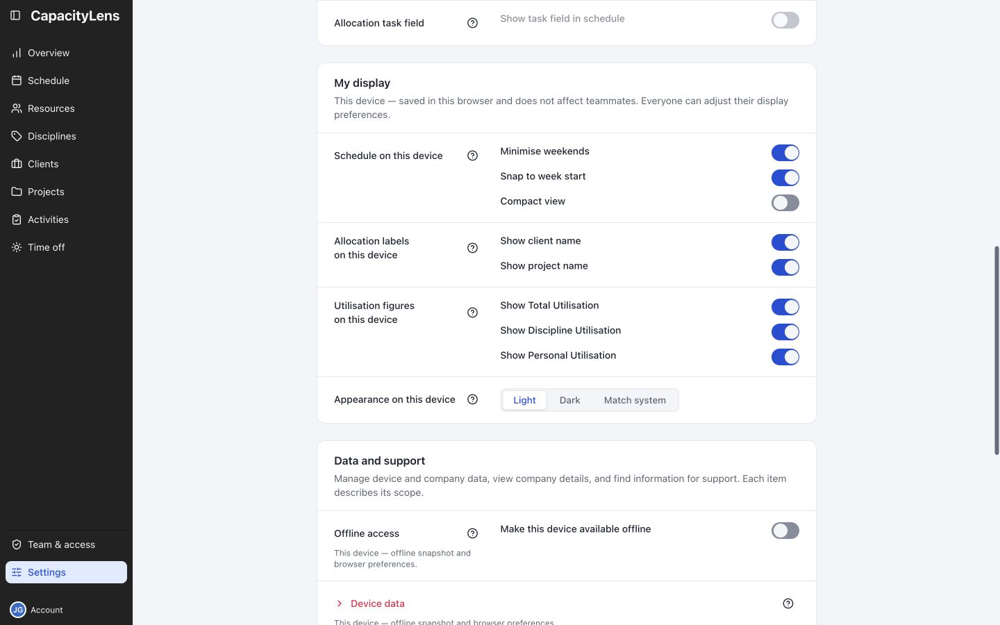

# Settings

Open Settings near the bottom of the left menu and find My display.

Adjust spacing, booking labels, utilisation figures or appearance. These choices apply to this browser.

If your company is preparing to use company login exclusively, Owners and Admins also find **SSO
cutover readiness** in its own group after **Company setup**.

[Display options](/guide/settings#my-display)

[Offline access](/guide/offline-access)

[Company settings — for people managing the plan](/admin/company-settings)
