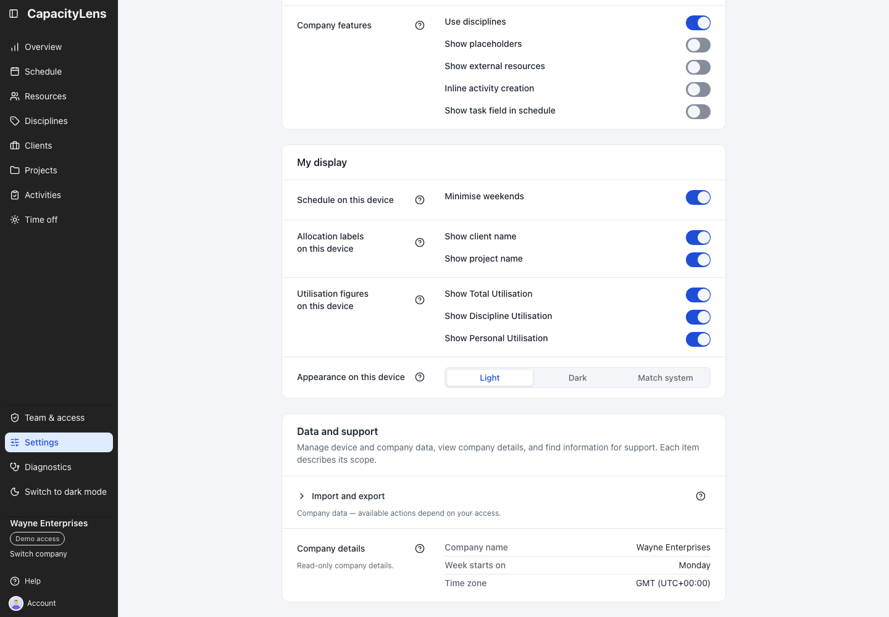
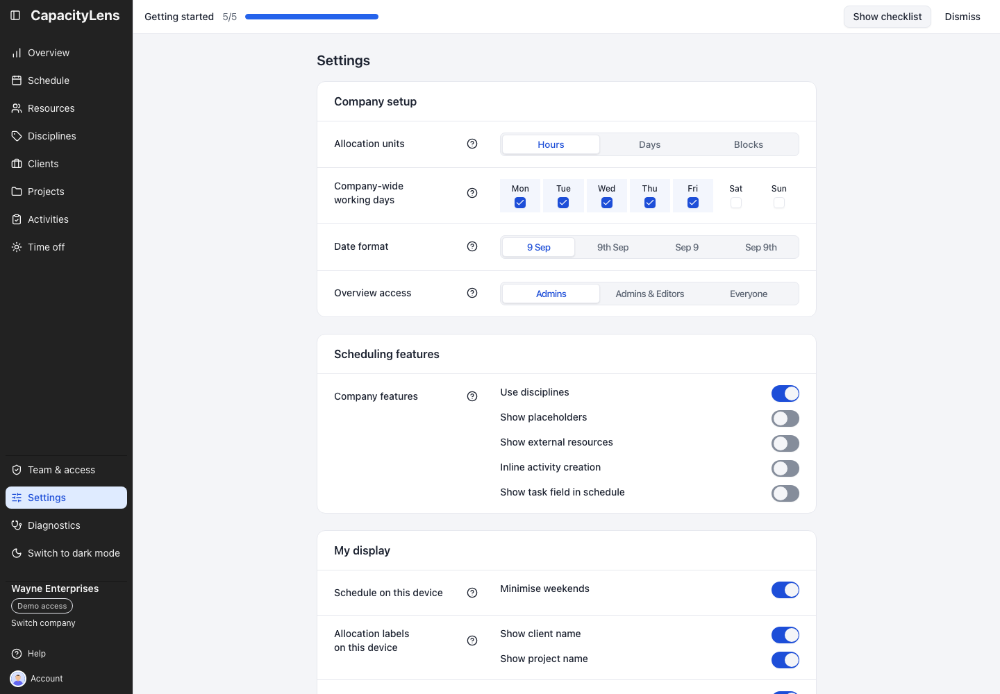
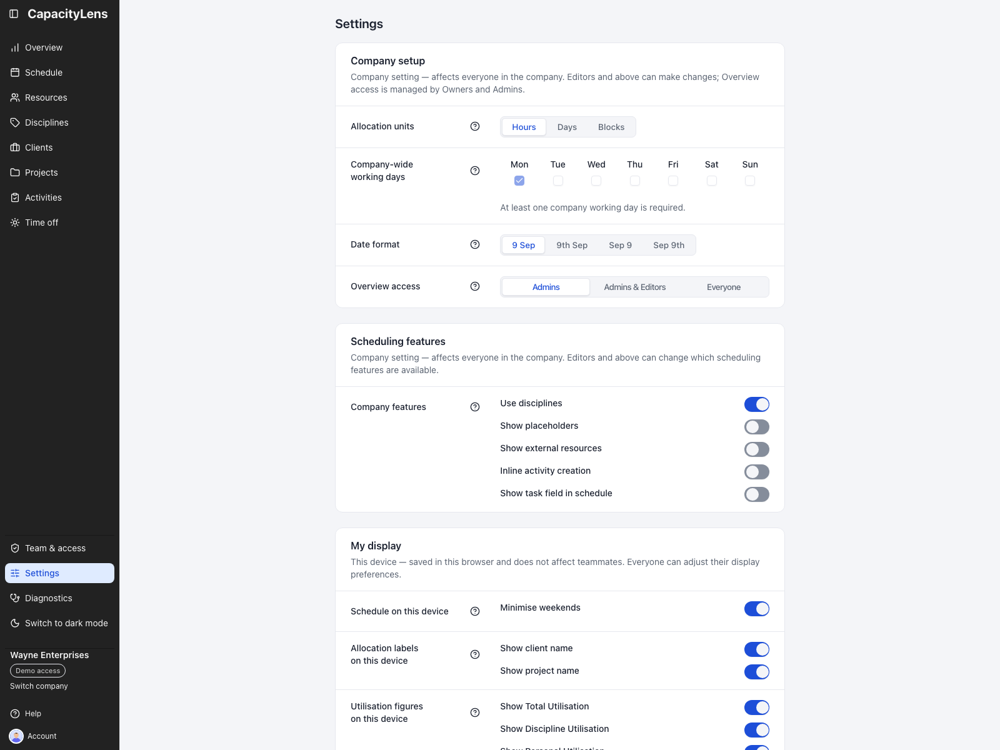
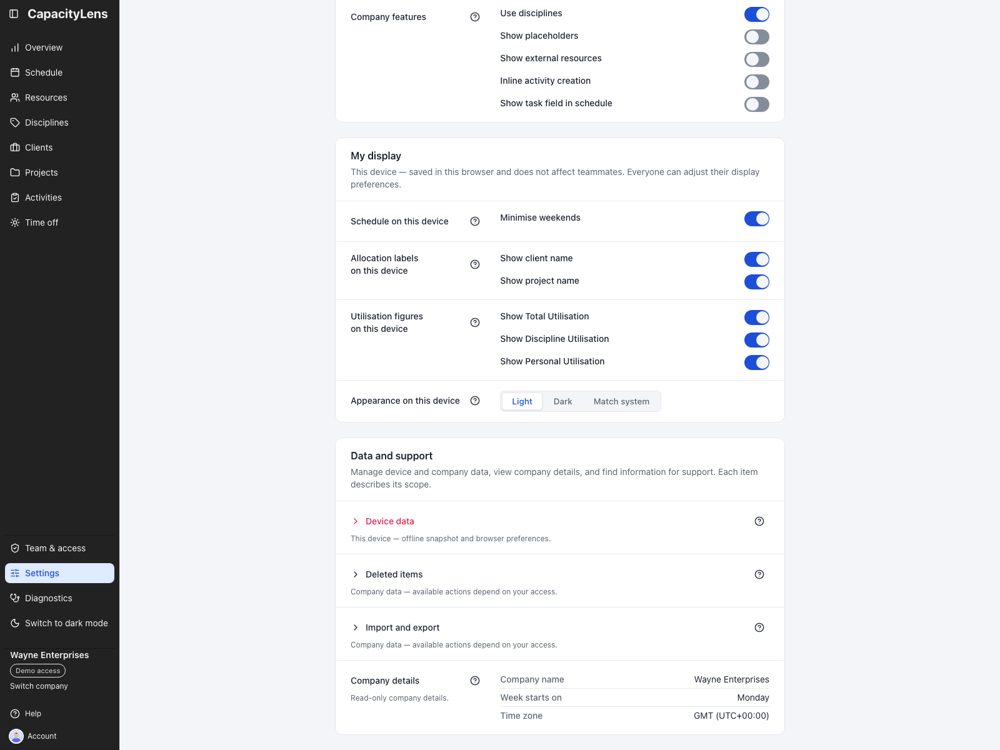
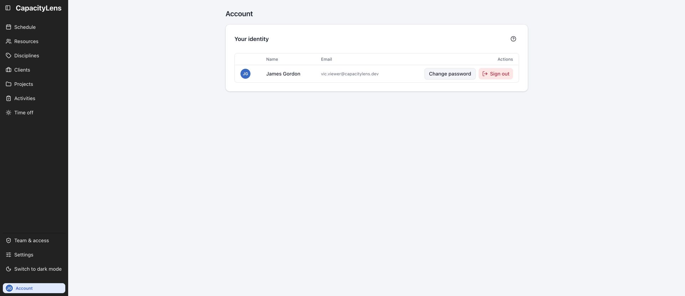

# Settings

Open Settings near the bottom of the left menu and find My display.

Adjust spacing, booking labels, utilisation figures or appearance. These choices apply to this browser.

[Company settings — for people managing the plan](/admin/company-settings)

## The settings page

Open **Settings** to find company rules, scheduling features and display preferences on one
scrollable page. Four groups are always present:

| Group | Scope and access |
| --- | --- |
| Company setup | Allocation units, working days, date format and Overview access. Editors and above can change planning settings; only Owners and Admins manage Overview access. |
| Scheduling features | One **Company features** section of company-wide switches. Editors and above can change them. |
| My display | Preferences saved in this browser. Everyone can adjust them without changing a teammate's display. |
| Data and support | Example data when available, import and export, offline access, and read-only company details. Available actions depend on your access. |

Labels and controls sit beside each other on wide screens and stack on narrow screens.
Each row has a question-mark button labelled **About &lt;section&gt;**: hover it
for that short label, or activate it to open the fuller explanation without keeping that
text on the page.

## Company setup

These settings affect everyone in the company. Editors and above can change them, except
**Overview access**, which is managed by Owners and Admins.

### Allocation units

Choose whether allocations are entered as **Hours**, **Days** or **Blocks**. New companies
start with Days; existing choices are preserved. See [Schedule and change work](/using/schedule-work).

### Company-wide working days

**Company-wide working days** is the company's shared working week. Seven abbreviated
weekday labels appear with their checkboxes, beginning with the first day of the company's
configured week. Each label and checkbox share a larger clickable target, while the checkbox
remains keyboard-operable and keeps the full weekday name for assistive technology. The targets
wrap on narrow screens. New companies select the first five days. You can select any combination,
but at least one day must stay checked: when only one remains, its checkbox and label are disabled
with an explanation until another day is selected.

Each person works the days that are ticked here **and** in their own working pattern. Days outside
that combination hold no capacity: allocations skip them, they count for nothing in utilisation,
and on such a start date the lane does not show the hover **+**, clicking or beginning a draw does
nothing, and a typed start date, a duplicate or a reassignment is rejected with the same rule. A
draw that begins on an allowed date may still cross blocked dates. The per-allocation
**Ignore working days** checkbox makes that allocation use every calendar day in its span and lets
an existing allocation be dragged or extended onto closed days — it never changes where a new
allocation may start — and time off stays a separate, visible conflict. A person's optional
**Start date** and **End date** add an inclusive
date boundary: capacity is zero outside the range, existing load remains visible, and Ignore
working days does not bypass it. New or placement-changing work outside the range is rejected, while
metadata edits and existing conflicting allocations remain allowed.

For example, if the company works Monday to Friday and Bruce Wayne works Monday, Wednesday and
Friday, his capacity and ordinary allocations use Monday, Wednesday and Friday.

Changing the selection recalculates capacity, utilisation and conflicts for existing allocations.
Allocation dates never move, but work on newly non-working days no longer counts unless the
allocation has Ignore working days enabled.

### Date format

**Date format** sets how planning dates read for everyone in the company: **9 Sep**,
**9th Sep**, **Sep 9** or **Sep 9th**. It applies to single calendar dates and ranges,
including dates on the Schedule and Time off pages. Editors and above can change it; a
Viewer sees the control disabled. The choice can be undone and takes effect without a reload.
It belongs to the company, but is not included in the JSON downloaded from **Import and export**.
Importing scheduling data preserves the destination company's settings, including its date format.
Compact weekday dates on the Time off page always retain the ordinal: with **9 Sep** selected,
a Wednesday appears as **Wed 9th Sep**.

A range crossing a year normally shows the year at both ends. The narrow week headings on
Overview are the deliberate exception: neighbouring columns provide the year context, so those
headings omit it.

Dates attached to server events use your browser's locale and local time zone instead.
These include session creation and expiry, password-reset expiry, invitation expiry in the
administration list and on the invite acceptance page, ownership-transfer deadlines, ownership
outcome dates and the offline banner's last-updated time. Your time zone decides which local day
or hour the instant falls on, while your browser locale decides the date order. The administration
list's invitation expiry or an ownership outcome may show only the date; it still follows this
viewer-local rule. Existing date-and-time displays, including invite acceptance and offline
last-updated, keep their time. CapacityLens never takes the date by cutting it from the stored UTC
timestamp.

### Overview access

Overview is limited to Owners and Admins by default. An Owner or Admin can choose
**Admins**, **Admins & Editors**, or **Everyone** under **Overview
access**. The setting controls both the sidebar link and direct access to the page. See
[Overview](/using/overview).

## Scheduling features

The **Company features** section holds every company-wide switch, in this order: **Use
disciplines**, **Show placeholders**, **Show external resources**, **Inline activity creation** and
**Show task field in schedule**. Editors and above can change them. **Use disciplines** starts on for a
new company; the other four switches start off. Turning a switch off hides that feature without deleting any data, and it returns when
you turn the switch back on.

Internal projects and activities are always shown and always use neutral grey bars, so there is no
setting for them.

<!-- Compatibility anchor for existing links to resourcing options. -->

### Disciplines

**Use disciplines** groups people by [discipline](/reference/glossary), such as Design or Development,
across the app. Create discipline names and colours on the standalone **Disciplines** page in the
main navigation. See [Resources](/using/resources).

### Placeholders and external resources

**Show placeholders** and **Show external resources** are independent switches. A
**Placeholder** is an unfilled role or tentative person you can use to plan future capacity
before someone is assigned. An **External resource** is a third party — such as a partner agency,
freelancer, supplier or subcontractor — that represents work leaving your team and carries no
capacity.

### Inline activity creation

New activities normally start on the **Activities** page, where your team can agree and
reuse consistent names. The allocation form still lets everyone pick an existing
[activity](/reference/glossary).

To let people create an activity without leaving an allocation, turn on **Inline
activity creation**. This workspace setting is off by default. Turning it on adds the inline **Add activity** controls for everyone who can
edit allocations; turning it off again hides only those controls and does not remove
activities or allocations.

### Allocation task field

Turn on **Show task field in schedule** to add an optional single-line **Task** description to the
allocation editor. It is off by default. Enabled task text appears above Notes in schedule details
and the person's schedule drawer. Turning the setting off hides the field and text without deleting
it, so re-enabling the setting restores existing tasks.

## My display

Everyone can adjust these preferences. They are saved in this browser and do not change a
teammate's display.

### Schedule on this device

**Minimise weekends** under **My display → Schedule on this device** narrows Saturday and Sunday in
this browser so the working week gets more room. Weekend work still appears in those columns. It is
a device preference, not company data, so it does not change a teammate's schedule or travel with
an export.

### Allocation labels on this device

Choose whether allocation bars show the client name and project name ahead of the activity name.

### Utilisation figures on this device

Choose which utilisation figures appear on this browser's schedule: total, per-discipline and personal.

### Appearance on this device

Choose **Light**, **Dark** or **Match system** for this browser's colour scheme.
For a quick explicit switch between light and dark, use the moon or sun button directly below
**Settings** in the sidebar. It switches to the opposite of the scheme shown, including when
**Match system** follows a dark device, and remains available when the sidebar is collapsed.

## Data and support

This group contains example data when available, import and export, read-only company details and
offline access. Available actions depend on your access.

Settings does not show the Device data or Deleted items sections. Archived items remain available
from their Resources, Clients, Projects or Activities pages. The destructive device-data cleanup
control is also not available in Settings.

### Offline access

Offline access is for reading the schedule on a train or a flaky connection, not for
editing it. This section covers what it does, what it deliberately doesn't do, and how to
turn it on.

::: warning
Offline access is read only. While you're viewing a cached [snapshot](/reference/glossary),
create, edit, delete, import and membership actions are all unavailable — CapacityLens
never queues an edit to apply later, and it never tries to merge one.
:::

#### Turn it on

Offline access is off by default and turned on per device, not per company.

1. Sign in on the device you want to use offline.
2. Open **Settings** and turn on **Make this device available offline**
   under **Offline access**.

Once it's on, CapacityLens keeps a copy of the last company you opened, stored on that
device only.

#### What you get

- The schedule, people, projects and time off exactly as they last loaded successfully
  while you were online.
- Automatic use of that snapshot if a request can't reach the server at all — you'll
  see a banner explaining you're looking at cached data.

<!-- screenshot: Offline banner shown at the top of the schedule while viewing a cached snapshot -->

- A snapshot that's good for seven days. After that, it's gone, and you'll need a
  connection to see anything.

#### What you don't get

- Any way to create, edit or delete anything while offline. The moment a cached
  snapshot is shown, your access drops to read only for everyone, regardless of your
  normal role.
- Edits that queue up and sync later. There's nothing to reconcile, because nothing was
  ever recorded. That's deliberate: you never lose work to a sync conflict, and you
  never discover that your "saved" changes went nowhere.
- Offline access for a company you haven't opened before, or one you haven't opened
  recently enough to still be within the seven-day window.

#### When it refreshes

Every time you successfully load the schedule while online, the offline snapshot
updates in the background. If the server is reachable but returns an error, or a
request takes too long, CapacityLens shows a retry screen instead of silently falling
back to old data — so you're never looking at a stale schedule without knowing it.

#### Turning it off

Turning off **Make this device available offline** in Settings — or signing out —
clears the cached snapshot and everything CapacityLens stored to protect it on that
device. Settings currently has no control to clear all CapacityLens preferences from the browser.

::: warning
Don't turn on offline access on a shared or borrowed device. The cached snapshot is
encrypted on disk, but anyone using the browser while you're signed in can still see it
through the app itself, same as any other page.
:::

### Example data

Owners and Admins see **Example data** only while the company shows no people, clients, projects or
allocations. **Add example data** adds two people, a client, a project and a few bookings across this
week and next. They are ordinary records, so delete them like any others. The server refuses the
request if the company already holds any of these, including archived or deleted people, clients and
projects.

<!-- Compatibility anchor for existing links to import and export. -->

### Import and export

**Export JSON** downloads scheduling records for the current company. **Import JSON** replaces
those records after confirmation; in signed-in server deployments, only an Owner can import.
The destination company's settings, including date format, stay unchanged. Browser preferences
are not part of this file.

### Company details {#calendar}

This read-only summary shows the company name, week start and time zone.

The company's week start and time zone apply to the whole team. Week start controls the
order of days and where each week begins. Time zone is selected during company creation from a
searchable list of supported IANA zones, with the browser's local zone preselected. It determines
which calendar date counts as "today".

Both choices are frozen after the company is created. Settings shows them in the
read-only **Data and support → Company details** summary so everyone can check the
company-wide values, but nobody can change them there.

Owners and Admins can find build details and copy a fuller support report on the separate
[Diagnostics](/admin/diagnostics) page.

## Your personal account

Your personal account is outside the **Data and support** group. It is reached through the
sidebar's **Account** row.

Open **Account** at the bottom of the sidebar to review your identity and the security controls
available for your sign-in method. Real and demo sessions can also **Sign out** from that page.
With one accessible company, real authentication hides the company context and switch; with two
or more, the sidebar retains them. These are personal controls, separate from the company settings
on this page. Your identity picture is also personal. When your identity provider supplies one,
the **Account** page shows it; a company administrator does not set it while creating or editing a
resource.

If a selected company cannot be loaded, a recovery screen hides the previously open company's
data. **Retry** loads the selected company again without changing your selection, or you can choose
another company.

For local-password identities, Account offers **Change password** in a dialog. A configured company
provider can show its connection controls. Provider sign-in may hide the local password control;
required multi-factor checks are managed by the provider. There is no local authenticator setup
control in the current installation. A long email is truncated, and its full address is available on hover or keyboard focus. Active
session details are hidden. See [Account](/using/account) for password, provider and recovery steps. Demo mode identifies the fictional persona; installations with
sign-in off have no credential controls or sign-out action.

## What's next

[Resources](/using/resources) and [Schedule work](/using/schedule-work) cover team structure and
booked work in more detail.
