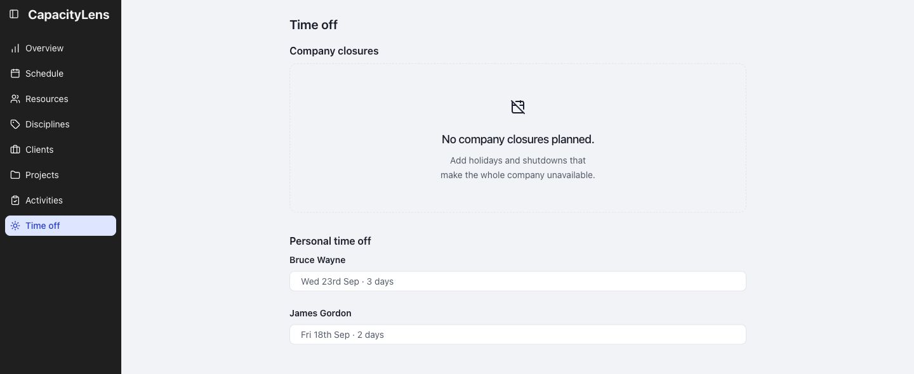
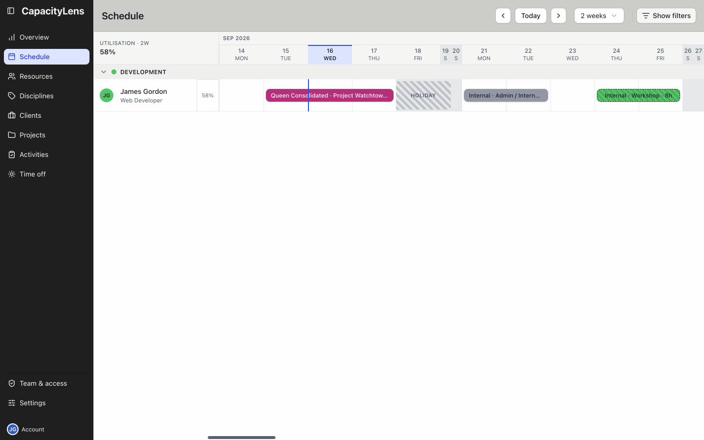

# Time off

Find your name under Personal time off to check recorded absences.

Company closures appear separately above it. The page shows current and upcoming entries.

## On Schedule

The same absence appears as a hatched block beside your planned work.

Time-off notes are visible only to Owners and Admins.

[Record or change time off](/using/record-time-off)

[Repeated absences and company closures](/guide/time-off)
