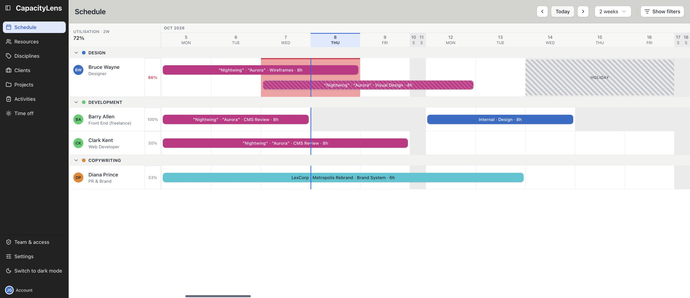
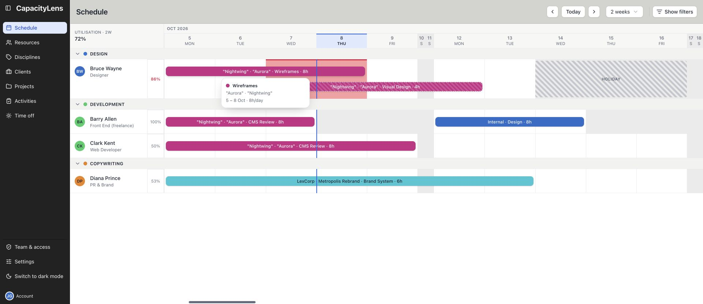
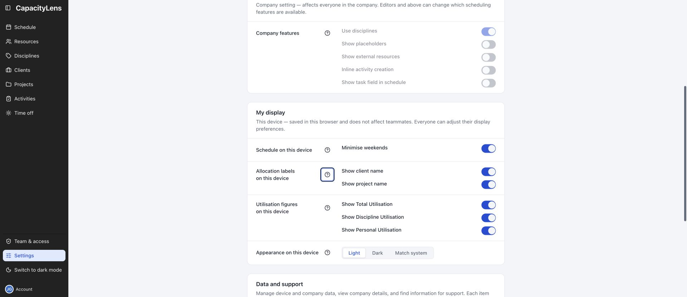

# Check the plan as a Viewer

A Viewer can read the company's planning data and use personal display controls. This is the
right role when you need to check work rather than change the team's plan. Editing bookings,
resources, time off and company settings requires Editor access or above.

## Join and check your access

Open the invitation or company joining link your Owner or Admin supplies. Use the authorised
email address and follow [Join your team](/using/join-your-team). An invitation, a reusable joining
link and a sign-in account have different purposes; signing in does not by itself admit you to a
company.

After joining, open **Team & access** near the bottom of the menu to check your company and role.
If several companies are available, use **Switch company** to select the intended one. Ask an
Owner or Admin when that company is missing or when your duties require a different role.
Open **Help** just above Account for a short Viewer tour and links to the user guides.

Your scheduled resource is separate from membership. An Admin can link your membership to the
right person on the schedule. If there is no link yet, you can still find that person's row by
name.

## Find and understand your work

1. Open **Schedule** in the left menu and select **Today**.
2. Use **Weeks visible**, **Prev** and **Next** to choose the period you want to inspect.
3. Select **Show filters** to find the person, client, project or activity you need. Clear a filter
   when expected rows or work disappear.
4. Read the bars on the person's row. Their dates, amount and status describe planned work;
   tentative work is provisional.
5. Open the avatar beside the person's name for the read-only work list. Close it to return to
   the shared schedule.

[Read the schedule](/using/read-the-schedule) shows the grid, filters, bar details, work list and
keyboard controls. A Viewer can inspect a booking, but cannot move, resize, reassign or delete it.
Ask the person responsible for the plan when something needs changing.

## Read availability in context

Utilisation beside a person describes the dates currently visible. A separate warning looks
forward over the next two weeks. A blank date or a low percentage is not the whole story: working
patterns, company closures, personal time off and existing bookings also affect availability.
At 100% a person is fully booked, not over capacity; over capacity means more work than available
time. Blocks do not measure capacity.

If **Overview** is available, it compares free capacity week by week. Choose **4 weeks**,
**8 weeks** or **12 weeks**, use **Has availability**, and decide whether to include **Tentative**
work. [Overview](/using/overview) explains the figures and rounding. The page is restricted to
Owners and Admins by default, so a missing menu link is expected until your company allows Viewers
to use it.

## Check people, work and time off

**Resources** shows scheduled people and their working patterns. **Clients**, **Projects** and
**Activities** describe the work used by bookings. **Disciplines** appears when your company has
that feature enabled. These pages are useful for reading even when you have no edit buttons.

**Time off** shows personal absences and company closures. You can see their effect on the plan,
but time-off notes are restricted to Owners and Admins. Private client and project real names are
visible only to the Owner; everyone else uses their code names. A missing confidential field is
an access rule, not a failed load.

Use [Resources](/using/resources), [Clients and projects](/using/projects),
[Activities](/using/activities) and [Time off](/using/time-off) for the specific page controls.

## Make the display comfortable

Open **Settings → My display** for spacing, booking labels, utilisation figures and appearance.
These preferences apply to this browser. Company-wide controls are read-only for a Viewer;
changing your display does not change another person's plan or preferences.

Open **Account** at the bottom of the menu to check your signed-in identity and its available
personal security controls. Use **Sign out** when you have finished on a shared device.
[Settings](/using/settings) and [Account](/using/account) explain the available choices.

An export is an optional planning-data download, not a system backup. Viewer exports omit archived
and deleted records and use confidential code names. A Viewer cannot import data. Do not mistake
a restricted export for a missing record in the live company.

## When you need help

### Why are there no buttons to add or change work?

That is expected for a Viewer. Ask an Owner or Admin for Editor access if your responsibilities
include maintaining the plan. Do not try to work around a hidden control with a direct URL.

### Why is a person or booking missing?

Check the company, selected dates and active filters first. The record may also be archived, or a
feature such as placeholders or external resources may be disabled. Ask the person managing the
plan if the expected work is still absent.

### Why can I not open Overview or Diagnostics?

Overview depends on the company's access setting. Diagnostics is reserved for Owners and Admins.
You can still read the Schedule; ask an Admin to review capacity or collect a support report when
needed.

### What if the page cannot load or shows an offline banner?

Use the offered retry or company-recovery control. An offline snapshot is always read-only and
expires after seven days. It may be older than the live plan; reconnect before relying on a recent
change. [Day-to-day FAQ](/using/faq) covers connection and access interruptions.
