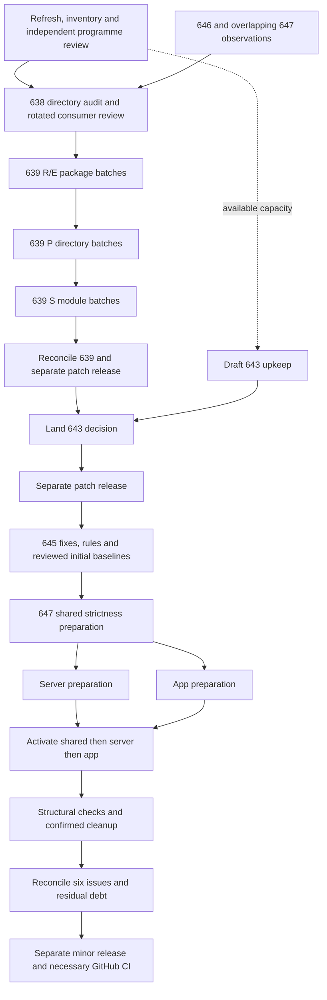

# Code conventions: audit, debt retirement and upkeep

Status: authorised 2026-09-07 (revision 4). Audit base: `d9824dfd3d7df3006a810e7368795fda08f9bd7f`, version 0.60.1-alpha.1.
Issues: #638 (audit), #639 (debt retirement), #643 (upkeep), #645 (enforcement),
#647 (strictness and structure), #646 (boundary and error dispositions).
Previous batch (conventions page and lint baseline, PRs #640–#642) is complete; its plan is in git
history.

AGENTS.md governs everything not stated here. No build, test or CI reads this file. This plan
records the authorised programme. Each implementation batch starts after its dependency and
independently reviewed footprint are ready.

## Outcome

Every non-test file in the typed packages has been read against
`docs-src/reference/conventions.md`, each deviation is a cited row with a class and a proposal,
the rows are triaged into batches that retire the debt without touching any stable identifier,
and a standing decision says how the page and its lint baseline are kept current.

## Rules for the programme

- **Order and releases.** Milestone 1 lands C3 (#638), then bounded C4 retirement (#639), then
  one separate patch release. Milestone 2 lands C5 (#643), then one separate patch release.
  Milestone 3 lands #645 enforcement, #647 strictness/structure and final #646 dispositions,
  then one separate minor release. Derive versions from settled main: absent intervening releases,
  0.60.2-alpha.1, 0.60.3-alpha.1 and 0.61.0-alpha.1.
- **Parallel preparation.** Audit directories are disjoint and collectively exhaustive. #646 and
  overlapping #647 observations feed C3 once. Independent C4 footprints may be prepared and
  validated together; renames precede parameters, then result changes. C5 may be drafted earlier
  but lands in milestone 2. Server and app strictness preparation can overlap after shared
  contracts settle; activation remains shared, server, then app.
- **Hard exclusions, all tasks.** No change to wire fields, SQL names, routes, environment
  variables, ids, emails, test-ids, released migrations, database fixtures or exported shared and
  externally consumed contracts, except an explicitly authorised named export with complete
  consumer footprint in a reviewed batch. This applies to every class, strictness and removals.
  Keep compatibility exports, including `AuthMode`. Docker-specific work is deferred; mutation
  tests are excluded throughout this programme.
- **Tooling scope.** C3–C5 add no dependencies, scripts, lint rules or tooling. Separately scoped
  #645/#647 batches may introduce their requested rules and compiler settings after review.
- **Baseline policy.** Existing file/rule counts never increase or transfer to another file or
  rule. Each newly introduced rule may receive one independently reviewed initial baseline with
  frozen file/rule/declaration inventory and classified residual findings; it only shrinks from
  then on and is never re-enrolled. Baselines must not hide confirmed unfixed defects. Enforced
  rules with residual debt do not mean every violation has been eliminated. C4 closure concerns
  its original convention debt and confirmed incorporated findings; milestone 3 owns new-rule debt.
- **Central ownership.** One coordinator owns compiler/lint configs, suppressions, package/lock
  files, changelog, plan/audit records and generated docs. Implementation briefs state this
  exception: owners propose central changes; the coordinator integrates and prunes them.
- **Footprint is the contract.** Each batch names source, test, import, re-export, filename and
  string consumers, fixed decisions, permitted discretion, preserved guarantees and checks.
  Out-of-footprint changes require revised review. Each writer uses a fresh feature branch and
  sibling worktree from fetched main. Implementation owners return signed commits without push
  or history rewriting.
- **Stop rule.** After two failed focused fix attempts, stop that owner's attempts and obtain an
  independent diagnosis. A boundary unable to preserve a listed guarantee is reported with the
  obstacle, changed files and smallest remaining step; independent work continues.
- **Validation.** Prose: focused Prettier and citation checks, plus documentation build where
  applicable. Code owners run focused tests, applicable typecheck, touched-directory lint and
  formatting. The coordinator runs `pnpm run gate`, `pnpm run gate:server` and `pnpm run e2e`
  under Node >=24 on the accepted integration tree. Disjoint batches may share that evidence;
  changed trees need refreshed checks. Keep one full-validation owner and one E2E process.
- **GitHub CI.** Every non-minor-release PR carries `[skip ci]`, including functional PRs.
  The minor release dispatches `gate.yml` and waits for success; no other pre-merge CI is
  required for this programme. Do not dispatch mutation or
  Docker workflows. Verify relevant run state and distinguish intentional skips from green checks.
  Review complete outgoing content, use DCO and normal merges, then verify issue, merge and branch
  cleanup. Merges to main remain at least five minutes apart for the alpha host.
- **Deadline.** Target 17:30 UTC / 18:30 London on 7 September 2026. Check scope/toolchain in the
  first 15 minutes; forecast within 60 minutes, at audit triage, after the first accepted gate,
  and after each batch or 30 minutes. Reserve measured validation/release time, provisionally
  90 minutes. Report an evidenced overrun and unfinished scope; never turn delay into accepted debt.

## Batch briefs

### C3 — Audit (#638)

**Facts.** The lint scope is `src/**`, `shared/src/**`, `server/src/**` and `server/scripts/**`
(`eslint.config.js`, conventions block). The ownership table in
`docs-src/reference/development.md:227–236` names ten owner areas, but leaves out directories
that hold much of the code: `src/lib` (38 non-test files), `src/components` outside the scheduler
(13 at the top level plus feature subdirectories), `src/hooks`, `server/src` at its root (49) and
`server/scripts`. So the audit unit is the directory, not the ownership row. Baseline at
e07278b8 (`eslint-suppressions.json`): `max-params` 252 (server/src 144, src/components 41,
src/lib 27, shared/src 20, src/data 10, other 10) and `naming-convention` 15 (ten `COLS_<table>`
constants in `server/src/tables/columns.ts`, one PascalCase `let` in a test, four negated names).
Known deviations recorded on the page: `ensureInternalClients` twice with different contracts,
`validateAuthUser` (a parse with a flag parameter), the four `validate*` return shapes,
`ensureBarColors`, `getRow` returning `undefined`, `isUnavailable` with four positional
parameters, `Status` and `OfflineCacheWriteResult` naming. Surveys at 3bb01646 also found one
exported `find*` (`findUserIdsByEmail`, `server/src/auth.ts:192`), four `handle*` names in
`src/`, and `resolveTheme(pref)` outside the abbreviation list. `tasks/plan-consensus.md` and
`tasks/plan-review.md` are leftovers of maintainability batch 2, whose plan is in git history.

**Fixed decisions.**

- Output is one file, `tasks/conventions-audit.md`, landed by its own docs-only pull request. It
  holds one table per directory with the columns `file:line` (at the audit base SHA), `symbol`,
  `rule` (the page section and bullet), `class`, `proposal` (the new name or signature), and
  `consumers` (every importer, re-export path, owning filename that must follow a principal
  rename per `development.md:161–168`, test file and string pin that the change touches). A
  symbol with two deviations gets two rows, one per rule (`validateAuthUser`: rename and flag
  parameter).
- Classes: `R` rename within one file; `E` rename of an export with callers in other files; `P`
  parameter shape (positional list to options type); `S` result shape (return type changes);
  `X` excluded by the hard exclusions, with the identifier named; `D` accepted debt, with the
  reason. Every row has exactly one class.
- Scope: every non-test file in the actual conventions globs and ignores in `eslint.config.js`: app
  TS/TSX, server source/operator TS, and shared TS/TSX/MTS/CTS. Record every read file, including
  zero-finding files. The four JavaScript operator scripts have separate context coverage outside
  the typed conventions block. Tests are not audited for prose rules; test files
  appear only through the `consumers` column and through baseline entries. Every
  `eslint-suppressions.json` entry, including entries in test files, is resolved to its
  declarations (the baseline records only file, rule and count) and each declaration gets its own
  classified row: a suppressed name is `R`, `E` or `X` on its own merits (`notInAccount` in
  `shared/src/domain/tenancy.ts:25` is a package export, so `E` or `X`, never `R`), a suppressed
  parameter list is `P`, `X` or `D`.
- Every row cites a line at the base SHA and quotes the rule it breaks. A row without a rule is
  not a finding. The page is not changed by the audit; a rule the audit finds unworkable becomes
  a `D` row with the reason and a note for C5.
- Development/import/TSDoc observations outside the six convention classes have a separate
  disposition ledger: actionable with an owning issue, nonviolating with evidence, or outside
  scope with the boundary named. A taxonomy gap alone is never accepted debt.
- The audit changes no code and proposes nothing on stable identifiers beyond an `X` row.
- Triage is part of C3: the file ends with the C4 batch list, each batch naming its class, its
  directories, its row count and its focused tests.
- The two leftover batch-2 files in `tasks/` are deleted in the same pull request.

**Permitted discretion.** How directories are grouped into tables; row order; proposal wording;
whether one directory with under five rows is folded into its parent's table.

**Files.** `tasks/conventions-audit.md` (new), `tasks/plan-consensus.md` and
`tasks/plan-review.md` (deleted), `tasks/plan.md` (completion record).

**Focused tests.** `pnpm exec prettier --check tasks/conventions-audit.md`; ten randomly chosen
rows resolve at the base SHA (`git show <sha>:<file> | sed -n <line>p`).

**Done.** Audit merged; a comment on #638 gives the row count per class and links the merge; the
C4 batch list is in the file.

### C4 — Debt retirement (#639)

**Facts.** `docs-src/reference/development.md:179–180` requires explicit compatibility exceptions
for package exports and externally consumed symbols; AGENTS.md "Naming and module contracts"
says naming changes never alter wire fields, stable identifiers or released migrations. ESLint
prunes the baseline with `pnpm exec eslint . --prune-suppressions`; an unpruned entry fails
`pnpm run lint`. Renames of exported symbols ripple into tests and, for `shared/`, into both
`src/` and `server/`; a principal rename moves its owning filename and test filename
(`development.md:161–168`). `P` rows on package exports exist (`rangesOverlap`,
`shared/src/lib/dateMath.ts:122`, four positional parameters, called with that signature in
`dateMath.test.ts:111–118`), so `P` changes call expressions in tests as well as sources. A
result-shape change (`S`) changes every caller's control flow.

**Fixed decisions.**

- Batches run in class order, each on its own branch and worktree: `R` and `E` renames grouped
  by package (`shared/`, `src/`, `server/`; at most one pull request per package per batch), then
  `P` grouped by directory, then `S` one module per pull request. A required principal-file
  rename that would otherwise transfer existing parameter suppressions is an inseparable `E+P`
  exception: retire every old-file suppression in the same reviewed batch before moving the file,
  with no new-path entry. Cohesive collections retain their capability filenames; this exception
  never creates a reason to move them. A rename inseparable from a result representation stays
  with that result-owning module (B677/B759). Connected callback or authorizer interfaces and
  implementations form one signature batch under their common parent directory; directory
  boundaries never create an invalid intermediate contract.
- Each batch is briefed from the audit rows it takes, and the brief is reviewed adversarially
  before implementation, as for any plan. The brief lists every file the rows touch plus the
  tests that reference the renamed symbols, and names the focused tests.
- The coordinator prunes `eslint-suppressions.json` for each integrated batch; C4 adds no entry. A
  batch that would need a new entry stops.
- Any row of any class that changes a `@capacitylens/shared` export or another externally
  consumed symbol proceeds only when the batch block in this plan records the authorisation for
  that symbol by name together with its complete consumer footprint from the audit's `consumers`
  column; otherwise the row becomes `X` and its baseline entry stays.
- Behaviour is preserved in `R`, `E` and `P` batches: every existing assertion keeps its
  guarantee. Tests may change mechanically to follow the change (renamed identifiers and
  imports, renamed test files, call expressions rewritten to the options type, mock and
  assertion references, string pins), and nothing else. Where a renamed symbol is a returned or
  shorthand object key that is also a wire or contract key, the key keeps its name through a
  local alias. Predicate renames keep their polarity. An `S` batch keeps every existing
  assertion's guarantee and labels any test as moved or new.
- `D` rows are not touched; they stay in the audit file with their reason.

**Permitted discretion.** Batch boundaries within a class; the order of modules inside a batch;
local helper placement where an options type is introduced.

**Files.** Per batch, listed in its brief. This plan gains one block per batch when it is selected.

**Focused tests.** Per batch, listed in its brief; every batch runs `pnpm run lint` with the
pruned baseline.

**Done.** Every `R`, `E`, `P` and `S` row is either landed or reclassified `D` or `X` with a
reason; the baseline holds only the entries of `D` and `X` rows; #639 closed with the merge links.

### C5 — Upkeep (going forward)

**Facts.** In place at e07278b8: `AGENTS.md` "Naming and module contracts" points at the page;
`CONTRIBUTING.md:59` says review checks names, parameters and result shapes against it;
`DECISIONS.md:334–339` names the page beside the development guide; the page's "What lint
enforces" section documents the baseline and the prune command. Not in place: a standing decision
that says the baseline only shrinks, how a new verb or shape enters the page, and where debt that
a batch declines to fix is recorded.

**Fixed decisions.**

- One bullet group added under `DECISIONS.md` "Maintainable module boundaries", after the bullet
  at lines 334–339:
  - Existing `eslint-suppressions.json` file/rule counts only shrink. A change prunes what it
    can and never increases existing counts; new code meets the rules. A newly introduced rule
    may have one reviewed initial baseline with classified residual findings, then only shrinks,
    as specified in the programme policy above.
  - A new verb, abbreviation or result shape enters the page in the same pull request as its
    first use, with a tree example, and is reviewed like code.
  - Debt a batch declines to fix is recorded in `tasks/conventions-audit.md` as `D` with a reason,
    never dropped; the audit issue, which the page names as the place to note untouched
    deviations, links to that record.
- No other file changes. The page itself is not edited by C5.

**Permitted discretion.** Wording.

**Files.** `DECISIONS.md`.

**Focused tests.** `pnpm exec prettier --check DECISIONS.md`.

**Done.** Decision merged; #643 closed with the merge link.

## Milestone 3 acceptance

#645 records exact rules, options and production/test scope; preserves deprecated compatibility
exports while migrating internal consumers; fixes near-zero findings without baseline entries;
resolves unnecessary assertions and boolean comparisons; and classifies the five larger smell
families with meaningful absence/default/error tests. Confirmed defects are fixed before enrollment.

#647 maps both `noUncheckedIndexedAccess` and `exactOptionalPropertyTypes` through
`tsconfig.app.json`, `tsconfig.node.json`, inherited `tsconfig.e2e.json`, `shared/tsconfig.json`,
inherited `shared/tsconfig.test.json` and `server/tsconfig.json`; root references are verified too.
Prepare both flags together within each owned file, preserve public contracts and explicitly test
empty collections, missing records, zero, empty strings, null/undefined, authority and transactions.
No blanket non-null assertions, speculative defaults or type widening to silence diagnostics.
Update `docs-src/reference/conventions.md` with the adopted rules and initial-baseline policy,
then rebuild and commit generated docs. Measure function length, complexity and nesting; review exact settings and one initial residual
baseline against standing tooling decisions. Verify dynamic/string consumers before dead-export
removal, and record justified duplication/removal dispositions.

#646 closes only after every candidate category has a verified disposition. A generic error or
unknown record is not itself a defect: quote the violated rule, respect the conventions page's
deferral to `DEFENSIVE-CODING.md`, and retain nonviolating observations with reasons.

## Completion record

- [x] Remote main and six issue states refreshed at the audit base; Node 24.19.0 and pnpm 11.4.0 available.
- [x] Deadline confirmed: 17:30 UTC / 18:30 London.
- [x] Revised programme independently reviewed; dependency, baseline, export and compiler scope corrections incorporated.
- [x] Exact audit coverage reconciled: 602 typed files, four operator context files and all 267 original suppression declarations. Independent consumer/classification reviews incorporated.
- [x] Audit delivery checks: independent assembly review accepted; ten randomly chosen source citations resolve at the base; Prettier and documentation build pass with generated docs unchanged.
- [x] #638 audit merged in PR #648 (`66eb8a9b`); issue closed and branch cleanup verified: 2,016 rows (R 1,102; E 361; P 276; S 34; X 101; D 142), with 72 triaged groups requiring bounded implementation briefs.
- [ ] #639 original actionable rows retired or justified D/X; closure evidence reviewed.
- [ ] First separate patch release merged and verified.
- [ ] #643 upkeep decision merged and closed.
- [ ] Second separate patch release merged and verified.
- [ ] #645 exact enforcement, fixes and initial residual baselines verified.
- [ ] #647 all intended flags, structural rules and cleanup dispositions verified.
- [ ] #646 all categories reconciled without duplicate findings.
- [ ] Complete final review and required local gates pass on the accepted tree.
- [ ] Separate minor release passes necessary GitHub CI and is verified after merge.
- [ ] Actual finish, residual debt and any unmet criteria recorded.

## Selected retirement batches

### Shared package names — #639

Status: independently reviewed, implementation in progress. Audit group C4-02; 137 R/E rows.

Fixed decisions: names only; public X contracts, persisted keys, positional signatures, result shapes and released migrations remain unchanged. Use `parseSchemaVersion` and `resolveArray` for A096/A098. Existing local comment references follow renamed bindings. All aliases preserve original object keys.

Files: `shared/src/data/internalClient.ts`, `shared/src/data/migrate.ts`, `shared/src/data/migrate/detect.ts`, `shared/src/data/seed/activities.ts`, `shared/src/data/seed/allocations.ts`, `shared/src/data/seed/constants.ts`, `shared/src/data/seed/orgTables.ts`, `shared/src/data/seed/resources.ts`, `shared/src/data/seed/schedule.ts`, `shared/src/data/transfer.ts`, `shared/src/domain/assertions/dependents.ts`, `shared/src/domain/assertions/refs.ts`, `shared/src/domain/importFold.ts`, `shared/src/domain/lifecycle/ancestry.ts`, `shared/src/domain/lifecycle/projection.ts`, `shared/src/domain/lifecycle/types.ts`, `shared/src/domain/mutations.ts`, `shared/src/domain/validationLookup.ts`, `shared/src/lib/color.test.ts`, `shared/src/lib/color.ts`, `shared/src/lib/dateMath.ts`, `shared/src/lib/integrity.ts`, `shared/src/lib/repeatingDates.ts`, `shared/src/lib/sanitize/account.ts`, `shared/src/lib/sanitize/coerce.ts`, `shared/src/lib/sanitize/importedFields.ts`, `shared/src/lib/sanitizeImport.ts`, `shared/src/lib/schedulingDays.ts`, `shared/src/lib/strings.ts`, `shared/src/types/entityHelpers.ts`.

Existing focused tests: `shared/src/data/internalClient.test.ts`, `shared/src/data/migrate.test.ts`, `shared/src/data/seed.test.ts`, `shared/src/data/transfer.test.ts`, `shared/src/domain/mutations.test.ts`, `shared/src/domain/lifecycle.test.ts`, `shared/src/domain/tenancy.test.ts`, `shared/src/lib/color.test.ts`, `shared/src/lib/dateMath.test.ts`, `shared/src/lib/integrity.test.ts`, `shared/src/lib/repeatingDates.test.ts`, `shared/src/lib/sanitizeImport.test.ts`, `shared/src/lib/schedulingDays.test.ts`, `shared/src/lib/strings.test.ts`, `shared/src/types/entityHelpers.test.ts`, `shared/src/packageExports.test.ts`.

Owner checks: shared production/test typecheck, lint over `shared/src`, and formatter over the explicit footprint. The coordinator owns integrated app/server gates and E2E. No new or weakened assertions are needed for names-only changes.
