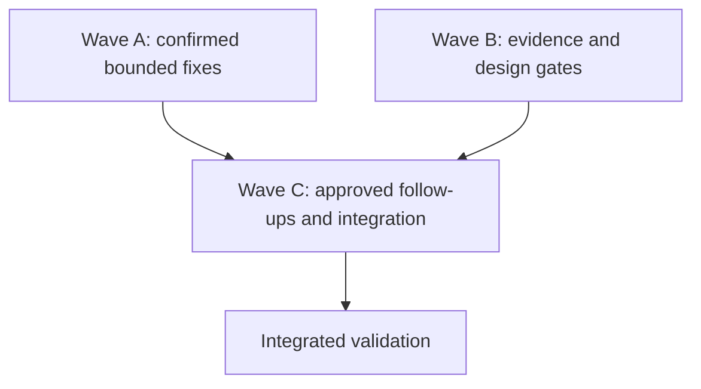

# Race-condition remediation programme

Status: proposed. Line-anchor base: `e39028c88c7c5c819c42c6fa3821f8c422c386fc`
(`origin/main`, 9 September 2026).
Wave issues: [Wave A #702](https://github.com/Kevinjohn/capacitylens/issues/702), Wave B
(submission interrupted), Wave C (pending).

Line anchors below are navigation aids pinned to the stated base. Symbols and owned paths are the
contract: every owner must resolve them again after creating its worktree and stop if an anchor no
longer implements the described behaviour.

This plan turns the concurrency audit into bounded implementation packets suitable for independent
Sol agents at low reasoning effort. It does not authorize implementation until the coordinator
selects a wave and pins its base revision.

## Outcome

Fix confirmed races with deterministic regression tests, validate plausible races before changing
behaviour, and reject findings that depend on unsupported deployment topology or lack a harmful
interleaving. Preserve public contracts, database schema, the single-process SQLite boundary,
account vocabulary, audit guarantees and client persistence semantics.

## Reconciled findings

- **Fix:** nested savepoint failure; import authority after worker processing; import-worker
  settlement; masquerade generation fencing; scheduler draw validation; week-snap timer cleanup;
  allocation-focus RAF cleanup; invite-signup exclusion; server-import exclusion; unmanaged E2E
  server reuse.
- **Evidence or design gate:** account PUT replay/revision ordering; external identity admission;
  reset issuance versus email correction; allocation double submission; auth E2E shared state;
  launcher shutdown and access-lab ownership.
- **Deferred pending a supported interleaving:** generic entity writes/deletes, generated
  Internal-client replacement and whole-state torn reads.
- **Deferred outside the supported topology:** pre-migration temp collision, scheduled-backup temp
  sweep and cross-scheduler retention. CapacityLens supports one server process per SQLite file.
- **Deferred product decision:** concurrent email corrections are currently last-write-wins; no
  identity-row revision contract promises conflict detection.
- **Separate operational improvements:** parallel E2E report paths, OIDC harness namespaces and
  concurrent documentation builds. Track them without representing them as shipped product races.

## Instructions for every implementation owner

1. Work from a fresh `feature/<short-description>` branch and isolated worktree based on the SHA in
   the packet. Read `AGENTS.md`, the complete packet, every editable file and named read-only context.
2. Modify only **Editable paths**. Stop if the fixed decision needs another production file, shared
   type, public contract, schema, migration, dependency, generated file or central configuration.
3. Write a deterministic failing regression test first. Use deferred promises, barriers, worker
   doubles or fake timers. Do not use sleeps or stress loops as primary evidence.
4. Implement the fixed decision without unrelated cleanup or refactoring.
5. Run the focused test, applicable typecheck, touched-directory lint with zero warnings and
   formatter check using Node 24 or newer and `pnpm` only.
6. After two failed focused attempts, stop and report `BLOCKED` with the exact error and smallest
   disputed span.
7. Inspect the diff, stage only owned paths and commit with `git commit -s`. Do not push, merge,
   rebase or reset.
8. Return `DONE` or `BLOCKED`, commit and base SHAs, changed files, new versus moved tests, command
   results, deviations and residual uncertainty.

## Execution order



Wave A packets may run concurrently where editable paths do not overlap. R02 follows R01. Wave B
investigations may run concurrently. Wave C contains only follow-ups approved from reproduced Wave
B evidence, followed by serialized integration.

## Wave A — confirmed bounded fixes

### R01 — Fail closed after nested rollback failure

**Editable:** `server/src/txn.ts`, `server/src/txn.test.ts`.

**Current source anchor:** `server/src/txn.ts:87-105` (`runNestedTransaction`, including savepoint
release and rollback).

**Fixed decisions:** Taint an enclosing transaction when nested rollback cannot be proven complete;
prevent release or commit of tainted work; still attempt top-level rollback; preserve the original
callback error; do not redesign the transaction API.

**Acceptance:** A nested write followed by failed savepoint rollback cannot commit even when the
outer callback catches the error. Cover successful and failed outer rollback, deeper nesting and a
throwing reporter.

**Focused test:** `pnpm --filter capacitylens-server exec vitest run src/txn.test.ts`.

### R02 — Reauthorize imports after worker preparation

**Editable:** `server/src/routes/importRoutes.ts`, new
`server/src/routes/importRoutes.race.test.ts`.

**Current source anchors:** authorization at `server/src/routes/importRoutes.ts:91-109`; worker gap
at `server/src/routes/importRoutes.ts:123-145`; commit-time fingerprint and replacement at
`server/src/routes/importRoutes.ts:162-168`.

**Read only:** `server/src/app.authz.test.ts`, `server/src/requestAbort.ts`, transaction, membership
lock and audit helpers.

**Fixed decisions:** Keep the early authorization check; recheck current owner authority after worker
completion and immediately before mutation; coordinate with the lock used by role changes; preserve
fingerprint conflict handling and atomic replacement.

**Acceptance:** A paused import cannot commit after its caller is demoted, removed or loses the
account. Refused attempts change neither scheduling data nor successful audit state.

### R03 — Settle every import-worker terminal path

**Editable:** `server/src/runImportWorker.ts`, `server/src/runImportWorker.test.ts`.

**Current source anchor:** `server/src/runImportWorker.ts:42-78`; exit handling is at lines `72-76`
and `postMessage` at line `77`.

**Fixed decisions:** Route synchronous `postMessage()` failure through common settlement and
termination; treat every exit before a valid response, including code zero, as failure; settle and
release queue capacity exactly once; preserve queue bounds and termination-before-release.

**Acceptance:** Cover synchronous post failure, zero and nonzero exit, response followed by exit,
abort/response competition and subsequent queued work.

**Focused test:**
`pnpm --filter capacitylens-server exec vitest run src/runImportWorker.test.ts`.

### R04 — Fence masquerade transitions

**Editable:** `src/auth/masqueradeController.ts`, `src/auth/masqueradeController.test.ts`.

**Current source anchors:** start at `src/auth/masqueradeController.ts:70-101`; retry at
`src/auth/masqueradeController.ts:104-119`; server-ended restoration at
`src/auth/masqueradeController.ts:197-243`.

**Fixed decisions:** Every asynchronous operation owns the existing generation; check generation and
expected state after every await and before every publication, history clear, notice or persistence
transition; prevent concurrent starts crossing the initial flush; stale completions are no-ops and
cannot release suspension owned by newer work.

**Acceptance:** Cover start superseded by server end, retry superseded by explicit end, restoration
superseded by a newer transition, simultaneous starts and stale rejection.

### R05 — Exclude repeated invitation signup

**Editable:** `src/components/invites/useInviteAcceptController.ts`,
`src/components/invites/inviteSignupActions.ts`, `src/components/invites/InviteAccept.test.tsx`.

**Current source anchors:** action construction at
`src/components/invites/useInviteAcceptController.ts:161-164`; signup action at
`src/components/invites/inviteSignupActions.ts:139-167`.

**Fixed decisions:** The synchronous latch lives in the stable controller, not the recreated action
factory; acquire before the first await; release after recoverable failure; retain through successful
navigation/reload and unknown-outcome recovery; preserve command identity.

**Acceptance:** Two immediate submissions produce one signup, sign-in and activation flow. A
recoverable failure permits exactly one retry.

### R06 — Exclude overlapping server imports

**Editable:** `src/components/import-export/useServerImport.ts`,
`src/components/ImportExport.persistence.test.tsx`.

**Current source anchor:** `src/components/import-export/useServerImport.ts:127-153`.

**Fixed decisions:** A ref-backed latch is authoritative; acquire before persistence flush; retain it
when `requiresReload` is true; preserve suspension and `dropParkedEdits` semantics.

**Acceptance:** Repeated confirmation produces one POST and one suspension. Out-of-order callbacks
cannot resume twice or discard unrelated parked edits.

### R07 — Cancel invalid scheduler draws

**Editable:** `src/components/scheduler/useResourceLaneInteraction.ts`,
`src/components/scheduler/ResourceLane.test.tsx`.

**Current source anchor:** `src/components/scheduler/useResourceLaneInteraction.ts:36-75`.

**Fixed decisions:** Gesture-local state retains pointer identity and coordinates only; reconcile
against the current resource, calendar window, geometry and availability at pointer-up; cancel when
the original target cannot be reconciled; preserve threshold, direction and cancellation behaviour.

**Acceptance:** Resource/window changes and newly blocked start days cancel. Ordinary rerenders and
reverse spans continue to work.

### R08 — Cancel stale week snapping

**Editable:** `src/components/scheduler/useSchedulerViewport.ts`,
`src/components/scheduler/useSchedulerViewport.test.tsx`.

**Current source anchor:** `src/components/scheduler/useSchedulerViewport.ts:276-293`.

**Fixed decision:** Invalidate pending timer/RAF work when snapping, calendar or semantic geometry
changes.

**Acceptance:** Cover disable-before-fire, zoom/calendar change, normal snapping and unmount.

### R09 — Own keyboard-focus scheduling

**Editable:** `src/components/scheduler/useAllocationGestureController.ts`,
`src/components/scheduler/AllocationBar.interaction.test.tsx`.

**Current source anchor:** `src/components/scheduler/useAllocationGestureController.ts:301-308`.

**Fixed decisions:** Store and cancel the RAF on replacement and unmount; capture and verify the
account identity before querying or focusing; preserve keyboard move and resize behaviour.

**Acceptance:** Cover successful focus, rapid operations, unmount and an account switch containing
the same allocation ID.

### R10 — Refuse unmanaged E2E server reuse

**Editable:** `playwright.config.ts`, new `scripts/playwright-server-reuse.test.mjs`.

**Current source anchors:** demo policy at `playwright.config.ts:45-52`; other reuse settings at
`playwright.config.ts:198`, `205`, `218`, `226`, `243` and `249`.

**Fixed decisions:** Automatically started E2E servers use `reuseExistingServer: false`; explicitly
externally managed rehearsal infrastructure remains unchanged; do not change ports, worker counts,
artifact paths or package scripts.

**Acceptance:** Every configuration branch is covered; an occupied endpoint fails instead of being
silently adopted.

**Focused test:** `node --test scripts/playwright-server-reuse.test.mjs`.

## Wave B — evidence and design gates

Wave B changes tests or planning evidence only. A production fix requires a newly reviewed packet.

### D01 — Account PUT concurrency

Inspect `server/src/routes/accountEntity/writeHandlers.ts` and
`server/src/app.accountRoutes.test.ts`. Determine whether removing the replay-miss await is sufficient
or authoritative state must be reread after replay. Preserve replay-before-stale semantics and HTTP
contracts. Prove the interleaving with a replay barrier before changing production code.

**Current source anchors:** `replayPut` at
`server/src/routes/accountEntity/writeHandlers.ts:147-169`; preflight read, awaited replay and
second guard at `server/src/routes/accountEntity/writeHandlers.ts:171-224`. Account PATCH remains
synchronous at `server/src/routes/accountEntity/writeHandlers.ts:245-285` and is excluded without
new evidence.

### D02 — External identity admission

Inspect Better Auth insertion transactions and invitation redemption. Pause after invitation lookup,
revoke or consume the invitation, then resume principal insertion. Establish whether an orphan
principal/link survives. Do not introduce reservation semantics during investigation.

**Current source anchors:** `server/src/authConfig/databaseHooks.ts:42-61` and
`server/src/accounts/adminPort/invitations.ts:34-47`.

### D03 — Reset issuance versus email correction

Inspect every token issuer and revoker. Prove correction-during-mint and mint-during-correction, then
identify the email/principal authorized by the surviving token. Freeze one shared linearization
boundary before implementation; a route-local lock is insufficient if adapter callers bypass it.

**Current source anchors:** `server/src/accounts/flows/passwordReset.ts:235-267`,
`server/src/accounts/identityPort/credentials.ts:172-185`,
`server/src/accounts/ssoCutoverRoutes.ts:232-270` and
`server/src/accounts/identityPort/federatedLinks.ts:164-183`. The coverage PR expanded
`server/src/accounts/conformance/accountFlows.conformance.test.ts`; resolve its current test symbols
instead of using former line numbers.

### D04 — Allocation duplicate submission

Use two real submit events in `src/components/scheduler/AllocationModal.test.tsx`. Calling an internal
closure twice is insufficient because save and modal closure are synchronous. Add a stable
modal-owned latch only if the public UI reproduces duplication.

**Current source anchor:** `src/components/scheduler/allocationSubmit.ts:172-221`.

### D05 — Auth E2E shared state

Find a concrete colliding global principal, workspace row or setting. Fresh contexts and unique
emails/organizations are deliberate isolation. Shared database use alone is not a defect. Do not
serialize workers without a failing reproduction.

**Current source anchor:** the documented isolation assumption at `playwright.config.ts:63-68`.

### D06 — Launcher lifecycle and access-lab ownership

Freeze cross-platform termination, bounded SIGTERM escalation, exclusive ownership before database
deletion and cleanup after partial startup. Expected future footprint:
`scripts/dev-processes.mjs`, `scripts/dev-fullstack.mjs`, `scripts/dev-access-lab.mjs` and focused Node
tests. One owner must hold the complete launcher footprint.

**Current source anchors:** `scripts/dev-fullstack.mjs:78-83`; access-lab deletion at
`scripts/dev-access-lab.mjs:9-24` and shutdown at `scripts/dev-access-lab.mjs:51-56`.

## Wave C — approved follow-ups and integration

### Approved addendum A01 — authoritative account PUT state after replay miss

**Evidence:** A deterministic `KeyedOperationLock` barrier in
`server/src/app.accountRoutes.test.ts` pauses trusted-local PUT replay after the route's preflight
read. A concurrent PATCH commits a newer revision; before remediation the paused PUT returns 200
and overwrites that winner instead of returning the expected 409.

**Fixed decision:** Preserve replay-before-stale semantics. After a replay miss, reread the account
row and rerun the create/update admission and immutable-field guards against that authoritative
state before applying the stale-write guard. Removing `await` is insufficient because the replay
contract and keyed lock are asynchronous.

**Editable:** `server/src/routes/accountEntity/writeHandlers.ts`,
`server/src/app.accountRoutes.test.ts`.

**Preserved contracts:** Completed commands still replay before stale rejection; authenticated
creation remains closed; trusted-local company caps, frozen fields, ownership concealment, HTTP
status bodies and PATCH behavior remain unchanged.

**Deterministic test:** `checks staleness against the account revision current after a replay miss`.

**Focused commands:**

```text
pnpm --filter capacitylens-server exec vitest run src/app.accountRoutes.test.ts
pnpm --filter capacitylens-server exec tsc -p tsconfig.json --noEmit
```

### Evidence disposition D02 — deferred external-identity admission boundary

The installed Better Auth 1.6.30 `internal-adapter.mjs` places OAuth user/link creation inside
`runWithTransaction`, but its Kysely adapter reports `transaction: undefined` when CapacityLens
passes the raw `node:sqlite` `DatabaseSync`. The configured asynchronous user-create hook therefore
checks `hasLivePreauthorizedInvitation` before insertion without a database transaction that can
exclude invitation revocation or consumption. A stale positive admission can create the Better Auth
principal/link after the invite ceases to be live.

This is reproduced by the source-level adapter topology, not rejected as safe. It remains deferred
because a correct fix needs a shared admission reservation or a transaction-capable Better Auth
adapter boundary spanning invite state and principal/link creation. A hook-local recheck still ends
before insertion and does not close the race; introducing reservation schema or replacing the auth
adapter transaction contract is outside this plan's no-schema/no-contract scope. Prerequisite:
approve one of those complete boundaries with migration, sanitisation and failure-recovery design.

### Evidence disposition D03 — deferred identity-global reset linearization

`issuePasswordReset` owns the account `KeyedOperationLock` for the target principal, but
`correctPrincipalEmail` enters the identity adapter's SQLite transaction without that lock. Token
minting reads the old email before awaiting Better Auth; correction can then update the email and
revoke existing tokens before the delayed mint inserts a new token for the old address. The inverse
ordering can likewise mint immediately before correction revokes it. The surviving token in the
first ordering identifies the old email and is inert after correction, but its existence violates
the intended revocation boundary and relies on Better Auth lookup behavior for safety.

This remains deferred because the shared linearization seam must live below both account-flow and
direct identity-adapter callers. A route-local lock would leave bypass callers racy. Prerequisite:
approve an identity-global principal-operation coordinator injected into every reset issuer,
revoker and email/federated-link correction path, with both orderings pinned in conformance tests.

### Evidence disposition D04 — rejected duplicate allocation submit

A public UI regression sends two real submit events at the mounted form while `onClose` synchronously
unmounts it after the first save. The second event cannot reach the React submit handler; exactly one
allocation is stored. The test is `saves once when two real submit events target a form closed by the
first` in `src/components/scheduler/AllocationModal.test.tsx`. No modal latch is justified.

### Evidence disposition D05 — rejected auth E2E shared-state collision

Every auth-backed spec that creates shared rows uses a distinct scenario prefix plus a run stamp;
each file has one stateful scenario. `login.auth.spec.ts` deliberately reuses only
`tester@capacitylens.dev` in one idempotent seed path, while its parallel scenarios use unique
emails and organizations. No common principal, workspace, invitation, token or setting is mutated
by two tests. Fresh browser contexts therefore complement—not mask—the database isolation. No
failing collision exists, so auth workers remain parallel.

### Approved addendum A06 — launcher ownership and bounded termination

**Evidence:** Both launchers call a fire-and-forget tree signal and immediately `process.exit`, so
they never wait for descendants or escalate a stuck SIGTERM. The access-lab checks ports and then
unconditionally deletes its database; two launches can both pass the probes and race through setup
and deletion because neither owns an exclusive pre-delete resource.

**Fixed decision:** Add shared process-tree termination that sends SIGTERM, waits a bounded grace
period, escalates remaining POSIX groups to SIGKILL (or Windows trees to forced `taskkill`), and
waits a final bounded interval. Add an exclusive file owner acquired before access-lab port checks
or database deletion, released on normal shutdown and every handled partial-start failure.

**Editable:** `scripts/dev-processes.mjs`, `scripts/dev-fullstack.mjs`,
`scripts/dev-access-lab.mjs`, new `scripts/dev-processes.test.mjs`.

**Preserved contracts:** Ports, child commands, environment isolation, process-group ownership,
exit codes and fail-fast collision diagnostics remain unchanged.

**Deterministic tests:** exclusive owner collision/release; graceful exit; POSIX SIGKILL escalation;
Windows forced-tree escalation.

**Focused command:** `node --test scripts/dev-processes.test.mjs`.

Wave C implements only follow-up packets approved from reproduced Wave B evidence. Each addendum
must state a fixed decision, exact editable paths, preserved contracts, deterministic test and
focused commands. Rejected and deferred findings remain recorded; they are not described as fixed.

The coordinator owns `CHANGELOG.md`, package scripts, task records and generated documentation.
After reviewing every committed diff, integrate accepted work and run the complete validation once,
serially, on Node 24 or newer:

```text
pnpm run gate
pnpm run gate:server
pnpm run e2e
```

Do not run E2E concurrently across worktrees. Record the tested commit. Any later code change gets
affected focused checks and an explicit decision on repeating the complete gates.

## Completion criteria

- Every confirmed item has an accepted signed commit and deterministic regression test.
- Every evidence-gated item is reproduced and fixed or rejected with source/test evidence.
- Deferred items retain their explicit topology or product prerequisite.
- No shared contract, schema, migration or wire field changes without separate approval.
- Focused checks and integrated gates pass on the recorded revision.
- An independent final review finds no unresolved concurrency regression in changed scope.

## Integrated validation record

The complete application, server and browser gates passed on code revision
`dd323397b898a8a7a2e31a1a7c47d98c15dfdffc` using Node 24.19.0:

```text
pnpm run gate
pnpm run gate:server
pnpm run e2e # 257 passed
```

The only later changes are this validation record and the prose-only changelog entry required for
the user-visible fixes; neither changes runtime code or invalidates the recorded gate evidence.
