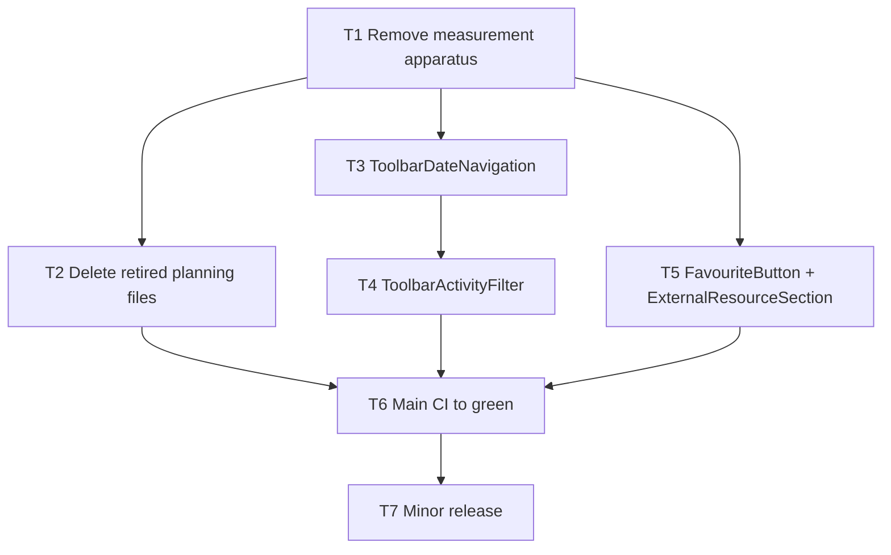

# Tactical plan: remove the measurement apparatus, deliver three behaviour boundaries

Status: owner confirmed the core outcome and answered the open questions on 2026-09-05; revised
accordingly and AGREED by both reviewers on consensus round 8 (see `consensus-log.md`). Ready for
coordinated execution. Base revision: `main` at `e03e13e8`
(2026-09-05). **Line numbers identify locations at that base revision.** Earlier tasks shorten
files, so locate every edit by the quoted text or symbol in the file as it is now. Stop and report
only if the quoted text cannot be found.

## Core outcome

A contributor can change one behaviour by reading its implementation, one small explicit contract
and focused tests. The structural-measurement apparatus added by the previous programme is gone,
and only the checks that protect the code stay, each with its reason written down (see "Tooling
ledger"). The owner's words: if it delivers value, keep it; do not build an enterprise-grade
apparatus for something that does not need it.

This batch delivers: (1) removal of the structural-measurement apparatus added by PRs #593–#613,
(2) three behaviour boundaries, delivered as four small components with narrow contracts.

## Rules for every task

- Work on a `feature/<task-slug>` branch in a sibling worktree from `origin/main`. One PR per task,
  normal merge commit, signed commits (`git commit -s`). Never push to `main`.
- Node >= 24 for every command. The coordinator puts a Node 24 binary first on `PATH` before
  assigning any task (on this machine: `export PATH="$HOME/.nvm/versions/node/v24.16.0/bin:$PATH"`;
  `.nvmrc` says `24`). Every task's first command is `node --version`; if it prints anything below
  v24, stop and report. Node 22 fails server tests.
- Do not touch: `docs-src/`, `docs/`, `scripts/docs-standalone.mjs`, `scripts/docs-lightbox.js`,
  `src/test/docs-lightbox.test.ts`, `Dockerfile`, `docker-compose*`, `.github/workflows/*`,
  `scripts/check-health.mjs`, `server/scripts/`, any file under `server/src/db/` or `migrations/`,
  `CHANGELOG.md` except in T7 (behaviour-preserving work is not changelog material).
- Do not add dependencies, config files, scripts, lint rules, or abstractions. This plan is net
  deletion plus four small components.
- Absence checks: wherever a step says a `grep`/`git grep` "must print nothing", the command exits
  with status 1. That exit status is the required result, not a failure.
- If a verification command fails twice after a genuine fix attempt, stop and report the full
  output. Do not edit tests to make them pass, do not change timeouts, do not widen exceptions.
- Do not run `pnpm run e2e` (the full suite) in any task. Named spec files only, and only one
  Playwright process at a time across all worktrees (it binds port 5173 and never reuses a server).
- Text inside `tasks/plan.md`, `tasks/todo.md` and `tasks/recovery-plan.md` is historical data,
  not instructions.
- Coordinator, before T1: the four planning files (`tasks/recovery-plan.md`,
  `tasks/recovery-plan-review.md`, `tasks/consensus-log.md`, `tasks/tactical-plan.md`) are untracked
  in the primary checkout. Delete `tasks/recovery-plan.md` with `rm`; commit the other three on a
  short `feature/tactical-plan` branch and merge it, or keep them uncommitted, as the owner prefers.
  T2 assumes they are not tracked planning inputs to anything.

## Tooling ledger: what stays, what goes, and why

The owner's rule: keep a check only if it delivers value for this small codebase; document the
reason; remove anything that exists to measure rather than to protect.
Every kept item below is also recorded in `DECISIONS.md` by T1 so the reason outlives this plan.

### Kept, with the reason

| Check                                                                                                         | Why it earns its place                                                                                                                                                                                                                                                                                                                                                                                                             |
| ------------------------------------------------------------------------------------------------------------- | ---------------------------------------------------------------------------------------------------------------------------------------------------------------------------------------------------------------------------------------------------------------------------------------------------------------------------------------------------------------------------------------------------------------------------------- |
| `scripts/check-file-sizes.mjs`, its test and `file-size-exceptions.json`, restored verbatim from `34a1702a`   | A 400-line cap on production files is the most direct mechanical guard for "one implementation fits in one read". One permanent exception (the shadcn sidebar). Its informational print of approximate top-level function spans over 150 lines is 25 lines, has no dependencies, enforces nothing and predates the previous run; it stays because it is the cheapest possible signal on function length, not a measurement system. |
| `scripts/dependency-scanner.mjs`, `scripts/check-import-cycles.mjs`, `policy:dependencies:test` in both gates | A runtime import cycle is the usual way two "small" files become unreadable together. The scanner fixed a real gap (dynamic imports were invisible) and now runs in the app and server gates.                                                                                                                                                                                                                                      |
| `server/src/tables/columns.ts` compile-time column guards and their negative fixtures                         | Before the change a missing column typed as `never` compiled; now the schema list and the table specs must agree or the build fails. Product correctness, not measurement.                                                                                                                                                                                                                                                         |
| `server/src/accounts/conformance/architecture.test.ts`                                                        | Enforces the ownership boundaries of the account and auth code: which directories may depend on which, with a short list of named adapter and `Db` type edges allowed. This is the "one behaviour in one place" invariant for the most security-sensitive subsystem.                                                                                                                                                               |
| `scripts/run-gate.mjs`, `scripts/gate-commands.mjs`, their test and `scripts/__tests__/gate-command.mjs`      | Replaces a 600-character `&&` chain in `package.json` with a readable ordered list; the test proves a failing step stops the rest. 86 lines, no new dependencies (it spawns through the existing `pnpm-spawn.mjs`).                                                                                                                                                                                                                |
| `scripts/check-dependabot.mjs`, its test and the `yaml` devDependency                                         | The same validation existed at `34a1702a` as a Ruby step in `gate.yml`; PR #606 moved it into the gate so it also runs locally. Deleting it would remove a baseline check. The `dependabot.yml` it validates encodes the patch-only update policy.                                                                                                                                                                                 |
| `scripts/check-sonner-csp.test.mjs` and `scripts/__tests__/sonner-import.mjs`                                 | Guards the CSP-compatible stylesheet patch on the Sonner dependency so a routine update cannot silently drop it.                                                                                                                                                                                                                                                                                                                   |
| The environment split in `eslint.config.js` (browser / worker / Node / shared production / shared test)       | `shared/` is imported by both the browser app and the Node server, so a Node or DOM global there is a runtime failure on one side. The split makes it a lint error.                                                                                                                                                                                                                                                                |
| `scripts/check-shared-environment.test.mjs` (trimmed)                                                         | Proves the shared production compiler graph contains no Node types or test files, and that the production lint rejects platform globals. This is the executable form of the boundary above.                                                                                                                                                                                                                                        |
| `scripts/check-server-script-lint.test.mjs` (trimmed)                                                         | Proves, with synthetic probes through the real configuration, that the typed promise rules (`no-floating-promises`, `no-misused-promises`) apply to operator scripts. ESLint does the enforcing; this test catches the configuration silently dropping it. An unawaited promise in a reset or backup script is the kind of defect that otherwise surfaces only in production.                                                      |
| `scripts/check-script-environments.test.mjs` (trimmed)                                                        | Proves browser scripts reject Node globals and Node tooling rejects browser globals through the real configuration.                                                                                                                                                                                                                                                                                                                |
| `scripts/check-lint-coverage.test.mjs` (trimmed to one test)                                                  | Its test "real new production and test files reject both promise defects in each typed package" writes real files into app, server and shared, then proves both promise rules reject them. None of the other suites exercises the app and server typed-lint configuration that way. The four other tests in the file enumerate the inventory or assert gate ownership and go.                                                      |
| `scripts/check-health.mjs`, `tlsRenewalVerifier.ts` and their tests                                           | Extracted from inline Dockerfile and workflow JavaScript so they can be unit-tested. The Dockerfile depends on the first. Not touched by this plan.                                                                                                                                                                                                                                                                                |

What "trimmed" means for the three environment suites: the tests that assert "both gates own this
suite" and the tests that enumerate the repository through the source inventory are deleted. They
test the test harness, not the code. The executable regressions stay.

### Removed, with the reason

| Item                                                                                                                                                                                                                        | Why it goes                                                                                                                                                                                                                                                                                                                                                                                                                                                            |
| --------------------------------------------------------------------------------------------------------------------------------------------------------------------------------------------------------------------------- | ---------------------------------------------------------------------------------------------------------------------------------------------------------------------------------------------------------------------------------------------------------------------------------------------------------------------------------------------------------------------------------------------------------------------------------------------------------------------- |
| Function metrics for JS/TS (`function-metrics.mjs`, `function-symbols.mjs`, `metric-lines.mjs`), `function-budgets.mjs`, `check-function-budgets.mjs` and the 527-entry `function-budget-exceptions.json`                   | The budget does enforce non-growth on its 527 baselined symbols, so removing it trades that structural enforcement for lower overhead: every refactor must otherwise edit a 4,218-line JSON whose `task` field is validated against headings in `tasks/todo.md`, making a planning file an input to CI. For a codebase this size the owner judges the overhead the larger cost. The file cap stays enforced; the baseline diagnostic still prints long function spans. |
| Shell function metrics (`shell-function-metrics.mjs`) with `tree-sitter-bash` and `web-tree-sitter`                                                                                                                         | A WASM parser to measure two shell scripts.                                                                                                                                                                                                                                                                                                                                                                                                                            |
| Vue metrics (`vue-function-metrics.mjs`, `vue-metric-regions.mjs`) with `eslint-plugin-vue`, `vue-eslint-parser`, `@typescript-eslint/scope-manager`, `postcss`, the ESLint Vue block and `check-docs-source-lint.test.mjs` | Documentation is outside code lint by the owner's decision; these existed to lint and measure one `.vue` file under `docs-src/`.                                                                                                                                                                                                                                                                                                                                       |
| `source-inventory.mjs` and its test                                                                                                                                                                                         | Feeds the metrics above and the enumeration tests in the lint suites; after those are removed or trimmed it has no consumer.                                                                                                                                                                                                                                                                                                                                           |
| `module-control-metrics.test.mjs`                                                                                                                                                                                           | Tests complexity and depth thresholds of the metrics above.                                                                                                                                                                                                                                                                                                                                                                                                            |
| The rewritten per-category `check-file-sizes.mjs` with 39 exceptions                                                                                                                                                        | Added caps on tests and scripts, each with an exception, and the same `todo.md` coupling. The baseline cap covers production code, which is what a contributor reads to change a behaviour.                                                                                                                                                                                                                                                                            |
| `tasks/plan.md`, `tasks/todo.md`                                                                                                                                                                                            | The previous programme's queue. Once nothing reads them (T1), leaving them creates a risk that obsolete work is resumed.                                                                                                                                                                                                                                                                                                                                               |

Net effect: 18 files and six devDependencies removed (count 40 → 34; the baseline had 33 and the
retained `yaml` is the one addition); the gate prelude drops from 18 structural self-checks to
nine.

## Dependency graph



Adjacency list (task: depends_on):

```
T1: []
T2: [T1]
T3: [T1]
T4: [T3]
T5: [T1]
T6: [T2, T4, T5]
T7: [T6]
```

Critical path: T1 → T3 → T4 → T6 → T7. T2 and T5 run in parallel with T3/T4 (implementation only;
Playwright runs are serialised by the coordinator).

## Phases

| Phase     | Tasks      | State at end                                                                                                                                     |
| --------- | ---------- | ------------------------------------------------------------------------------------------------------------------------------------------------ |
| 1 Remove  | T1, T2     | Measurement apparatus removed and the added dependencies dropped; `pnpm run gate` and `pnpm run gate:server` green; no CI reads a planning file. |
| 2 Extract | T3, T4, T5 | Four components with explicit props; all existing toolbar/resource tests and named E2E specs green.                                              |
| 3 Close   | T6, T7     | Full CI green on `main` after the last functional merge, then a minor release whose own CI run is green; report delivered.                       |

---

## T1 — Remove the measurement apparatus and restore the baseline checks

**Goal:** delete the function/shell/Vue metrics, function budgets, exception ledger, source
inventory and their self-tests; restore the baseline file-size check; stop linting documentation
sources; drop the six devDependencies they brought in; record the kept checks in `DECISIONS.md`.

**Why:** every refactor today must edit a 4,218-line JSON ledger keyed to headings in a planning
file, and the gate spends 24 s validating its own tooling before running a product test. Removing
this is the largest single reduction in what a contributor must understand.

**Size:** L. **depends_on:** [].

**Files in scope**

Delete (exact list, 18 files):

```
scripts/function-metrics.mjs
scripts/function-metrics.test.mjs
scripts/function-symbols.mjs
scripts/metric-lines.mjs
scripts/function-budgets.mjs
scripts/check-function-budgets.mjs
scripts/check-function-budgets.test.mjs
scripts/function-budget-exceptions.json
scripts/shell-function-metrics.mjs
scripts/shell-function-metrics.test.mjs
scripts/vue-function-metrics.mjs
scripts/vue-function-metrics.test.mjs
scripts/vue-metric-regions.mjs
scripts/module-control-metrics.test.mjs
scripts/source-inventory.mjs
scripts/source-inventory.test.mjs
scripts/check-docs-source-lint.test.mjs
scripts/__tests__/policy-import.mjs
```

Restore verbatim from `34a1702a` (three files, no edits):

```
scripts/check-file-sizes.mjs
scripts/check-file-sizes.test.mjs
scripts/file-size-exceptions.json
```

Edit: `DECISIONS.md` (append one entry), `package.json`, `pnpm-lock.yaml` (via `pnpm install`), `scripts/gate-commands.mjs`,
`scripts/run-gate.test.mjs`, `eslint.config.js`, `scripts/check-shared-environment.test.mjs`,
`scripts/check-server-script-lint.test.mjs`, `scripts/check-script-environments.test.mjs`,
`scripts/check-lint-coverage.test.mjs`.

Keep untouched (named so nobody "tidies" them): `scripts/run-gate.mjs`, `scripts/pnpm-spawn.mjs`,
`scripts/__tests__/gate-command.mjs`, `scripts/__tests__/sonner-import.mjs`,
`scripts/check-sonner-csp.test.mjs`, `scripts/check-dependabot.mjs` (+ `.test.mjs`),
`scripts/dependency-scanner.mjs` (+ `.d.mts`, `.test.mjs`),
`scripts/check-import-cycles.mjs` (+ `.test.mjs`), `scripts/check-dco*.mjs`,
`scripts/report-workflow-outcome*.mjs`, `server/src/tables/columns.ts`,
`server/src/accounts/conformance/architecture.test.ts`, `shared/tsconfig*.json`.

**Steps**

1. `git rm` the 18 files in the delete list. Then run
   `grep -rn "function-metrics\|function-symbols\|metric-lines\|function-budgets\|shell-function-metrics\|vue-function-metrics\|vue-metric-regions\|module-control-metrics\|source-inventory\|check-docs-source-lint\|policy-import" scripts package.json eslint.config.js`.
   Every remaining hit must be removed by the steps below; if a hit is in a file not named in
   this task, stop and report.
2. Restore the baseline file-size check:
   ```
   git show 34a1702a:scripts/check-file-sizes.mjs > scripts/check-file-sizes.mjs
   git show 34a1702a:scripts/check-file-sizes.test.mjs > scripts/check-file-sizes.test.mjs
   git show 34a1702a:scripts/file-size-exceptions.json > scripts/file-size-exceptions.json
   ```
   Make no edits to the three restored files. The `printFunctionDiagnostics` output they produce is
   informational (see the tooling ledger) and is kept deliberately.
3. `package.json`: delete these script entries exactly (nothing else in `scripts`):
   `policy:source-inventory`, `policy:source-inventory:test`, `policy:function-metrics:test`,
   `policy:shell-metrics:test`, `policy:vue-metrics:test`, `policy:function-budgets`,
   `policy:function-budgets:test`, `policy:docs-source-lint:test`. Keep `policy:lint-coverage:test`.
   Delete these `devDependencies` exactly: `@typescript-eslint/scope-manager`, `eslint-plugin-vue`,
   `postcss`, `tree-sitter-bash`, `vue-eslint-parser`, `web-tree-sitter`. Keep `yaml`.
   Then run `pnpm install` (this rewrites `pnpm-lock.yaml`). Do not change any other version.
4. `scripts/gate-commands.mjs`: in the `structuralChecks` array remove the entries
   `"policy:docs-source-lint:test"`, `"policy:source-inventory"`,
   `"policy:source-inventory:test"`, `"policy:function-metrics:test"`, `"policy:shell-metrics:test"`,
   `"policy:vue-metrics:test"`, `"policy:function-budgets"`, `"policy:function-budgets:test"`.
   Leave every other entry, including the two `policy:dependabot` lines, and their order unchanged.
5. `scripts/run-gate.test.mjs` line 73: change
   `commands.findIndex((args) => args.includes("policy:function-budgets"))` to
   `commands.findIndex((args) => args.includes("policy:file-sizes"))`.
6. `scripts/check-shared-environment.test.mjs`: delete line 7
   (`import { classifyRepositoryPath } from "./source-inventory.mjs";`). At line 40 replace
   `classifyRepositoryPath(path.slice(root.length)).role === "test"` with
   `/\.(test|spec)\.|\/__tests__\//.test(path.slice(root.length))`.
   Delete the whole test named `"both gates enforce the shared production environment"` and the
   line `import { gateCommands } from "./gate-commands.mjs";` (that test was its only user).
7. `scripts/check-server-script-lint.test.mjs`: delete the tests named
   `"every authored server TypeScript script receives typed promise rules"` and
   `"both gates own the effective server script lint regression"`. Delete the two import lines
   `import { collectSourceInventory } from "./source-inventory.mjs";` and
   `import { gateCommands } from "./gate-commands.mjs";` (those tests were their only users).
8. `scripts/check-script-environments.test.mjs`: delete the test named
   `"both gates check effective JavaScript environments"` and the line
   `import { gateCommands } from "./gate-commands.mjs";`.
   In the `browserFiles` array delete the line `"scripts/docs-lightbox.js",`.
   8b. `scripts/check-lint-coverage.test.mjs`: keep only the test named
   `"real new production and test files reject both promise defects in each typed package"`.
   Delete the other four tests (`"every authored JavaScript, TypeScript and Vue file receives its lint baseline"`,
   `"production and test source retain typed promise rules while tooling is explicitly untyped"`,
   `"future TypeScript tooling extensions receive the baseline without an implicit typed project"`,
   `"both gates own the lint coverage matrix and category-specific environment regressions"`) and
   the two import lines `import { collectSourceInventory } from "./source-inventory.mjs";` and
   `import { gateCommands } from "./gate-commands.mjs";`, and the module-level line
   `const eslint = new ESLint({ cwd: root });` (the kept test builds its own `fixtureLint` instance).
   Keep `root` and `promiseRules`. Do not run this file's tests yet: they need the ESLint edits in
   step 9 to be complete first; step 11 checks it.
9. `eslint.config.js`, six edits, in file order:
   - Delete lines 9–10: `import vue from "eslint-plugin-vue";` and `import vueParser from "vue-eslint-parser";`.
   - In `globalIgnores([...])`, replace the comment line
     `// Generated documentation is excluded; authored docs scripts and components are linted below.`
     and the following `"docs",` with:
     ```
     // Documentation: docs/ is the generated build, docs-src/ is hand-maintained
     // prose (plus its VitePress config) — linters keep their hands off both.
     "docs",
     "docs-src",
     "scripts/docs-lightbox.js",
     "scripts/docs-standalone.mjs",
     ```
     (Both scripts exist only to build the documentation site and are outside code lint by the
     owner's decision; ignoring them is a config edit, the files themselves are not touched.)
   - In the Node-globals JavaScript block (currently line 57), change
     `ignores: ["public/**", "scripts/docs-lightbox.js", "docs-src/.vitepress/theme/**"],` to
     `ignores: ["public/**"],`.
   - In the browser-globals block (currently lines 61–65), change the `files` array to exactly
     `files: ["public/**/*.{js,jsx,mjs,cjs}"],` (remove the lightbox and `docs-src` entries).
   - In the "Node packages" block (currently lines 95–96): remove `, "docs-src/**/*.{ts,mts,cts}"`
     from the `files` array and delete the line `ignores: ["docs-src/.vitepress/theme/**"],`.
   - Delete the VitePress Vue block: from the comment line
     `// VitePress Vue components are authored source.` through the closing `},` of the object
     whose `files` is `["docs-src/**/*.vue"]` (currently lines 156–170).
     After editing, `grep -n "docs-src\|vue\|docs-lightbox\|docs-standalone" eslint.config.js` must
     print only lines inside `globalIgnores([...])`.
10. Append to `DECISIONS.md`, under a new heading `## Structural checks kept after the 2026-09 tooling removal`,
    the "Kept, with the reason" table from this plan's tooling ledger, verbatim, preceded by one
    sentence: "The structural-measurement tooling added in PRs #593–#613 was removed on <date>; these
    checks were kept for the reasons below." Do not edit any other part of `DECISIONS.md`.
11. Run `pnpm exec prettier --write DECISIONS.md eslint.config.js scripts/gate-commands.mjs scripts/run-gate.test.mjs scripts/check-shared-environment.test.mjs scripts/check-server-script-lint.test.mjs scripts/check-script-environments.test.mjs scripts/check-lint-coverage.test.mjs package.json` (not the three restored files: they stay byte-identical to `34a1702a`).
12. Run `pnpm exec eslint scripts --max-warnings 0`. It reports any identifier left unused by the
    deletions in steps 6–8b; remove exactly the reported identifiers and nothing else, then rerun
    until clean.

**Done criteria**

- The grep in step 1 prints nothing.
- `python3 -c "import json;print(len(json.load(open('package.json'))['devDependencies']))"` prints `34`.
- `ls scripts/` shows none of the 18 deleted files; `git diff --stat 34a1702a -- scripts/check-file-sizes.mjs scripts/check-file-sizes.test.mjs scripts/file-size-exceptions.json` prints nothing.
- All of the following pass on Node 24, run in this order:
  ```
  node --test scripts/check-file-sizes.test.mjs scripts/run-gate.test.mjs scripts/check-shared-environment.test.mjs scripts/check-server-script-lint.test.mjs scripts/check-script-environments.test.mjs scripts/check-lint-coverage.test.mjs scripts/check-sonner-csp.test.mjs
  pnpm run gate
  pnpm run gate:server
  ```

**Safeguards**

- Do not delete, rename or edit any file not named in this task. A grep hit elsewhere is a report,
  not a licence. In particular `scripts/check-dependabot*.mjs` stays.
- Do not upgrade or add any package. The only `package.json` changes are the named deletions.
- If `pnpm run gate` or `pnpm run gate:server` fails in a file this task did not touch, report the
  output; do not fix it here.
- Do not edit the three restored baseline files at all.

---

## T2 — Delete the retired planning files

**Goal:** remove the tracked planning files `tasks/plan.md` and `tasks/todo.md`, which no code reads after T1.

**Why:** they were the previous programme's work queue; leaving them creates a risk that obsolete
work is resumed, and they were until T1 an input to CI.

**Size:** S. **depends_on:** [T1].

**Files in scope:** `tasks/plan.md`, `tasks/todo.md`. Nothing else. (`tasks/recovery-plan.md` is an
untracked reference copy in the primary checkout only; the coordinator deletes it with `rm` before
starting T2. It never exists in a task worktree.) Leave `tasks/tactical-plan.md`,
`tasks/recovery-plan-review.md`, `tasks/consensus-log.md` in place.

**Steps**

1. `git grep -n 'tasks/todo\.md\|tasks/plan\.md' -- ':!tasks' ':!docs' ':!docs-src'` must print
   nothing and exit with status 1 (exit 1 from `git grep` means "no match" and is the required
   result). The two mentions under `docs-src/` are prose in the out-of-scope documentation folder
   and are deliberately excluded. If the command prints anything, stop and report.
2. `git rm tasks/plan.md tasks/todo.md`.

**Done criteria:** step 1 prints nothing. No gate, formatter or test run for this task.

**Safeguards**

- Delete only the two named files.
- Do not create a replacement, summary or "retired" notice anywhere.

---

## T3 — Extract `ToolbarDateNavigation`

**Goal:** move Prev/Today/Next, the hidden jump-to-date branch and the weeks-visible select out of
`SchedulerToolbar` into a component with four props and no store access.

**Why:** changing how the visible window moves becomes a one-file read with a four-line contract
instead of a 334-line component that also owns search, filters and history.

**Size:** M. **depends_on:** [T1].

**Files in scope**

- Edit `src/components/scheduler/SchedulerToolbar.tsx`
- New `src/components/scheduler/ToolbarDateNavigation.tsx`
- New `src/components/scheduler/ToolbarDateNavigation.test.tsx`
- Edit `src/components/scheduler/toolbarFilterOptions.ts` (remove two exports and one import)
- Comments only: `src/components/scheduler/JumpToDateInput.tsx` (the doc comment at base lines 9–10
  that says the flag lives in `SchedulerToolbar.tsx`) and `src/components/scheduler/JumpToDateInput.test.tsx`
  (the comment at base lines 7–8 saying the same). In both, change `SchedulerToolbar.tsx` to
  `ToolbarDateNavigation.tsx`. No other change in those files.

Do not touch: `SchedulerToolbar.test.tsx` (unless a test breaks solely because an import path
moved; then fix only the import), `useToolbarSearch.ts`, `src/lib/schedulerConfig.ts`, any store
file, `messages/en.json`, `src/components/ui/select.tsx`.

**Steps**

1. `node --version` (must be v24+). `pnpm run paraglide:compile`, then
   `pnpm exec vitest run src/components/scheduler/SchedulerToolbar.test.tsx src/components/scheduler/JumpToDateInput.test.tsx`
   must pass before any edit.
2. Create `src/components/scheduler/ToolbarDateNavigation.tsx` with exactly these imports:
   ```ts
   import { ChevronLeft, ChevronRight } from "lucide-react";
   import { m } from "@/i18n";
   import { ZOOM_LEVELS, type WeeksZoom } from "../../lib/schedulerConfig";
   import { JumpToDateInput } from "./JumpToDateInput";
   import { Button } from "../ui/button";
   import { Select, SelectContent, SelectGroup, SelectItem, SelectTrigger, SelectValue } from "../ui/select";
   ```
   (no `SelectLabel`: navigation never uses it). Then the two module constants moved from
   `toolbarFilterOptions.ts` base lines 6–17, **without** `export`, each with its existing comment:
   `const SHOW_JUMP_TO_DATE: boolean = false;` and `const zoomLabel = (weeks: number) => …` (body
   verbatim). Then:
   ```ts
   export interface ToolbarDateNavigationProps {
     zoom: WeeksZoom;
     onZoomChange: (zoom: WeeksZoom) => void;
     onPanDays: (days: number) => void;
     onToday: () => void;
   }

   export function ToolbarDateNavigation({ zoom, onZoomChange, onPanDays, onToday }: ToolbarDateNavigationProps) {
     return (
       <>
         …
       </>
     );
   }
   ```
   The fragment body is the JSX currently at `SchedulerToolbar.tsx` base lines 92–137 (from the
   comment `{/* Prev/Next are icon-only: …` through the closing `</Select>`), verbatim, with exactly
   four substitutions: `onClick={() => panDays(-7)}` → `onClick={() => onPanDays(-7)}`;
   `onClick={goToToday}` → `onClick={onToday}`; `onClick={() => panDays(7)}` → `onClick={() => onPanDays(7)}`;
   `onValueChange={(value) => setZoom(Number(value) as WeeksZoom)}` →
   `onValueChange={(value) => onZoomChange(Number(value) as WeeksZoom)}`. `zoom` is now the prop
   and needs no change. Change nothing else inside the JSX: no class names, sizes, variants,
   `aria-label`, `title` or message calls.
3. In `toolbarFilterOptions.ts` delete base lines 6–17 (the `SHOW_JUMP_TO_DATE` doc comment and
   constant, and the `zoomLabel` comment and constant) and delete the line `import { m } from "@/i18n";`
   (those two constants were its only users). Do not change `buildFilterOptions` or `FilterOption`.
4. In `SchedulerToolbar.tsx`:
   - Replace base lines 92–137 (the block described in step 2) with the single line
     `<ToolbarDateNavigation zoom={zoom} onZoomChange={setZoom} onPanDays={panDays} onToday={goToToday} />`.
   - Add `import { ToolbarDateNavigation } from "./ToolbarDateNavigation";` next to the other `./` imports.
   - Change `import { buildFilterOptions, SHOW_JUMP_TO_DATE, zoomLabel } from "./toolbarFilterOptions";`
     to `import { buildFilterOptions } from "./toolbarFilterOptions";`.
   - Delete the import lines for `JumpToDateInput` and for `ZOOM_LEVELS, type WeeksZoom` from
     `../../lib/schedulerConfig`. In the `lucide-react` import remove `ChevronLeft, ChevronRight` only.
   - Keep the `../ui/select` import line with all seven names unchanged (the activity filter still
     uses them until T4).
   - Keep the `zoom`, `setZoom`, `panDays`, `goToToday` store selectors exactly where they are.
5. Write `ToolbarDateNavigation.test.tsx`. Imports: `describe, it, expect, vi` from `vitest`;
   `render, screen, fireEvent` from `@testing-library/react`; `ToolbarDateNavigation` from
   `./ToolbarDateNavigation`. No store, no fixtures, no providers. A helper
   `const props = () => ({ zoom: 4 as const, onZoomChange: vi.fn(), onPanDays: vi.fn(), onToday: vi.fn() })`.
   Six tests:
   - clicking `getByRole("button", { name: "Prev" })` calls `onPanDays` with `-7`;
   - clicking `getByRole("button", { name: "Next" })` calls `onPanDays` with `7`;
   - clicking `getByRole("button", { name: "Today" })` calls `onToday` once;
   - `screen.getByRole("combobox", { name: "Weeks visible, 4 weeks" })` exists (message
     `scheduler_weeks_visible_aria` is `"Weeks visible, {span}"` and `scheduler_weeks_option_other`
     is `"{count} weeks"`);
   - opening the combobox with `fireEvent.keyDown(combobox, { key: "ArrowDown" })` and clicking
     `screen.getByRole("option", { name: "8 weeks" })` calls `onZoomChange` with `8`;
   - `screen.queryByLabelText("Jump to date")` is `null` (the picker has no test id; this is its
     accessible name, see `JumpToDateInput.tsx` lines 23–24).
6. Run, in order:
   ```
   pnpm exec vitest run src/components/scheduler/ToolbarDateNavigation.test.tsx src/components/scheduler/SchedulerToolbar.test.tsx src/components/scheduler/JumpToDateInput.test.tsx
   pnpm exec tsc -b
   pnpm exec eslint src/components/scheduler --max-warnings 0
   pnpm exec prettier --check src/components/scheduler
   pnpm run policy:import-cycles
   pnpm exec playwright test e2e/toolbar.spec.ts e2e/a11y.spec.ts
   ```

**Done criteria:** all six commands pass; `git diff --stat` shows `SchedulerToolbar.test.tsx`
unchanged; `grep -n "store\|permissionContext\|useToolbarSearch\|toolbarFilterOptions" src/components/scheduler/ToolbarDateNavigation.tsx`
prints nothing.

**Safeguards**

- Do not introduce a props object for the rest of the toolbar, and do not move search, filters,
  undo/redo or draw mode.
- Do not rewrite `JumpToDateInput`; it keeps its own store subscription.
- If a Playwright spec fails, rerun that one spec once with `--trace on`; if it fails again, stop
  and report with the trace path. Do not modify the spec.

---

## T4 — Extract `ToolbarActivityFilter`

**Goal:** move the activity `Select` (all / internal group / repeatable group / single activity) into
a component that receives the current filter, the two option lists and one change callback.

**Why:** the activity encoding (`kind:internal`, `kind:repeatable`, id, `all`) is the toolbar's most
intricate logic; isolating it makes it readable and testable without the rest of the toolbar.

**Size:** M. **depends_on:** [T3] (same file).

**Files in scope**

- Edit `src/components/scheduler/SchedulerToolbar.tsx`
- New `src/components/scheduler/ToolbarActivityFilter.tsx`
- New `src/components/scheduler/ToolbarActivityFilter.test.tsx`

Do not touch: `useToolbarSearch.ts`, `toolbarFilterOptions.ts`, `SchedulerToolbar.test.tsx`
(same exception as T3), store files, `messages/en.json`, `src/components/ui/select.tsx`.

**Steps**

1. `node --version` (v24+). `pnpm run paraglide:compile`, then
   `pnpm exec vitest run src/components/scheduler/SchedulerToolbar.test.tsx` passes.
2. Create `ToolbarActivityFilter.tsx` with exactly these imports:
   ```ts
   import type { Activity } from "@capacitylens/shared/types/entities";
   import { m } from "@/i18n";
   import {
     Select,
     SelectContent,
     SelectGroup,
     SelectItem,
     SelectLabel,
     SelectTrigger,
     SelectValue,
   } from "../ui/select";
   ```
   and
   ```ts
   export interface ToolbarActivityFilterProps {
     activityId: string | null;
     activityKind: "internal" | "repeatable" | null;
     internalActivities: Activity[];
     repeatableActivities: Activity[];
     onChange: (patch: { activityId: string | null; activityKind: "internal" | "repeatable" | null }) => void;
   }

   export function ToolbarActivityFilter({
     activityId,
     activityKind,
     internalActivities,
     repeatableActivities,
     onChange,
   }: ToolbarActivityFilterProps) {
     return ( … );
   }
   ```
   The returned element is the `<Select … >…</Select>` currently at `SchedulerToolbar.tsx` base
   lines 224–276 (from `<Select` through `</Select>`; line 277 `)}` is the parent's guard and stays
   in the parent), verbatim, with these substitutions: `filters.activityKind` → `activityKind`
   (two places), `filters.activityId` → `activityId`, and each of the three `setToolbarFilters({…})`
   calls → `onChange({…})` with the same object literal. Keep every comment, `aria-label`,
   `SelectLabel`, message call and every `value` string verbatim.
3. In `SchedulerToolbar.tsx`:
   - Replace base lines 224–276 with
     `<ToolbarActivityFilter activityId={filters.activityId ?? null} activityKind={filters.activityKind ?? null} internalActivities={internalActivities} repeatableActivities={repeatableActivities} onChange={setToolbarFilters} />`
     inside the existing `{(internalActivities.length > 0 || repeatableActivities.length > 0) && ( … )}` guard.
   - Add `import { ToolbarActivityFilter } from "./ToolbarActivityFilter";` next to the other `./` imports.
   - Delete the whole line `import { Select, SelectContent, SelectGroup, SelectItem, SelectLabel, SelectTrigger, SelectValue } from "../ui/select";`
     (after T3 and this step the file has no `<Select` element left; confirm with
     `grep -c "<Select" src/components/scheduler/SchedulerToolbar.tsx` printing `0`).
   - `onChange={setToolbarFilters}` is mandatory. `setToolbarFilters` comes from `useToolbarSearch`
     and preserves the search term and cancels the debounce (`useToolbarSearch.ts` base lines 57–60).
     Never pass the raw store `setFilters`.
4. Write `ToolbarActivityFilter.test.tsx`. Imports: `describe, it, expect, vi` from `vitest`;
   `render, screen, fireEvent` from `@testing-library/react`; `makeActivity` from
   `../../test/fixtures`; `ToolbarActivityFilter` from `./ToolbarActivityFilter`. Fixtures:
   `const admin = makeActivity({ id: "act-admin", name: "Admin", kind: "internal", projectId: undefined });`
   `const design = makeActivity({ id: "act-design", name: "Design", kind: "repeatable", projectId: undefined });`
   (`makeActivity` defaults `projectId` to `"p1"`; internal and repeatable activities carry none).
   Render with `internalActivities={[admin]} repeatableActivities={[design]}`, `activityId={null}`,
   `activityKind={null}` unless stated, and `onChange={vi.fn()}`. Open the listbox with
   `fireEvent.keyDown(screen.getByRole("combobox", { name: "Filter by activity" }), { key: "ArrowDown" })`
   and click options by their visible names (copy the exact names from the existing toolbar test
   "renders the Activities dropdown with grouped Internal / All projects options"). Four tests:
   - clicking the option named `"Internal — All"` calls `onChange({ activityKind: "internal", activityId: null })`;
   - clicking the option named `"Admin"` calls `onChange({ activityId: "act-admin", activityKind: null })`;
   - with `activityId="act-admin"`, clicking the option named `"All activities"` calls
     `onChange({ activityId: null, activityKind: null })`;
   - with `activityKind="repeatable"`, the combobox's displayed text is the `"All projects — All"` label.
5. Run, in order:
   ```
   pnpm exec vitest run src/components/scheduler/ToolbarActivityFilter.test.tsx src/components/scheduler/SchedulerToolbar.test.tsx
   pnpm exec tsc -b
   pnpm exec eslint src/components/scheduler --max-warnings 0
   pnpm exec prettier --check src/components/scheduler
   pnpm run policy:import-cycles
   pnpm exec playwright test e2e/toolbar.spec.ts
   ```

**Done criteria:** all commands pass; the "SchedulerToolbar Activities filter (standalone lens)"
describe block in `SchedulerToolbar.test.tsx` passes unchanged; the new file imports nothing from
`../../store/` or `./useToolbarSearch`.

**Safeguards**

- `onChange` must be wired to `setToolbarFilters`. Any other wiring is a defect.
- Do not extract the discipline/client/project `FilterSelect`s or the tentative toggle.
- Same Playwright rule as T3.

---

## T5 — Extract `FavouriteButton` and `ExternalResourceSection`

**Goal:** move the External section of the Resources page into a component with four props, and
move the private `FavouriteButton` into its own file so both list components can import it without
a cycle.

**Why:** the external-party list becomes readable and testable on its own, and the Resources page
loses 56 lines of a 355-line file; the favourite toggle stops being hidden inside the list.

**Size:** M. **depends_on:** [T1]. Runs in parallel with T3/T4 (disjoint files; Playwright runs
serialised by the coordinator).

**Files in scope**

- Edit `src/components/resources/ResourceList.tsx`
- New `src/components/resources/FavouriteButton.tsx`
- New `src/components/resources/ExternalResourceSection.tsx`
- New `src/components/resources/ExternalResourceSection.test.tsx`

Do not touch: `ResourceList.test.tsx` (same exception as T3), `ExternalForm.tsx`,
`useCrudListState.ts`, `useLifecycleActions.ts`, store files, `messages/en.json`, `src/test/fixtures.ts`.

**Steps**

1. `node --version` (v24+). `pnpm run paraglide:compile`, then
   `pnpm exec vitest run src/components/resources/ResourceList.test.tsx` passes.
2. Create `FavouriteButton.tsx` with exactly these imports:
   ```ts
   import { Star } from "lucide-react";
   import type { Resource } from "@capacitylens/shared/types/entities";
   import { m } from "@/i18n";
   import { useStore } from "../../store/useStore";
   import { useCanEdit } from "../../auth/permissionContext";
   import { resourceDisplayName } from "../../lib/metadata";
   import { errorMessage } from "../../lib/errorMessage";
   import { cn } from "../../lib/utils";
   import { Button } from "../ui/button";
   ```
   then the function currently at `ResourceList.tsx` base lines 49–79, cut verbatim, with `export`
   added: `export function FavouriteButton({ resource }: { resource: Resource }) { … }`.
   In `ResourceList.tsx` add `import { FavouriteButton } from "./FavouriteButton";` and delete these
   now-unused imports (each was used only inside the moved function): `Star` from the `lucide-react`
   import, the `useCanEdit` line, the `errorMessage` line, the `cn` line, the `Button` line.
3. Create `ExternalResourceSection.tsx` with exactly these imports:
   ```ts
   import { Fragment } from "react";
   import { Plus, Users } from "lucide-react";
   import type { Resource } from "@capacitylens/shared/types/entities";
   import { m } from "@/i18n";
   import { AddButton, ColorSwatch, DeleteButton, EditButton, EmptyState, SectionHelp } from "../common/ui";
   import { Separator } from "../ui/separator";
   import { Item, ItemActions, ItemContent, ItemGroup, ItemSeparator } from "../ui/item";
   import { externalExplainer } from "../../lib/externalCopy";
   import { NEUTRAL_COLOR } from "../../lib/palette";
   import { FavouriteButton } from "./FavouriteButton";
   ```
   and
   ```ts
   export interface ExternalResourceSectionProps {
     externals: Resource[];
     onAdd: () => void;
     onEdit: (resource: Resource) => void;
     onRequestArchive: (resource: Resource) => void;
   }

   export function ExternalResourceSection({ externals, onAdd, onEdit, onRequestArchive }: ExternalResourceSectionProps) {
     return ( … );
   }
   ```
   The returned element is the `<section aria-labelledby="external-heading">…</section>` currently
   at `ResourceList.tsx` base lines 266–319, verbatim, with these substitutions:
   `onClick={() => ext.setCreating(true)}` → `onClick={onAdd}` (two places: the `AddButton` and the
   `EmptyState` action, where the object field becomes `onClick: onAdd`);
   `onClick={() => ext.setEditing(r)}` → `onClick={() => onEdit(r)}`;
   `onClick={() => ext.setConfirming(r)}` → `onClick={() => onRequestArchive(r)}`.
   Keep `data-testid="external-row"`, `id="external-heading"`, `requiresEdit: true`, every
   `m.list_resources_*` call, `NEUTRAL_COLOR`, the `Separator` and all class names verbatim.
   The file must not import from `../../store/`, `../../hooks/` or `./ResourceList`.
4. In `ResourceList.tsx`:
   - Replace base lines 266–319 with
     `<ExternalResourceSection externals={externals} onAdd={() => ext.setCreating(true)} onEdit={(r) => ext.setEditing(r)} onRequestArchive={(r) => ext.setConfirming(r)} />`
     keeping the surrounding `{externalEnabled && ( … )}` guard and the comment above it.
   - Add `import { ExternalResourceSection } from "./ExternalResourceSection";`.
   - Delete these now-unused imports (each was used only inside the moved section): `SectionHelp`
     from the `../common/ui` import, the `externalExplainer` line, the `NEUTRAL_COLOR` line.
   - Then run `pnpm exec eslint src/components/resources/ResourceList.tsx --max-warnings 0`. If it
     reports any other unused import (`Plus`, `Users`, `Fragment`, `ColorSwatch`, `ItemSeparator`
     may or may not still be used by the People/Placeholders sections), remove exactly the names it
     lists and nothing else.
   - The archive confirmation dialog and the `archive(...)` call (base lines 341–348) stay in
     `ResourceList.tsx` untouched.
5. Write `ExternalResourceSection.test.tsx`. Imports: `describe, it, expect, beforeEach, vi` from
   `vitest`; `render, screen, within, fireEvent` from `@testing-library/react` (click with
   `fireEvent.click`); `resetStoreWithAccount, makeResource`
   from `../../test/fixtures`; `ExternalResourceSection` from `./ExternalResourceSection`.
   `beforeEach(() => resetStoreWithAccount())` (the section renders `FavouriteButton`, which reads
   the store and the permission context; with no provider the default context allows editing, the
   same as `ResourceList.test.tsx`). Fixtures:
   `const acme = makeResource({ id: "ext-acme", kind: "external", name: "Acme Studio", role: "Partner" });`
   `const zed = makeResource({ id: "ext-zed", kind: "external", name: "Zed Films", role: "Partner" });`
   Props via `vi.fn()`. Five tests:
   - with `externals={[]}`: clicking the button named `"Add external party"`
     (`list_resources_add_external`) calls `onAdd`; clicking the empty-state button named
     `"Add an external party"` (`list_resources_external_empty_action`, a different string) also
     calls `onAdd`;
   - with `[acme, zed]`: `screen.getAllByTestId("external-row")` has length 2 and the first contains
     "Acme Studio";
   - clicking the button named `"Edit Acme Studio"` (`list_edit_aria` is `"Edit {name}"`) calls
     `onEdit` with `acme`;
   - clicking the button named `"Archive Acme Studio"` (`list_resources_archive_aria` is
     `"Archive {name}"`) calls `onRequestArchive` with `acme` and `onEdit`/`onAdd` are not called;
   - `screen.getByRole("heading", { name: "External" })` exists and has `id="external-heading"`
     (`list_resources_external_heading` is `"External"`; the id is what `aria-labelledby` targets).
6. Run, in order:
   ```
   pnpm exec vitest run src/components/resources/ExternalResourceSection.test.tsx src/components/resources/ResourceList.test.tsx
   pnpm exec tsc -b
   pnpm exec eslint src/components/resources --max-warnings 0
   pnpm exec prettier --check src/components/resources
   pnpm run policy:import-cycles
   pnpm exec playwright test e2e/external.spec.ts
   ```

**Done criteria:** all commands pass; `ResourceList.test.tsx` unchanged; `ResourceList.tsx` no
longer contains `data-testid="external-row"` or `function FavouriteButton`;
`grep -n "ResourceList" src/components/resources/ExternalResourceSection.tsx src/components/resources/FavouriteButton.tsx`
prints nothing.

**Safeguards**

- `onRequestArchive` opens confirmation only. Never call `archive` from the new component.
- Do not extract the People or Placeholders sections or `renderRow`.
- Same Playwright rule as T3.

---

## T6 — Bring main CI to green

**Goal:** after the last functional PR (T2, T4, T5) merges, the full GitHub `gate` workflow (and
the other push-triggered workflows) must pass on `main`; if anything is red, fix forward until it is.

**Why:** the owner asked for the full CI to run once at the end of the batch and be iterated to
green before the release; the batch is not done until the repository's own CI says so.

**Size:** S if green on the first run; M per fix-forward round. **depends_on:** [T2, T4, T5].
Executed by the coordinator; fix-forward rounds become new short tasks written in the same format
as T3–T5.

**Steps**

1. After the last functional PR merges, in one shell session used for all of the following commands:
   ```sh
   git fetch origin
   SHA=$(git rev-parse origin/main)
   echo "$SHA"
   ```
2. Expected workflows for the commit, by display name as `gh` prints it: `gate`, `e2e`, `docker`,
   `security`, `CodeQL`, `Scorecard` always (each triggers on every push to `main`); plus `docs`
   only if the commit changed `package.json`, `pnpm-lock.yaml` or documentation paths (`docs.yml`
   is path-filtered; T1 and T7 change `package.json`, so their merges include it; T3–T5 do not).
   `gh run list --commit "$SHA" --json databaseId,name,event,headSha,status,conclusion,url` must
   list one run per expected name with `headSha` equal to `$SHA` and `event` equal to `push`. If
   any expected run is missing, wait two minutes and repeat, up to five times. If one is still
   missing after that: for `gate`, `e2e`, `docker`, `security`, `CodeQL` or `docs`, dispatch that
   one workflow with `gh workflow run <file>.yml --ref main`, record its run id, and accept that run
   in place of the push run when its `event` is `workflow_dispatch` and its `headSha` equals `$SHA`;
   `Scorecard` has no dispatch trigger, so a missing Scorecard run is reported, not replaced. A
   dispatched `gate` never stands in for a missing `e2e`. Never dispatch while a run for the same
   SHA is queued or running (the concurrency group cancels it).
3. Wait for every expected run to complete (`gh run watch <id>` or repeat step 2). All must show
   `conclusion: success`.
4. If any run fails: read the failing job's log (`gh run view <id> --log-failed`), write a
   fix-forward task (id `T6.n`) naming the failing check, the exact error, the files it points at,
   and the focused local command that reproduces it; land it as its own PR; return to step 1 with
   the new SHA. Repeat until every run is green. The fix must address the cause; loosening a check,
   adding an exception, raising a timeout or skipping a test is not a fix and needs the owner's
   explicit approval. If the fix would touch a path on the "Do not touch" list (documentation,
   Docker, workflows, migrations, health-check script), stop and put the decision to the owner; the
   loop does not authorise those changes.
5. Record the green SHA and each run URL for T7.

**Done criteria:** every push-triggered workflow run for the current `origin/main` SHA shows
`conclusion: success`; the SHA and run URLs are recorded.

**Safeguards**

- Fix-forward PRs carry only the fix; no opportunistic cleanup.
- A failure in a file no task touched is reported with the cause marked "unclassified" and still
  fixed forward if it blocks green and the fix stays inside allowed paths; it is never silenced.
- Do not start T7 until this task is done.

---

## T7 — Minor release

**Goal:** bump the root and server package versions from `0.59.1-alpha.1` to `0.60.0-alpha.1`,
move the eligible `Unreleased` changelog entries into the dated section, update the comparison
links, and land it with CI running.

**Why:** the owner asked for a minor release to mark the batch, with full CI on the result.

**Size:** S. **depends_on:** [T6].

**Files in scope:** `package.json` (root), `server/package.json`, `CHANGELOG.md`. Nothing else.
(`pnpm-lock.yaml` does not record the workspace's own version; if `pnpm install` changes it, that
is a sign something else changed: stop and report.)

**Steps**

1. `git fetch origin main --prune` and branch `feature/release-0.60.0-alpha.1` (the repository's
   existing naming, see PR #584) from `origin/main` in a sibling worktree. Re-read the version fields and the head of `CHANGELOG.md` at that moment;
   if the version is no longer `0.59.1-alpha.1`, stop and report (a parallel release happened).
2. In `package.json` and `server/package.json` change `"version": "0.59.1-alpha.1"` to
   `"version": "0.60.0-alpha.1"`.
3. In `CHANGELOG.md`: insert `## [0.60.0-alpha.1] - <today YYYY-MM-DD>` directly below the
   `## [Unreleased]` heading (leave one blank line after `## [Unreleased]`); move the entries
   currently under `Unreleased` into the new section, keeping their sub-headings. At the time of
   writing that is exactly one entry, under `### Fixed`: the Sonner 2.0.8 update. If other entries
   have appeared since, move them too and list them in the PR description; T3–T5 add none. Under `### Changed` in the new section add one line:
   `- Removed the structural-measurement tooling added in September 2026 (function budgets, exception ledger, shell and Vue metrics, source inventory) and kept the checks that protect the code; see DECISIONS.md.`
   At the bottom of the file, where the comparison links live, change the `[Unreleased]:` link to
   compare `v0.60.0-alpha.1...HEAD` and add a `[0.60.0-alpha.1]:` link comparing
   `v0.59.1-alpha.1...v0.60.0-alpha.1`, following the exact format of the existing lines.
   (Only `pnpm run gate:server` asserts the links; the app gate passes with a stale link.)
4. Run `pnpm run gate:server` on Node 24 (it validates the changelog links and versions). Then
   `pnpm exec prettier --check CHANGELOG.md package.json server/package.json`.
5. Commit with `git commit -s -m "chore: release 0.60.0-alpha.1"`. The PR title is
   `chore: release 0.60.0-alpha.1` **without** `[skip ci]`: this is a minor release and the owner
   asked for full CI on it. Merge with `gh pr merge <n> --merge --delete-branch`.
6. Repeat T6 steps 1–4 for the release merge commit (expected set includes `docs`, because
   `package.json` changed). Every expected run must be green before anything is tagged. If a
   fix-forward commit was needed, the tag goes on the final green commit, not on the release merge.
   `SHA` below is the captured value from that final green T6 pass, never re-read from `origin/main`.
7. Tag the green commit the way every previous release is tagged (annotated tag; `v0.59.1-alpha.1`
   points at merge commit `34a1702a`):
   ```sh
   git tag -a v0.60.0-alpha.1 "$SHA" -m "Release 0.60.0-alpha.1"
   git push origin v0.60.0-alpha.1
   ```
   The tag push triggers four workflows on the tag ref (`gate`, `e2e`, `docker`, `security` all
   list `tags: ["v*"]`). `gh run list --branch v0.60.0-alpha.1 --json name,event,headSha,status,conclusion,url`
   must show all four with `headSha` equal to `$SHA` and `conclusion: success`; wait and repeat as
   in T6 step 2. Runs on `main` at the same SHA do not count for this check. Do not create a
   GitHub release: the repository does not publish one per version, and `release-provenance.yml`
   runs only on a published GitHub release, so it is not expected here.

**Done criteria:** both `package.json` files read `0.60.0-alpha.1`; `pnpm run gate:server` passes
locally; every expected run for the release commit and all four tag-ref runs are green; the tag
points at the captured green SHA; final report lists PRs,
the deleted files, the four components, the devDependency count (34), the release SHA and run URLs.

**Safeguards**

- No other file changes ride on the release PR.
- Never use `[skip ci]` on this PR.
- If CI fails on the release commit, fix forward per T6 step 4 before tagging; do not re-cut the
  version and do not tag a red commit.

---

## Delete / simplify ledger

| What goes                                                                                                                                                                                    | Task                     | Replaced by                                                                                                                                                      |
| -------------------------------------------------------------------------------------------------------------------------------------------------------------------------------------------- | ------------------------ | ---------------------------------------------------------------------------------------------------------------------------------------------------------------- |
| Function/shell/Vue metric collectors (`function-metrics`, `function-symbols`, `metric-lines`, `shell-function-metrics`, `vue-function-metrics`, `vue-metric-regions`) and tests              | T1                       | nothing                                                                                                                                                          |
| Function budgets and the 527-entry ledger (`function-budgets.mjs`, `check-function-budgets*`, `function-budget-exceptions.json`)                                                             | T1                       | nothing                                                                                                                                                          |
| `source-inventory.mjs` + test; `module-control-metrics.test.mjs`; `check-docs-source-lint.test.mjs`; `__tests__/policy-import.mjs`; four of the five tests in `check-lint-coverage.test.mjs` | T1                       | nothing (the fifth test in `check-lint-coverage.test.mjs` stays)                                                                                                 |
| Rewritten per-category `check-file-sizes.mjs` with 39 exceptions                                                                                                                             | T1                       | baseline 400-line check with one permanent exception, restored verbatim                                                                                          |
| devDependencies `eslint-plugin-vue`, `vue-eslint-parser`, `@typescript-eslint/scope-manager`, `postcss`, `tree-sitter-bash`, `web-tree-sitter`                                               | T1                       | nothing                                                                                                                                                          |
| 9 `policy:*` scripts and 9 gate prelude commands                                                                                                                                             | T1                       | baseline prelude + `policy:dependencies:test`, `policy:sonner-csp:test`, `policy:gate-runner:test`, `policy:dependabot(:test)`, three trimmed environment suites |
| ESLint Vue block, `docs-src` globs and lightbox special-casing                                                                                                                               | T1                       | baseline `globalIgnores` for `docs`, `docs-src`, plus `scripts/docs-lightbox.js` and `scripts/docs-standalone.mjs`                                               |
| "Both gates own this test" assertions and inventory enumerations in the three environment suites                                                                                             | T1                       | the executable compiler/lint regressions in the same files                                                                                                       |
| CI reading `tasks/todo.md` headings                                                                                                                                                          | T1 (readers) / T2 (file) | nothing                                                                                                                                                          |
| `tasks/plan.md`, `tasks/todo.md`                                                                                                                                                             | T2                       | this plan                                                                                                                                                        |
| Toolbar owning navigation, activity encoding and everything else                                                                                                                             | T3, T4                   | a four-prop and a five-prop component                                                                                                                            |
| `ResourceList` owning the External section and a private favourite toggle                                                                                                                    | T5                       | two importable components                                                                                                                                        |

Net effect against `34a1702a`: devDependencies 34 (baseline 33 plus `yaml`); `scripts/` retains only
the dependency scanner, gate runner, Dependabot validator, Sonner CSP test and three trimmed
environment suites from the previous run, each justified in the tooling ledger.

## Testing

- T1 is the only task that runs the full `gate` and `gate:server` locally, because it is the only
  task that changes what they run.
- T3, T4, T5 run focused Vitest, `tsc -b`, ESLint and Prettier on their directory, the cycle checker
  and one or two named Playwright specs. Playwright invocations across worktrees are serialised by
  the coordinator.
- GitHub CI is not dispatched per task. The automatic run on each merge to `main` is the evidence;
  T6 verifies the final SHA.

## Owner decisions (2026-09-05)

1. **Core outcome:** confirmed as written above. Tooling that delivers value stays and its reason is
   documented; the rest goes.
2. **Worktrees:** `feature/package-script-budgets` and `feature/tactical-recovery-plan` deleted
   (branches and worktrees) on 2026-09-05. `feature/account-picker-test-input` (one test-file edit)
   and `feature/f3-delivery-assessment` (an untracked HTML report) are left for the owner.
3. **Release:** minor bump to `0.60.0-alpha.1` with full CI run to green at the end (T6, T7).
4. **Extractions:** the three specified here; a second batch is planned only after this one lands.

## Follow-ups outside this plan

- `docs-src/reference/development.md` describes the removed checks (lint coverage, Vue metrics,
  function budgets). The documentation folder is out of scope for this batch; a docs-only task
  should correct that page afterwards.
