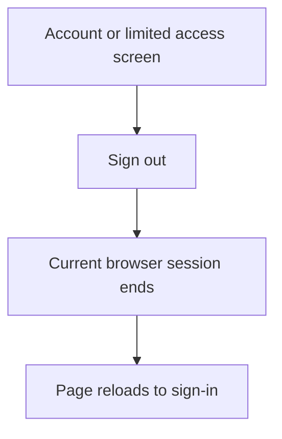
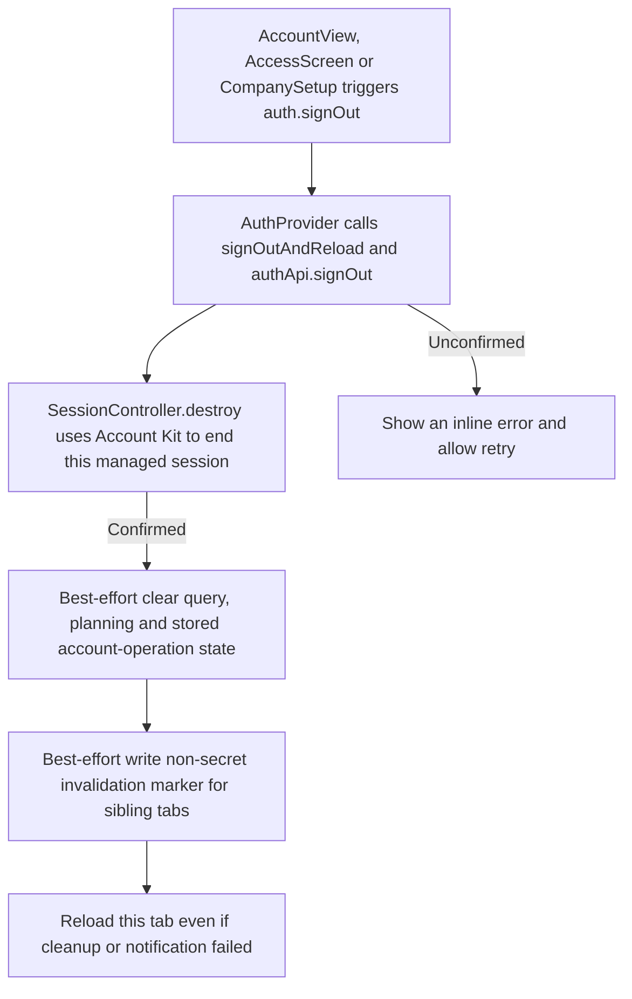

# US-ACCOUNT-04 — Sign out of this browser

As a signed-in person, I want to sign out of this browser so that this session ends when I am done.

**Status:** Current
**Access:** Any signed-in person.
**Entry:** Account → Sign out; limited account access screen → Sign out
**Documentation:** [Account](../../docs-src/using/account.md)
**Source:** [AccountView.tsx](../../apps/frontend/src/components/account/AccountView.tsx); [AccessScreens.tsx](../../apps/frontend/src/auth/AccessScreens.tsx)

## Acceptance criteria

- Selecting **Sign out** ends the current browser session and returns to sign-in. It does not delete company membership or scheduling records, and other sessions remain signed in unless the password is changed or reset.

## User flow

```mermaid
flowchart TD
  screen["Account or limited access screen"] --> out["Sign out"]
  out --> ended["Current browser session ends"]
  ended --> reload["Page reloads to sign-in"]
```

## Code flow

```mermaid
flowchart TD
  entry["AccountView, AccessScreen or CompanySetup triggers auth.signOut"] --> request["AuthProvider calls signOutAndReload and authApi.signOut"]
  request --> logout["SessionController.destroy uses Account Kit to end this managed session"]
  request -->|Unconfirmed| error["Show an inline error and allow retry"]
  logout -->|Confirmed| cleanup["Best-effort clear query, planning and stored account-operation state"]
  cleanup --> signal["Best-effort write non-secret invalidation marker for sibling tabs"]
  signal --> reload["Reload this tab even if cleanup or notification failed"]
```

**Code references:** [AccessScreens.tsx](../../apps/frontend/src/auth/AccessScreens.tsx#L25) · [CompanySetup.tsx](../../apps/frontend/src/auth/CompanySetup.tsx#L131) · [SignOutButton.tsx](../../apps/frontend/src/auth/SignOutButton.tsx#L14) · [signOut.ts](../../apps/frontend/src/auth/signOut.ts#L17) · [Cleanup and notification](../../apps/frontend/src/auth/signOut.ts#L24) · [session_controller.ts](../../apps/backend/app/controllers/session_controller.ts#L88) · [password_sessions.spec.ts](../../apps/backend/tests/functional/auth/password_sessions.spec.ts#L44)
