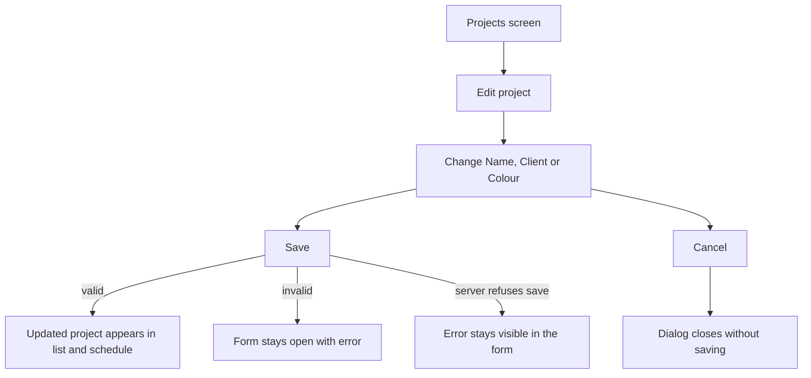
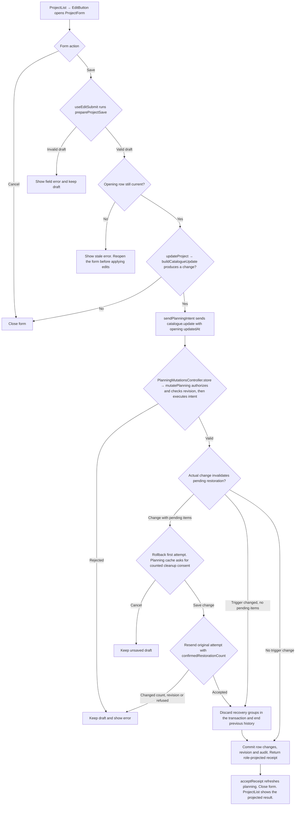

# US-PRJ-02 — Edit a project

As an Editor, I want to edit a project’s name, client and colour so that its updated details appear throughout the schedule.

**Status:** Current
**Access:** Editor and above (Editor, Admin, Owner)
**Entry:** Projects screen → project row → Edit
**Documentation:** [Guide](../../docs-src/using/projects.md)
**Source:** [ProjectList.tsx](../../apps/frontend/src/components/projects/ProjectList.tsx) · [ProjectForm.tsx](../../apps/frontend/src/components/projects/ProjectForm.tsx)

## Acceptance criteria

| Field         | Control         | Required/default/conditions                                                                                                |
| ------------- | --------------- | -------------------------------------------------------------------------------------------------------------------------- |
| Client        | Picker          | Required; Internal first, then active clients by name; a current archived client stays selected but cannot be chosen again |
| Name          | Text field      | Required; current value prefilled; read-only for non-Owners when the project uses a code name                              |
| Use code name | Switch          | Owner only; current value prefilled                                                                                        |
| Code name     | Text field      | Owner only; shown and required when Use code name is on                                                                    |
| Colour        | Preset swatches | Current colour preselected; hidden when the client is Internal                                                             |

- **Save** updates the project. Invalid required values keep the form open with an error. **Cancel** closes without saving.

## User flow

```mermaid
flowchart TD
  A["Projects screen"] --> B["Edit project"] --> C["Change Name, Client or Colour"] --> D["Save"]
  D -->|valid| E["Updated project appears in list and schedule"]
  D -->|invalid| F["Form stays open with error"]
  C --> G["Cancel"] --> H["Dialog closes without saving"]

  D -->|server refuses save| X["Error stays visible in the form"]
```

## Code flow

```mermaid
flowchart TD
  ENTRY["ProjectList → EditButton opens ProjectForm"] --> ACTION{"Form action"}
  ACTION -->|Cancel| CLOSE["Close form"]
  ACTION -->|Save| FORM{"useEditSubmit runs prepareProjectSave"}
  FORM -->|Invalid draft| FIELD["Show field error and keep draft"]
  FORM -->|Valid draft| STALE{"Opening row still current?"}
  STALE -->|No| REOPEN["Show stale error. Reopen the form before applying edits"]
  STALE -->|Yes| DIFF{"updateProject → buildCatalogueUpdate produces a change?"}
  DIFF -->|No| CLOSE
  DIFF -->|Yes| SEND["sendPlanningIntent sends catalogue.update with opening updatedAt"]
  SEND --> SERVER{"PlanningMutationsController.store → mutatePlanning authorizes and checks revision, then executes intent"}
  SERVER -->|Rejected| ERROR["Keep draft and show error"]
  SERVER -->|Valid| CLEAN{"Actual change invalidates pending restoration?"}
  CLEAN -->|Change with pending items| PROMPT{"Rollback first attempt. Planning cache asks for counted cleanup consent"}
  PROMPT -->|Cancel| KEEP["Keep unsaved draft"]
  PROMPT -->|Save change| RETRY{"Resend original attempt with confirmedRestorationCount"}
  RETRY -->|Changed count, revision or refused| ERROR
  RETRY -->|Accepted| DISCARD["Discard recovery groups in the transaction and end previous history"]
  CLEAN -->|Trigger changed, no pending items| DISCARD
  DISCARD --> COMMIT["Commit row changes, revision and audit. Return role-projected receipt"]
  CLEAN -->|No trigger change| COMMIT
  COMMIT --> DONE["acceptReceipt refreshes planning. Close form. ProjectList shows the projected result."]
```

Owner, Admin and Editor can write planning data. Viewer and view-as-member lack write authority. The write goes through `POST /api/v1/companies/:companyId/planning/mutations` with admitted company access. The planning cache refreshes on a stale revision and reconciles an uncertain write before another attempt. Footer Cancel closes the form, including during a pending save. The dispatched save can still settle. The list reads the active projection. The form has a disabled fallback for a supplied missing or archived current client. A non-Owner editing a private project sees a protected name and can update permitted client and colour fields. The server pins unauthorized hidden fields. A project’s own private name and its client’s projected name are independent.

**Code references:** [ProjectList.tsx](../../apps/frontend/src/components/projects/ProjectList.tsx#L69) · [ProjectForm.tsx](../../apps/frontend/src/components/projects/ProjectForm.tsx#L151) · [ProjectForm.tsx](../../apps/frontend/src/components/projects/ProjectForm.tsx#L128) · [entity_rules.ts](../../apps/backend/app/services/planning/entity_rules.ts#L88) · [projection.ts](../../packages/shared/src/domain/lifecycle/projection.ts#L36) · [domain.ts](../../apps/backend/app/services/planning/entity_validation/domain.ts#L43) · [restoration_pending_groups.spec.ts](../../apps/backend/tests/functional/planning/restoration_pending_batches.spec.ts#L28) · [Write controls](../../apps/frontend/src/components/common/crudButtons.tsx#L7) · [Cancel button](../../apps/frontend/src/components/common/FormButtons.tsx#L17) · [useEditSubmit.ts](../../apps/frontend/src/hooks/useEditSubmit.ts#L44) · [Row checks](../../apps/backend/app/services/planning/entity_write_service.ts#L91) · [typedPlanningActions.ts](../../apps/frontend/src/store/typedPlanningActions.ts#L188) · [planningIntents.ts](../../apps/frontend/src/data/planning/planningIntents.ts#L502) · [sendPlanningIntent](../../apps/frontend/src/store/slices/planningSessionSlice.ts#L139) · [Planning transport](../../apps/frontend/src/data/planning/planningTransport.ts#L64) · [Planning route](../../apps/backend/start/routes/planning.ts#L16) · [Mutation controller](../../apps/backend/app/controllers/planning_mutations_controller.ts#L19) · [Planning transaction](../../apps/backend/app/services/planning_service.ts#L222) · [Company write authority](../../apps/backend/app/services/planning/planning_access_service.ts#L31) · [Receipt and refresh](../../apps/frontend/src/data/planning/planningCache.ts#L469) · [usePrivateNameFields.ts](../../apps/frontend/src/components/common/usePrivateNameFields.ts#L27) · [restricted_fields.ts](../../apps/backend/app/services/planning/restricted_fields.ts#L21) · [mutation_changes.ts](../../apps/backend/app/services/planning/mutation_changes.ts#L74) · [Confirmation retry](../../apps/frontend/src/data/planning/planningCache.ts#L420) · [Role projection](../../apps/backend/app/transformers/state_transformer.ts#L46)
